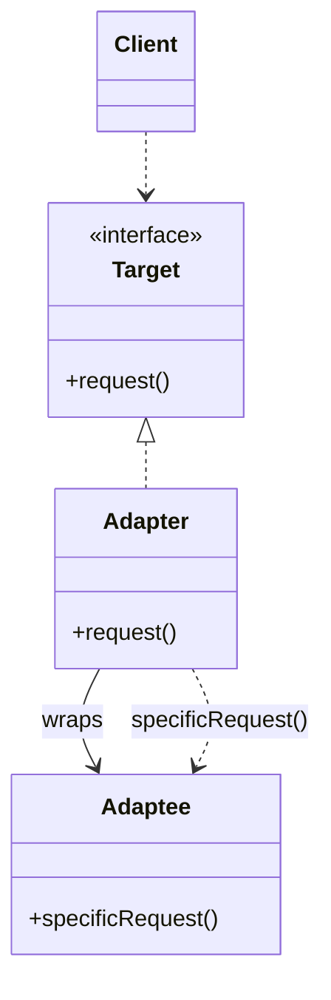
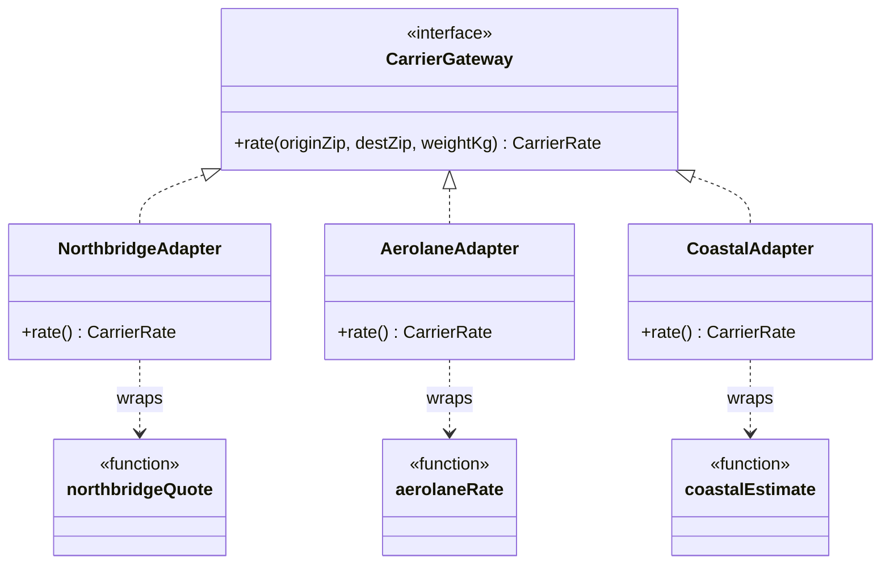

# Walkthrough — Carrier gateway at Ravensgate, the Adapter route

Read this **after** you have your own version. This route does not absorb
act 2 - [`solutions/facade/`](../facade/WALKTHROUGH.md) is the one this
repository considers the better fit, and its walkthrough makes the case
for why. This file is here because a candidate you didn't pick is still
worth understanding, in code, not just in the abstract.

---

## The structure, twice

The GoF diagram. A `Client` talks to a `Target` interface; an `Adapter`
implements `Target` by wrapping an `Adaptee` and translating each call
into whatever the `Adaptee` actually understands:

This exercise's names - three adapters, three adaptees, because three
carriers means three genuinely unrelated native shapes:

**On the mapping.** The book's `Adaptee` is usually a class with its own
identity; here each one is a single frozen function - `northbridgeQuote`,
`aerolaneRate`, `coastalEstimate`. That doesn't change the shape of the
pattern: each adapter still exists to hide exactly one incompatible
interface behind the one the rest of the codebase wants, it just does it
by calling a function instead of delegating to an object.

**On the name.** `registry.ts` is the file; `gateways` is what it exports.
Not `registry`, the noun the filename suggests - `registry` fails
question 4 from [`docs/NAMING.md`](../../../../../docs/NAMING.md):
nothing here registers an adapter at runtime, it's three fixed entries,
known at compile time, built once. `gateways` says what the values
*are* - each one a `CarrierGateway` - not a claim about machinery this
code doesn't have.

**On the name, a second time.** `NorthbridgeAdapter`, not
`NorthbridgeCarrierGateway` or `NorthbridgeClient`. `NorthbridgeClient`
already names something else in this file - the native function it wraps
is conceptually "the Northbridge client," and giving the adapter the same
name would let two different things answer to it (question 2).
`NorthbridgeAdapter` says what role the class plays, which is exactly
what the GoF naming table this repository follows asks a `ConcreteAdapter`
to say.

**On the name, a third time.** `rate`, not `getRate` or `quote`. `quote`
would collide with `northbridgeQuote`'s own name badly enough that
`NorthbridgeAdapter.rate()` calling `northbridgeQuote()` would read as one
quoting the other, rather than one adapting the other (question 3). `rate`
is also simply the method `CarrierGateway` already declares - the
interface isn't this route's to rename.

---

## Why this route doesn't absorb act 2

Adapter answers act 1's question cleanly: three unrelated shapes, three
small classes, one per shape, and neither `checkout.ts` nor
`rate-comparison.ts` has to know any of them exist any more. Act 2 asks a
different question - **the same rule, applied identically to all three
carriers at once** - and "one class per carrier" means that rule has
nowhere to live but *inside each of the three classes, separately*.
`docs/TYPESCRIPT.md` actually predicts this: Adapter's classic,
class-per-adaptee form "earns its keep... when the adapter holds state or
must be swapped at runtime," and a cache is exactly that kind of state -
the prediction comes true, just not in this candidate's favour, because
the state has to be tripled instead of held once. See
[ACT2.md](./ACT2.md) for the measured version of this argument.

---

## What it cost, even in act 1

- **Three files where Proxy needs one, and Facade needs one.** Reading
  "what does Ravensgate's rate-lookup do for every carrier" means opening
  three separate files that share no code beyond the interface they all
  implement.
- **The interface is doing real work, but nothing here enforces its
  own input.** Neither `NorthbridgeAdapter` nor its siblings validate
  `originZip`/`destZip`/`weightKg` - that responsibility doesn't exist
  anywhere in this route, same as `src/`. [`facade`](../facade/WALKTHROUGH.md)
  adds it; this route doesn't.

## What act 2 showed

See [ACT2.md](./ACT2.md) for the numbers: 33 lines and 4 hunks here -
worse than [`facade`](../facade/ACT2.md)'s 11, worse than
[`proxy`](../proxy/ACT2.md)'s 13, and worse even than the no-pattern
baseline's file count (though not its lines). The cache had to be written
three times, once per adapter class, because nothing in this route holds
all three carriers at once.
