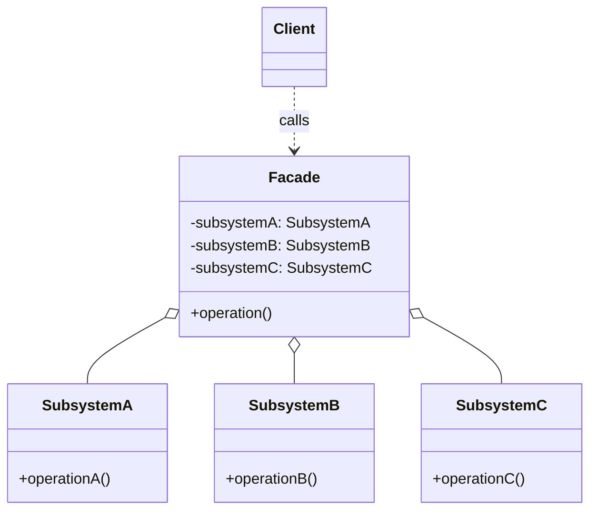
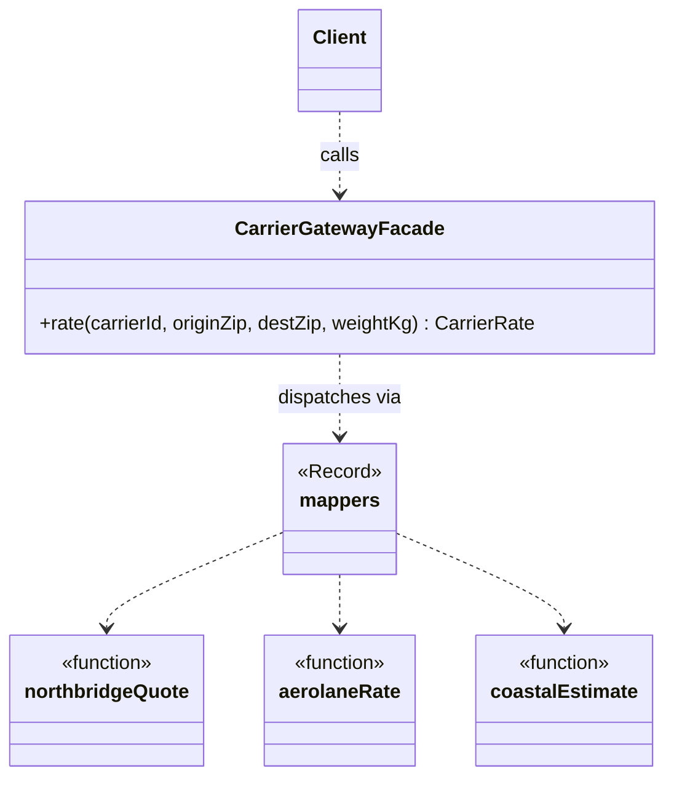

# Walkthrough — Carrier gateway at Ravensgate

Read this **after** you have your own version and your own `CHOICE.md`.

---

## The structure, twice

The GoF diagram. A `Facade` holds references to every class in a
`Subsystem` and exposes one simplified operation that sequences calls
across them; a `Client` talks only to the `Facade`, never touching a
subsystem class directly:



This exercise's names:



**On the mapping.** The book's `Facade` typically hides several
*classes*; here the subsystem it hides is three unrelated *functions*,
reached through `mappers` rather than through subsystem objects the
facade constructs and holds. `CarrierGatewayFacade` also doesn't
`implement CarrierGateway` the way `adapter` and `proxy` both do - and
that's not an oversight. `CarrierGateway.rate()` takes no `carrierId`; it
is built to answer for *one* carrier. A facade's whole point is to be the
single entry point for the *subsystem*, so its `rate()` takes `carrierId`
as an argument instead. Implementing the per-carrier interface would mean
picking one carrier to be built around, which is exactly the shape this
route exists to avoid.

**On the mapping, a second time.** This is the one route that validates
its own input - `validate()` runs before any translation happens.
Neither `adapter` nor `proxy` do this, and neither does `src/`. That's
not incidental to being a facade: "a facade that leaks its subsystems is
not one" ([`docs/TYPESCRIPT.md`](../../../../../docs/TYPESCRIPT.md)'s own
line about this pattern), and letting a malformed zip code reach
`northbridgeQuote` unchecked is exactly the kind of leak a single
entry point is supposed to close. Adapter and Proxy could each add the
same check, but they'd have to add it once per class or once inside the
one `switch` - here it's one function, called once, before dispatch ever
happens.

**On the name.** `mappers`, not `translators` or `handlers`. `handlers`
fails question 4 from
[`docs/NAMING.md`](../../../../../docs/NAMING.md) - nothing here handles
an event or a request in the sense that word usually promises, it maps
one shape onto another and returns. `mappers` says exactly that, and
matches the type it holds, `Mapper`.

**On the name, a second time.** `CarrierGatewayFacade`, not
`CarrierService` or `RateGateway`. `CarrierService` fails question 2 -
"service" is vague enough to mean almost any class in this codebase.
`CarrierGatewayFacade` says both what it's for (the same `CarrierGateway`
concept the other two routes name their classes after) and what it is
structurally, which matters here because a reader comparing all three
candidates benefits from the pattern name being visible at the call site,
not just in a comment.

**On the name, a third time.** `carrierGatewayFacade`, the singleton, not
`gateway` or `instance`. `instance` fails question 1 - it says what kind
of thing the binding is (an instance) but nothing about what it's an
instance *of*, which matters more here since there's exactly one facade,
not a family of them the way `adapter`'s three adapters are a family.

---

## Why this candidate, over the other two

Both Adapter and Proxy were live options through all of act 1 - either
one produces working code that passes every act-1 test, and
`solutions/adapter/` and `solutions/proxy/` in this repository prove it.
What decided it, once act 2 arrived: **the requirement was never about
any one carrier - it was about one rule ("don't call a carrier's native
client twice for the same request") applying uniformly across all three
at once.** A facade is the one candidate that was already built around
"all three carriers, one place." Adapter's whole design is "one carrier,
one class," so the same rule has to be written three times. Proxy is
closer - one class - but that one class is still built *per carrier*, so
the cache field lives inside three separate instances of it and the
caching logic sits next to a `switch` that's still doing the three-way
translation Facade only does inside `mappers.ts`. Facade's `rate()` is
the one method in this whole exercise that every request, for every
carrier, actually passes through - which makes it the cheapest possible
place to add a rule about requests in general. See
[`solutions/adapter/WALKTHROUGH.md`](../adapter/WALKTHROUGH.md) and
[`solutions/proxy/WALKTHROUGH.md`](../proxy/WALKTHROUGH.md) for how each
of those routes actually absorbed the change.

Read against GoF's own text, this is close to the point Facade's own
*Intent* makes about "a unified interface to a set of interfaces in a
subsystem" - a rule about the subsystem as a whole has a natural home
in the one place already built to speak for the subsystem as a whole,
in a way it doesn't have a natural home inside any of the subsystem's
individual parts.

---

## Step 1 — dispatch through one method, not one class per carrier

```ts
export class CarrierGatewayFacade {
  rate(carrierId: CarrierId, originZip: string, destZip: string, weightKg: number): CarrierRate {
    validate(originZip, destZip, weightKg);
    return mappers[carrierId](originZip, destZip, weightKg);
  }
}
```

Every request - whichever carrier it names - passes through this one
method. That's the property act 2 measures: a rule that has to apply to
"every request, regardless of carrier" attaches here once, rather than
once per carrier.

---

## Where TypeScript changes this

[`docs/TYPESCRIPT.md`](../../../../../docs/TYPESCRIPT.md) calls Facade
"a module" in TypeScript - "the only real rule: a facade that leaks its
subsystems is not one." This route is almost that plain: `mappers.ts` is
a `Record` of functions, and the "facade" is one small class wrapping one
method around it. The class earns its keep over a bare module-level
function for a small, specific reason: act 2's cache needs somewhere to
live that persists across calls and isn't visible from outside, and a
class field does that more plainly here than a closure over a
module-level `Map` would (compare the no-pattern baseline's
`rate-cache.ts`, described in [ACT2.md](./ACT2.md), which had to become a
whole extra file to get the same privacy `adapter`'s classes and this
route's single field get for free).

---

## What it cost

- **`mappers.ts` knows all three carriers' shapes in one file.** That's
  exactly what `adapter`'s split into three files exists to avoid - this
  route trades "one file that has to change for a new carrier" for
  "no file has to be found and opened to add caching."
- **`CarrierGatewayFacade` doesn't implement `CarrierGateway`.** A reader
  expecting every "gateway"-named class in this exercise to satisfy the
  same interface has to learn why this one doesn't, and the answer -
  *because it isn't per-carrier* - isn't visible from the name alone.
- **See [ACT2.md](./ACT2.md) for the actual price** of the caching
  requirement, measured, and for how the other two candidates fared
  against the same requirement.

## What act 2 showed

See [ACT2.md](./ACT2.md) for the numbers: 11 lines and 2 hunks here,
against 47 lines and 4 hunks with no pattern at all, and better than both
other candidates too. The shape of the win matters as much as the size:
the cache attaches to the one method every request already passes
through, so the diff is two additions to one class - a field and a
lookup-then-store wrapped around the existing dispatch - not a change
repeated at every carrier's own translation site.
