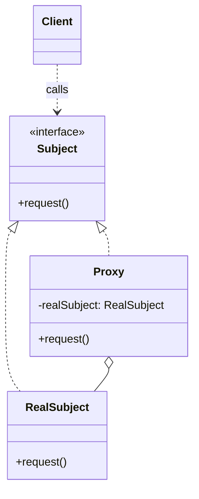
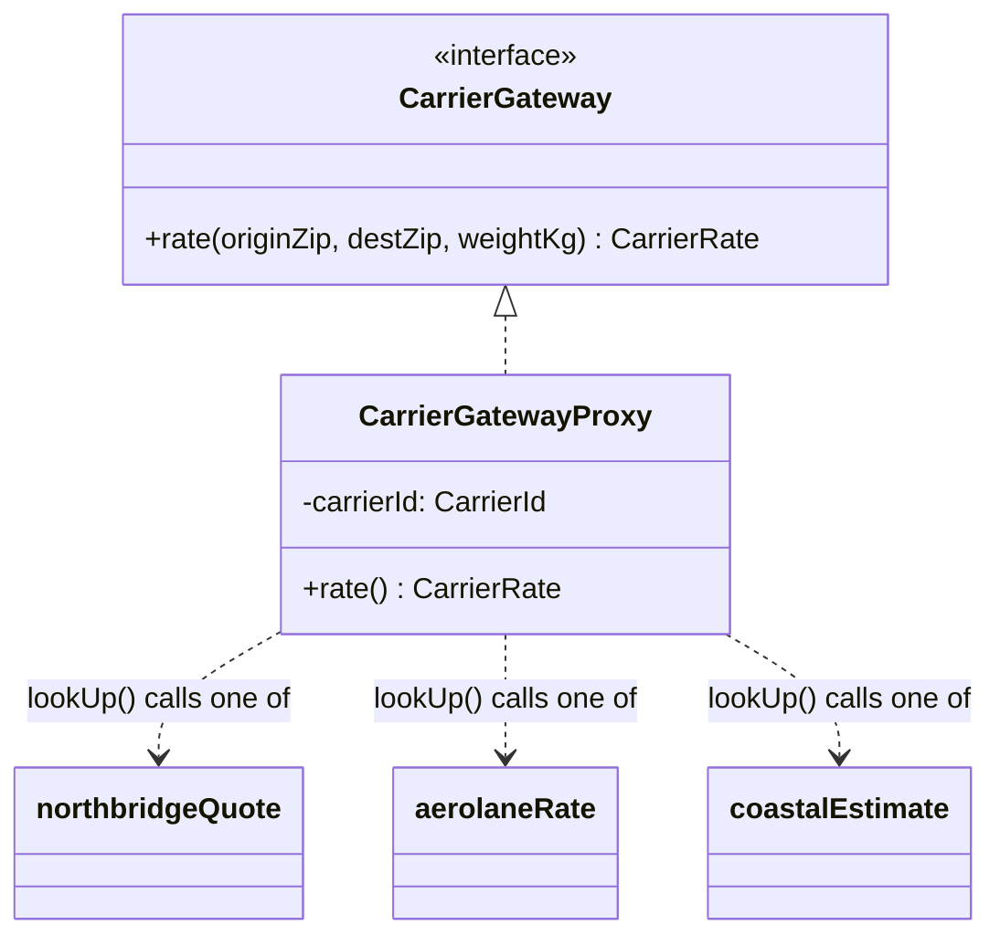

# Walkthrough — Carrier gateway at Ravensgate, the Proxy route

Read this **after** you have your own version. This route does not absorb
act 2 - [`solutions/facade/`](../facade/WALKTHROUGH.md) is the one this
repository considers the better fit, and its walkthrough makes the case
for why. This file is here because a candidate you didn't pick is still
worth understanding, in code, not just in the abstract.

---

## The structure, twice

The GoF diagram. A `Subject` interface declares the operation both the
`RealSubject` and the `Proxy` implement; the `Proxy` holds a reference to
- or, here, enough information to reach - the real thing, and controls
access to it, so a `Client` calling through `Subject` can't tell which
one actually answered:

This exercise's names:

**On the mapping.** There's no single `RealSubject` here, and that's the
honest limit of this diagram: the book's `Proxy` stands in for *one*
real thing, configured once, at the type level - the constructor takes no
argument because there's nothing to choose. `CarrierGatewayProxy` takes a
`carrierId`, which means the "real subject" it stands in for is decided
per *instance*, at runtime, not per *class*. The pattern's shape survives
- one class, controlling access, behind the same interface as whatever it
wraps - but "wraps" here means "knows how to reach," not "holds a
reference to."

**On the name.** `CarrierGatewayProxy`, not `CarrierProxy` or
`GatewayProxy`. `CarrierProxy` fails question 1 from
[`docs/NAMING.md`](../../../../../docs/NAMING.md) - it says what this
proxies (a carrier) but not what it implements, and the class exists
specifically because it satisfies `CarrierGateway`. `GatewayProxy` fails
question 2: "gateway" alone could mean this proxy or the interface it
implements, and the file already needs both names to be distinct.

**On the name, a second time.** `lookUp`, not `resolve` or `fetch`.
`fetch` reads as a network call, which this isn't (it calls a
same-process function) - question 4, is it true. `lookUp` says exactly
what happens: given `this.carrierId`, find and call the one native client
that answers to it.

**On the name, a third time.** `registry.ts` exporting `gateways`, same
choice [`adapter`](../adapter/WALKTHROUGH.md) made and for the same
reason - three fixed entries built once, not a `registry` that registers
anything at runtime.

---

## Why this route doesn't absorb act 2

Proxy gets partway to what act 2 wants, and it's worth being precise
about how far: because there's only *one class*, the cache only has to be
**written once** - a real advantage over Adapter's three copies. But it's
still one cache field per *instance*, and there are three instances (one
per carrier, built in `registry.ts`), so the caching logic and the
three-way translation `switch` end up stacked in the same `rate()`
method, doing two jobs at once. Facade needed only one instance for all
three carriers, because nothing about a facade is *per-carrier* in the
first place - that's the difference act 2 measures. See
[ACT2.md](./ACT2.md) for the numbers.

---

## What it cost, even in act 1

- **The `switch` inside `rate()` still lists all three carriers, in one
  place.** Better than duplicating it - Adapter effectively splits the
  same switch across three files - but a fourth carrier still means
  finding this one method and adding a case, the same as `src/` today.
- **Nothing here validates its input**, same gap as
  [`adapter`](../adapter/WALKTHROUGH.md) and `src/`.
  [`facade`](../facade/WALKTHROUGH.md) is the one route that does.

## What act 2 showed

See [ACT2.md](./ACT2.md) for the numbers: 13 lines and 2 hunks here -
close to [`facade`](../facade/ACT2.md)'s 11 and 2, and much better than
[`adapter`](../adapter/ACT2.md)'s 33. The one class this route already
had turned out to matter more than which pattern built it.
