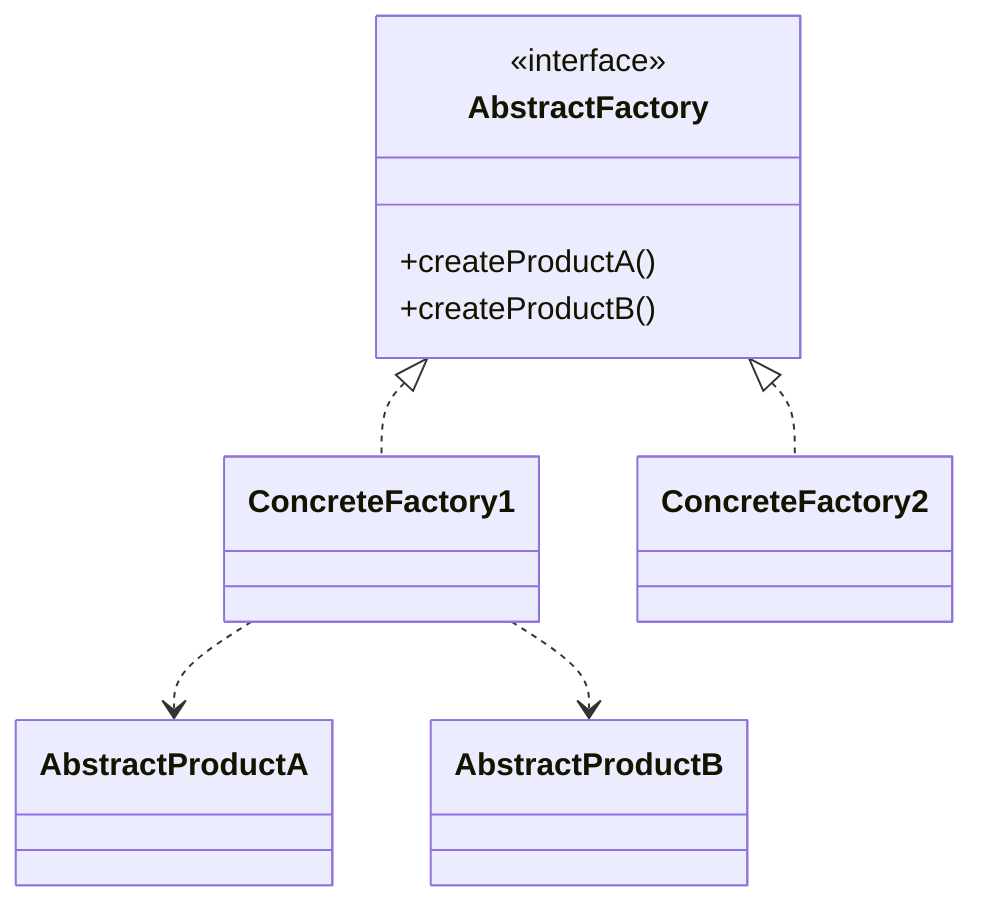
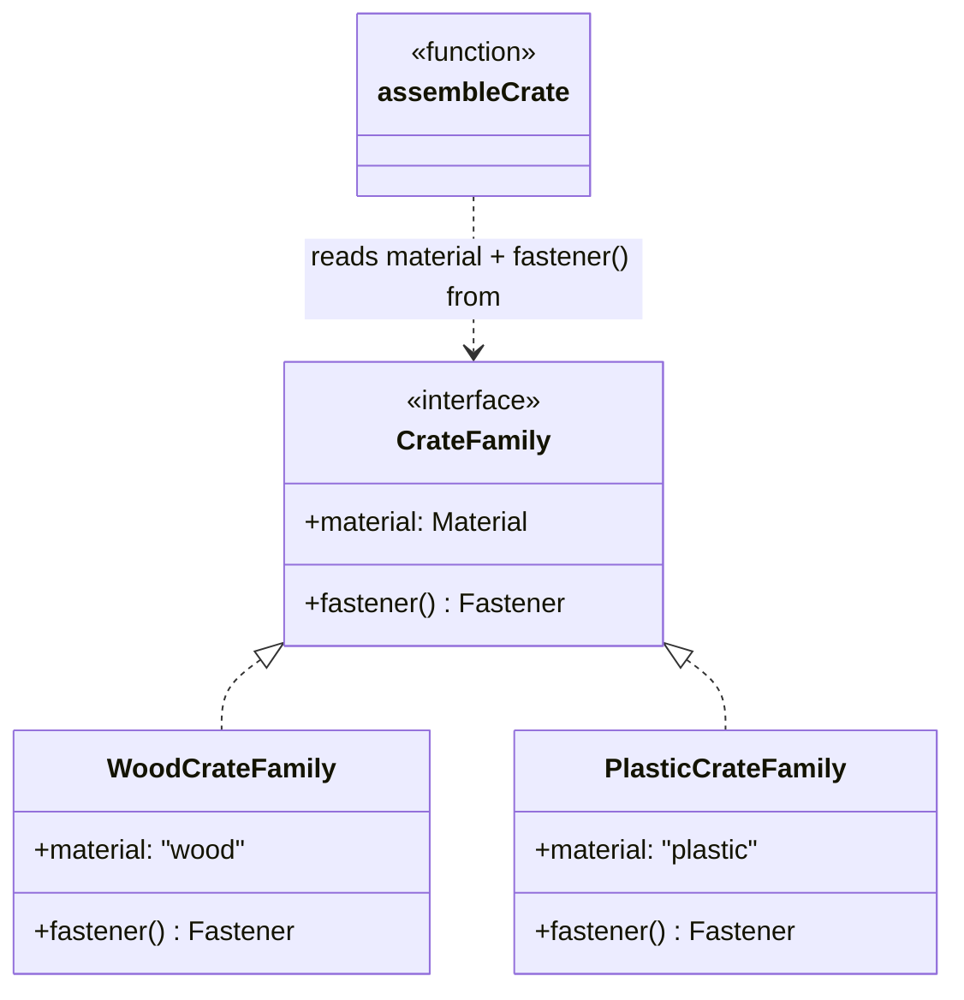

# Walkthrough — Crate config at Ravensgate

Read this **after** you have your own version and your own `CHOICE.md`.

---

## The structure, twice

The GoF diagram. An `AbstractFactory` interface declares one creation method per product in
the family; each `ConcreteFactory` supplies a matching set, so a caller holding one factory
can never accidentally pair a product from one family with a product from another:

This exercise's names:

**On the mapping.** The book's canonical examples coordinate *several* products per family - a
GUI toolkit's button and checkbox, a furniture line's chair, table and sofa. This domain only
has one product that varies by material at all: the fastener. `material` itself is carried as
plain data (`family.material`), not a second product method, because nothing downstream needs
it to be polymorphic - it's read, not dispatched on. That's a minimal, single-product instance
of the pattern, and it's worth sitting with *why* it's minimal here before act 2 shows what
that costs.

**On the name.** `CrateFamily`, not `MaterialFactory`. `Factory` fails question 2 from
[`docs/NAMING.md`](../../../../../docs/NAMING.md) - it's already the name of a different GoF
pattern this repository's drills cover separately, and reusing it bare here would make two
different patterns answer to the same word. `Family` says what these classes actually group: a
coherent, non-mixable set of choices for one material.

**On the name, a second time.** `.fastener()`, not `.getFastener()`. Question 3 - `family.
fastener()` reads as a question answered at the call site inside `assembleCrate`; the `get`
prefix would add a verb that changes nothing about what the call returns.

**On the name, a third time.** `WoodCrateFamily`/`PlasticCrateFamily`, not `WoodFactory`/
`PlasticFactory`. Question 4 - `Factory` bare would claim these classes *create things* in
general, but each one only supplies one material's fastener choice; `Family` is what's
literally true of what they represent.

---

## Why this route doesn't absorb act 2

Abstract Factory earns its keep, per `docs/TYPESCRIPT.md`'s own framing, "when mismatching
two families is the bug you are preventing" - and that bug is real here: act 1's own test
suite checks that a wood crate and a plastic crate never share a fastener, and `CrateFamily`
makes that mismatch structurally impossible rather than merely tested for. But act 2's new
rule - an insulated crate's `maxLoadKg` may not exceed 800kg - has nothing to do with which
family was chosen: it applies to wood and plastic alike, so it cuts *across* the family axis
this pattern protects rather than varying *along* it. `WoodCrateFamily` and
`PlasticCrateFamily` need no change at all; the entire new check lands in `assembleCrate`'s
shared body, in exactly the same shape as [`solutions/object-literal`](../object-literal/WALKTHROUGH.md)'s
equivalent function. See [ACT2.md](./ACT2.md) for the measured tie.

---

## Where TypeScript changes this

[`docs/TYPESCRIPT.md`](../../../../../docs/TYPESCRIPT.md)'s summary table: "An object of
factory functions" is the idiomatic TypeScript shape, reserved for "when mismatching two
families is the bug you are preventing." This route's class-based form is closer to the book
than that idiom suggests it needs to be, for a family this small - but the real lesson act 2
teaches isn't about class-vs-object-literal syntax at all: it's that the *axis* this pattern
protects (which family) and the axis this act 2 varies along (insulated or not) are simply
different axes, and no amount of idiomatic TypeScript changes that.

---

## What it cost

- **A family of one product doesn't get to show the pattern's real strength.** The book's
  multi-product coordination - keeping several related choices from drifting out of sync - has
  nothing to coordinate here beyond the one fastener; `material` itself is plain data these
  classes just happen to carry alongside it.
- **Two tiny classes for two lines of real logic.** `WoodCrateFamily` and
  `PlasticCrateFamily` each exist entirely to answer one `fastener()` call differently -
  real structure, but a lot of it for `"nails"` versus `"bolts"`.
- **See [ACT2.md](./ACT2.md) for the actual price** of the insulated-crate requirement,
  measured, and for how the other two candidates fared against the same requirement.

## What act 2 showed

See [ACT2.md](./ACT2.md) for the numbers: 14 lines and 6 hunks here, tied byte-for-byte with
[`object-literal`](../object-literal/ACT2.md) on every dimension, and cheaper than both the
no-pattern baseline (15 lines) and Builder (19 lines). The tie isn't a coincidence: once the
family axis has nothing to do with the change, `assembleCrate` here and object-literal's
`assembleCrate` end up doing exactly the same work, in exactly the same shape.
