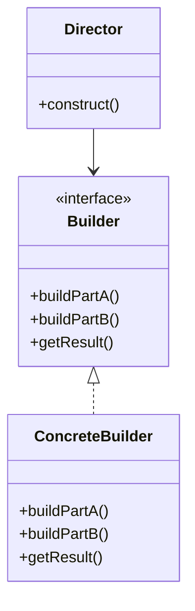
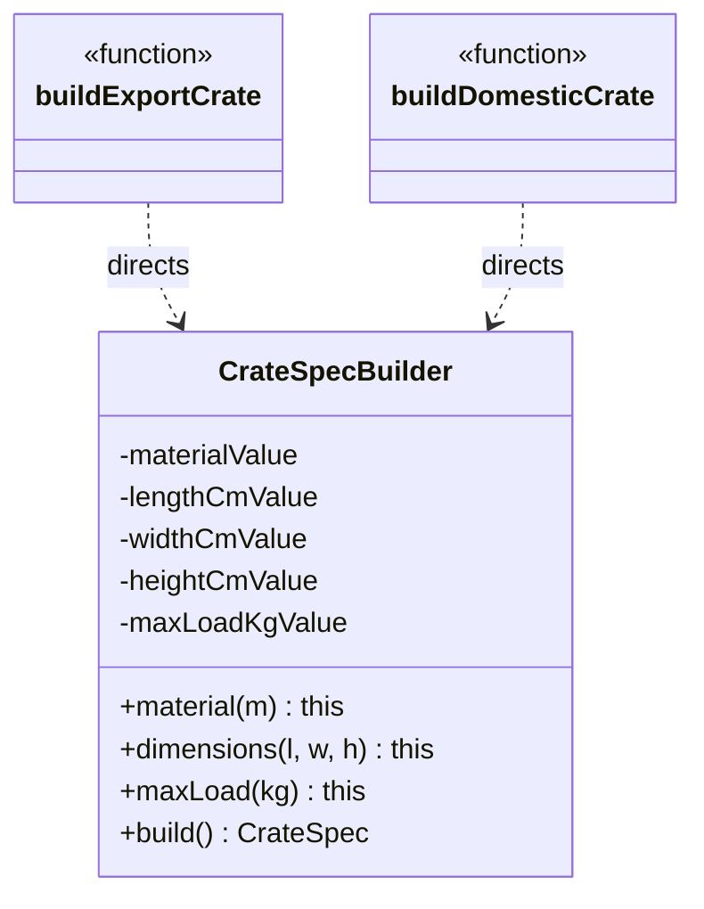

# Walkthrough — Crate config at Ravensgate

Read this **after** you have your own version and your own `CHOICE.md`.

---

## The structure, twice

The GoF diagram. A `Director` knows the *order* to call a `Builder`'s steps in; the
`Builder` (often split into an interface and a `ConcreteBuilder`) accumulates state across
those calls and hands back one finished product at the end:

This exercise's names:

**On the mapping.** There's no separate `Builder` interface here, distinct from a
`ConcreteBuilder` - this domain has exactly one product shape (`CrateSpec`), so there's
nothing a second implementation would vary. And there's no class playing `Director` either:
`buildExportCrate` and `buildDomesticCrate` play that role as plain functions, each a
different four-call sequence over the same `CrateSpecBuilder`, rather than an object with a
`construct()` method of its own.

**On the name.** `CrateSpecBuilder`, not `Builder` or `CrateBuilder`. `Builder` fails question
2 from [`docs/NAMING.md`](../../../../../docs/NAMING.md) - it's already the name of the GoF
pattern itself, and using it bare for this one class would make the pattern and the
implementation answer to the same word in conversation. `CrateSpecBuilder` says which product
this builder assembles, matching the type it returns.

**On the name, a second time.** `.material()`/`.dimensions()`/`.maxLoad()`, not `.setMaterial()`
or `.withMaterial()`. `.setMaterial()` fails question 3 - `.material("wood")` reads as a
sentence at the call site inside the fluent chain, where `.setMaterial("wood")` adds a verb
that doesn't change what the call does.

**On the name, a third time.** `.build()`, not `.create()` or `.toSpec()`. `.create()` fails
question 4 for this specific class - it would be true of nearly any factory-shaped method in
this repository, and doesn't say that this one *validates* before it returns, which is the one
thing a reader relying on this class needs to know before skipping the checks themselves.

---

## Why this route doesn't absorb act 2

Builder's strength is ordered or optional construction, validated once at the end - and
`docs/TYPESCRIPT.md`'s own summary table reserves it for "ordered steps, or an immutable
product validated once at the end." This domain has neither: all four (then five) fields can
be supplied in any order, and there was never more than one validation pass to consolidate.
Act 2's one new field lands on the one place this route is built to make *not* cheap: a new
field means a new private slot, a new fluent method, a new line each in `.build()`'s
destructuring, validation and return - and, because the new field is optional rather than
part of an existing required sequence, every call site still has to add its own
`.insulated(insulated)` link to stay correct. That's a change to the class's definition *and*
a change to both of its call sites, where the other two candidates only touch one function's
signature and its one shared body. See [ACT2.md](./ACT2.md) for the measured version of this
argument.

---

## Where TypeScript changes this

[`docs/TYPESCRIPT.md`](../../../../../docs/TYPESCRIPT.md)'s summary table marks the idiomatic
TypeScript form of Builder as "an object literal and a validating constructor" - which is
almost exactly what [`solutions/object-literal`](../object-literal/WALKTHROUGH.md) does. This
route instead uses the classic, class-based, fluent form the book describes, paying for
step-by-step ceremony this domain's four order-independent fields never asked for.

---

## What it cost

- **Every field lives in three places at once**: a private slot, a fluent method, and a line
  each in `.build()`'s destructuring, validation and return literal. A five-field product pays
  this five times over.
- **The fluent chain hides the moment validation actually happens.** A reader has to know that
  nothing is checked until `.build()` runs - `.material("wood").dimensions(-1, -1, -1)` type-checks
  and returns `this` without complaint.
- **See [ACT2.md](./ACT2.md) for the actual price** of the insulated-crate requirement,
  measured, and for how the other two candidates fared against the same requirement.

## What act 2 showed

See [ACT2.md](./ACT2.md) for the numbers: 19 lines and 8 hunks here, against 15 lines and 6
hunks with no pattern at all, and the most expensive of all four measured routes on every
dimension. The shape of the loss matters as much as the size: this is the only route where
the new field required editing a class definition *and* both of its call sites.
