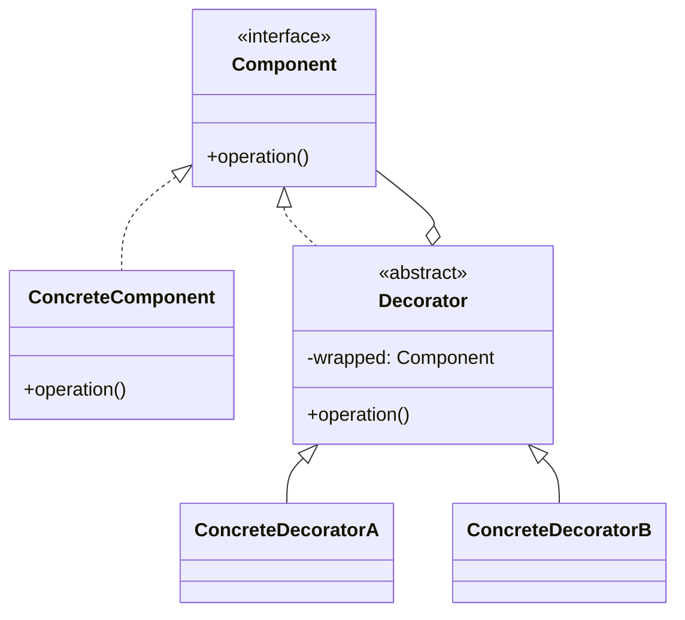
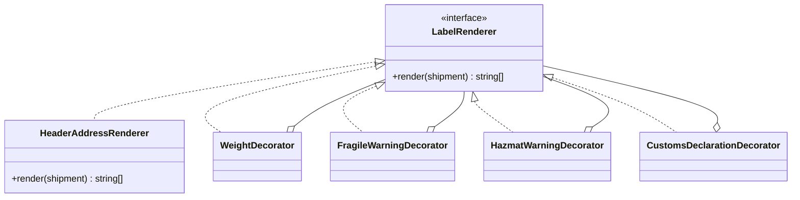

# Walkthrough — Label pipeline at Ravensgate, the Decorator route

Read this **after** you have your own version. This route does not absorb act 2 -
[`solutions/pipeline/`](../pipeline/WALKTHROUGH.md) is the one this repository considers the
better fit, and its walkthrough makes the case for why. This file is here because a candidate
you didn't pick is still worth understanding, in code, not just in the abstract.

---

## The structure, twice

The GoF diagram. A `Component` interface declares the operation; a `ConcreteComponent`
implements the base behaviour, and a chain of `Decorator`s, each wrapping the next, add to it:

This exercise's names:

**On the mapping.** `HeaderAddressRenderer` is this route's `ConcreteComponent` - but it
wasn't always this small. In act 1, the base renderer produced header, address **and**
weight together, in one class, which is the natural act-1 shape (nothing yet needs to land
between them). Act 2 needed a seam between the address and the weight, and a decorator can
only wrap what's already been built - so the base had to be split, and weight promoted to its
own decorator, purely to open that seam. That split is this route's real story, more than any
of the four decorator classes individually.

**On the name.** `LabelRenderer`, not `LabelComponent`. `LabelComponent` would echo GoF's own
`Component` too closely for a codebase that doesn't use that word anywhere else - question 2
from [`docs/NAMING.md`](../../../../../docs/NAMING.md), could it name something else in this
file. `LabelRenderer` says what every implementer actually does: take a shipment, produce the
lines of a label.

**On the name, a second time.** `wrapped`, not `inner` or `component`. `component` repeats
the GoF vocabulary this route deliberately doesn't use elsewhere (see above); `inner` fails
question 4 - it isn't true that the wrapped renderer is "inside" the decorator in any
structural sense, only that it's called first. `wrapped` says exactly the relationship: this
decorator wraps that renderer's output.

**On the name, a third time.** `HeaderAddressRenderer`, not `BaseLabelRenderer` (its act-1
name). Once weight moved out into its own decorator, `BaseLabelRenderer` stopped being true -
question 4 - it no longer rendered the label's base content, only two-thirds of it.
Renaming it to say exactly what it produces was part of the honest cost of act 2, not a
polish step.

---

## Why this route doesn't absorb act 2

Decorator answers act 1's question cleanly: every optional section is its own class, and
`sections()` builds one fixed chain that either includes a decorator or doesn't, per
shipment. Act 2 asks a harder question of that shape: **not just "should this section
appear," but "at which end of the sequence."** A decorator's position is fixed by where it
sits in the wrapping - the outermost decorator runs last, the innermost first, and nothing
about "wrap" supports "insert in the middle" without first creating a seam there.
[`docs/TYPESCRIPT.md`](../../../../../docs/TYPESCRIPT.md) doesn't have a row for this exact
shape, but the general lesson holds: append-only structures are cheap to extend at their own
edges and expensive to extend anywhere else.
See [ACT2.md](./ACT2.md) for the measured version of this argument.

---

## What it cost, even in act 1

- **Every decorator repeats the same three lines** - call `wrapped.render()`, check a
  condition, conditionally append. `Stage` values in
  [`pipeline`](../pipeline/WALKTHROUGH.md) share this same shape as plain functions, at a
  fraction of the ceremony.
- **The composition order lives in `label-content.ts`, not in `renderer.ts`.** Reading which
  section comes before which means reading the one function that builds the chain, not the
  decorator classes themselves - each of which only knows it comes "after whatever it wraps,"
  never its absolute position.

## What act 2 showed

See [ACT2.md](./ACT2.md) for the numbers: 41 lines and 4 hunks here - worse than
[`pipeline`](../pipeline/ACT2.md)'s 23, worse than
[`template-method`](../template-method/ACT2.md)'s 23, and worse than the no-pattern
baseline's 24. The base renderer had to be split into two pieces, a new decorator had to be
written, and `buildLabel`'s composition function had to grow a second, almost-but-not-quite
duplicate chain for the international case - three separate costs, where the other two
candidates each paid only one.
