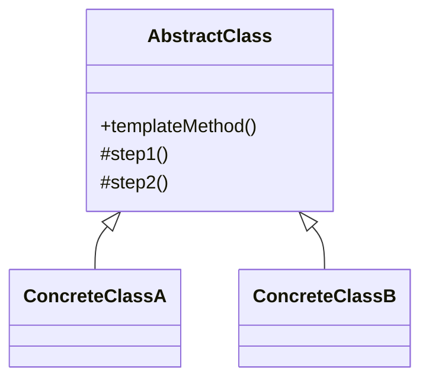
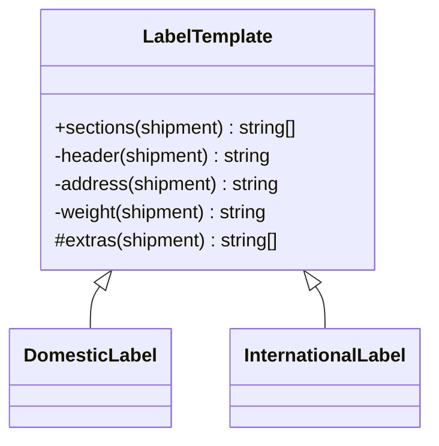

# Walkthrough — Label pipeline at Ravensgate, the Template Method route

Read this **after** you have your own version. This route does not absorb act 2 -
[`solutions/pipeline/`](../pipeline/WALKTHROUGH.md) is the one this repository considers the
better fit, and its walkthrough makes the case for why. This file is here because a candidate
you didn't pick is still worth understanding, in code, not just in the abstract.

---

## The structure, twice

The GoF diagram. An `AbstractClass` defines a `templateMethod()` that calls a fixed sequence
of steps, some of them overridable; each `ConcreteClass` supplies only the steps that differ:

This exercise's names:

**On the mapping.** `sections()` is the template method proper - GoF's own convention names it
`templateMethod()`, deliberately generic; this route names it after what it returns instead,
the same choice [`pipeline`](../pipeline/WALKTHROUGH.md) makes for its own assembly function.
`header`, `address` and `weight` are `private`, not `protected` - GoF's template steps are
usually all overridable in principle, but nothing in this domain ever needs a different
header, address or weight format, so marking them `private` says that plainly rather than
leaving it as an unstated convention.

**On the name.** `extras`, not `optionalSteps` or `modifiers`. `modifiers` would borrow
Decorator's vocabulary for a mechanism that works completely differently here - question 2
from [`docs/NAMING.md`](../../../../../docs/NAMING.md), could it name something else nearby
(a reader comparing all three candidates would see "modifier" and expect wrapping, not
inheritance). `extras` just says what it returns: the sections beyond the three fixed ones.

**On the name, a second time.** `DomesticLabel` and `InternationalLabel`, not
`USLabelTemplate` and `NonUSLabelTemplate`. The latter would fail question 4 for
`NonUSLabelTemplate` specifically - "non-US" describes everything by what it isn't, which
stops being true the moment a third destination category exists. `International` names what
the category actually is.

**On the name, a third time.** `beforeWeight`, the act-2 hook, not `middleSection` or
`insert`. `insert` describes a verb, not a place - question 1, does it say what vs how - and
every other hook in this class (`extras`) is named by *where* it sits in the sequence relative
to the fixed steps, not by what a caller does with it. `beforeWeight` keeps that same
convention.

---

## Why this route doesn't absorb act 2

Template Method answers act 1's question well: `DomesticLabel` needed nothing at all, and
`InternationalLabel` only needed to extend `extras`. Act 2 needed a section **before** the
weight step, and the skeleton, as act 1 left it, had no hook there - only `extras`, after
weight. Adding one means editing `LabelTemplate` itself, the one class every subclass
inherits from, which is exactly the class this pattern is built to keep stable. Both
subclasses end up touched too: `DomesticLabel` gains its first override, and
`InternationalLabel`'s own `extras` has to grow a second condition to place a possible
signature line after customs. Three separate edits, in the one file the pattern's whole
premise says should change the least. See [ACT2.md](./ACT2.md) for the measured version of
this argument.

---

## What it cost, even in act 1

- **Two subclasses for what is, in practice, one conditional.** `DomesticLabel extends
  LabelTemplate {}` was empty in act 1 - all the actual behaviour difference lived in
  `InternationalLabel`'s single override. A reader has to open both files to see that only one
  of the two classes does anything at all.
- **The skeleton method itself was never at risk in act 1** - which is exactly what changed in
  act 2. A pattern whose whole value proposition is "the skeleton doesn't change" paying for a
  skeleton change is the most on-the-nose kind of cost this exercise measures.

## What act 2 showed

See [ACT2.md](./ACT2.md) for the numbers: 23 lines and 3 hunks, all inside one file
(`label-template.ts`) - fewer files than [`pipeline`](../pipeline/ACT2.md)'s 2, tied with it
on lines, but one more hunk. Worth sitting with: this route comes close enough to the winner
that "fewer files touched" is a real point in its favour, even though it isn't the one this
repository picked. See [`pipeline/WALKTHROUGH.md`](../pipeline/WALKTHROUGH.md) for why the
tie on lines wasn't the deciding factor.
