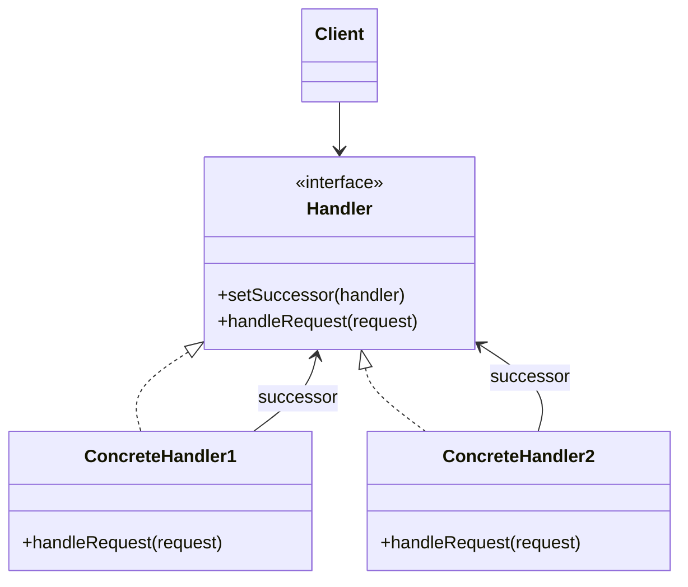

# Walkthrough — Order events at Ravensgate

Read this **after** you have your own version and your own `CHOICE.md`.

---

## The structure, twice

The GoF diagram. Each `Handler` holds a reference to the next one in the chain; a request
enters at the first handler and moves forward until one of them decides not to pass it on:



This exercise's names:

```mermaid
classDiagram
    class Link {
        <<function type>>
        (order) boolean
    }
    class inventoryLink
    class analyticsLink
    class emailLink
    class smsLink
    class runChain {
        <<function>>
    }
    Link <|.. inventoryLink
    Link <|.. analyticsLink
    Link <|.. emailLink
    Link <|.. smsLink
    runChain ..> Link : walks an array of, stopping on false
```

**On the mapping.** The book's chain is a linked list of handler *objects*, each one wired to
its own successor and free to be reconfigured at runtime. This route follows
[`docs/TYPESCRIPT.md`](../../../../../docs/TYPESCRIPT.md)'s own line about this pattern: "an
array of predicates you reduce over." A `Link` is a function, not an object; the chain is a
plain array, not a linked structure each handler carries a pointer into; and "continue" is a
returned `boolean` rather than a call to `successor.handleRequest()`. The behaviour is the
same - any link can stop everything after it - but the wiring is data (an array literal) rather
than object references set up at construction time.

**On the mapping, a second time.** The book's handlers are usually free to decide they can't
handle a request and pass it along *unmodified* for someone else to try. Every link here
handles its own consumer unconditionally when reached - none of them inspects the order and
decides "not my job." The only thing a link decides is whether the *rest of the chain* runs at
all, which is a narrower use of "chain of responsibility" than the book's running example, and
the one this domain actually needs.

**On the name.** `Link`, not `Handler` or `Rule`. `Handler` is the book's own word, and
question 1 in [`docs/NAMING.md`](../../../../../docs/NAMING.md) says the book's word is only
better than inventing one when the domain has no word of its own - `docs/TYPESCRIPT.md` already
calls this shape a chain of "links" in TypeScript, so reusing that word keeps this route's
vocabulary consistent with the rest of the repository's own description of the pattern.

**On the name, a second time.** `runChain`, not `handle` or `process`. `process` fails
question 4 - it's true of nearly any function that takes an order and does something, and
promises nothing about the stop-on-`false` behaviour that's the entire reason this function
exists instead of a plain `for` loop calling four unconditional functions.

**On the name, a third time.** `links`, the array, not `chain` or `handlers`. `chain` collides
with this candidate's own name in the exercise's `meta.json` and README - reusing it for one
local variable would make every future reference to "the chain" ambiguous between "this
candidate" and "this one array."

---

## Why this route doesn't absorb act 2

Chain of Responsibility answers act 2's question almost directly: the pattern's whole idea is
that any link can stop what follows, and a fraud hold that silences exactly "everything after
this point" is close to a textbook use of that idea. It just isn't the *cheapest* way to get
there in this exercise. Making the hold work meant two changes: a new link
(`fraudLink`, in `links.ts`) and inserting it into the fixed `links` array at the one position
where it silences email and sms without touching inventory or analytics (`order-events.ts`).
That's one more file and one more hunk than the route that only had to add an `if` inside a
method that already named the whole sequence - `docs/TYPESCRIPT.md`'s own note that this
pattern earns its keep "when a link must be able to stop the chain **and** the chain is
configured per caller" names exactly the second half this exercise doesn't need: there's only
ever one chain here, configured once, for every caller. See [ACT2.md](./ACT2.md) for the
measured version of this argument.

---

## Where TypeScript changes this

[`docs/TYPESCRIPT.md`](../../../../../docs/TYPESCRIPT.md) is direct about this pattern in
TypeScript: "an array of predicates you reduce over," and this route is close to that literally
- a `for` loop over an array, breaking on the first `false`, rather than a `.reduce()`. The
object-oriented form (`Handler` objects, each wired to a `successor`) earns its keep, per the
same table entry, "when a link must be able to stop the chain and the chain is configured per
caller" - a chain assembled differently depending on who's asking. This exercise's chain is
identical for every caller, which is exactly the case the function-array form is meant for.

---

## What it cost

- **A fixed array, same risk as the pipeline candidate elsewhere in this repository:** nothing
  enforces that `links` lists every consumer exactly once, in the right order - a typo'd array
  literal typechecks fine and fails silently until a test catches it.
- **Every link returns `true` unconditionally except the one act 2 added.** That asymmetry is
  invisible from any single link's own file - a reader has to open `links.ts` in full to notice
  only `fraudLink` ever returns `false`.
- **See [ACT2.md](./ACT2.md) for the actual price** of the fraud-hold requirement, measured,
  and for how the other two candidates fared against the same requirement.

## What act 2 showed

See [ACT2.md](./ACT2.md) for the numbers: 8 lines and 3 hunks here, against 13 lines and 1 hunk
with no pattern at all, and close to but a little more than
[`mediator`](../mediator/ACT2.md)'s 7 lines and 2 hunks. The shape of the near-miss matters as
much as the size: this route's stop-the-chain mechanism is arguably the most direct match for
what act 2 asked, and it still cost one more file and one more hunk than wrapping two calls in
an existing method - a reminder that "conceptually closest" and "cheapest, measured" aren't
always the same candidate.
