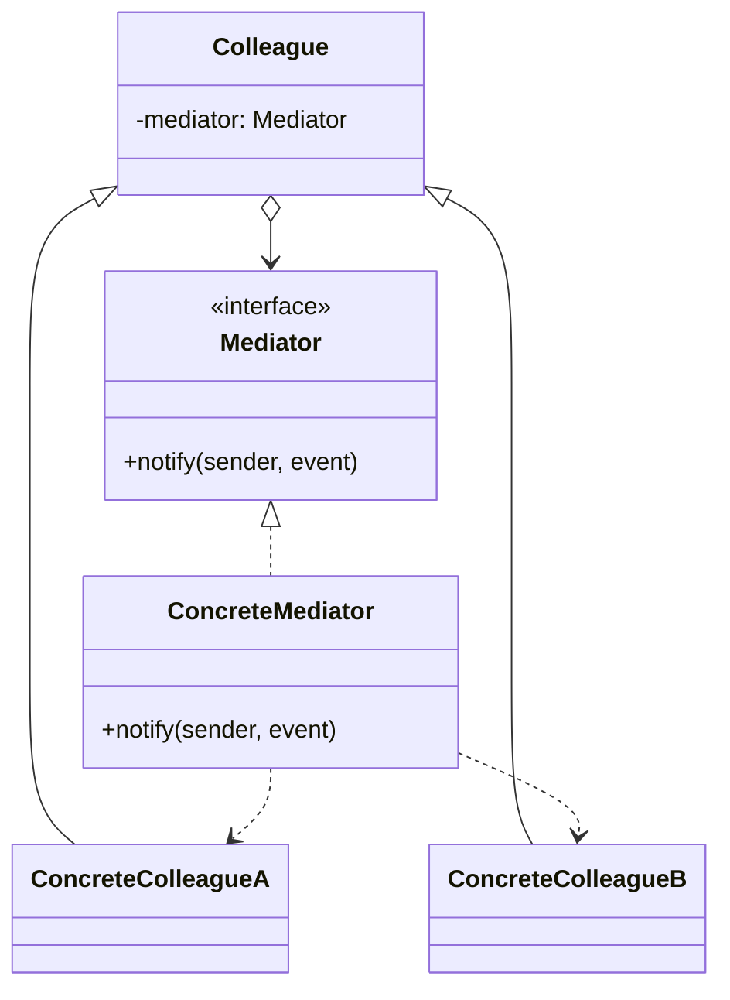
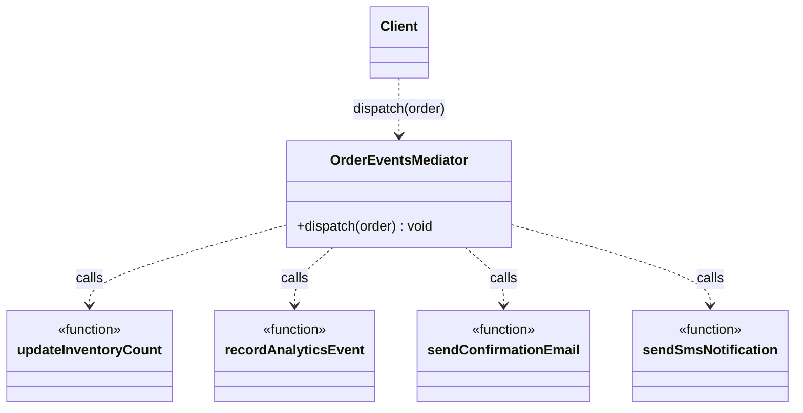

# Walkthrough — Order events at Ravensgate

Read this **after** you have your own version and your own `CHOICE.md`.

---

## The structure, twice

The GoF diagram. A `Mediator` coordinates a set of `Colleague`s that would otherwise talk to
each other directly; each colleague knows its mediator, but not the other colleagues, and the
mediator is the one place that knows how they all fit together:



This exercise's names:



**On the mapping.** The book's colleagues usually hold a reference back to their mediator, so
a colleague can *initiate* a notification ("I changed, tell the others"). Here the four
consumers are plain functions with no state and no way to call back - `dispatch()` is the only
direction anything moves. That's a narrower mediator than the book's, and a fair one: nothing
in this domain needs a consumer to ask the mediator anything, only the mediator to call each
consumer in turn. `OrderEventsMediator` also doesn't implement a `Mediator` interface the way
the book diagram shows - there's exactly one mediator in this exercise, so an interface would
describe a family of one.

**On the name.** `OrderEventsMediator`, not `OrderCoordinator` or `NotificationHub`.
`NotificationHub` fails question 2 from [`docs/NAMING.md`](../../../../../docs/NAMING.md) -
"hub" could name almost any central class in this codebase, and this class is specifically the
one that knows the pattern's own name, which matters when a reader is comparing this route
against `observer` and `chain-of-responsibility` by name alone.

**On the name, a second time.** `dispatch`, not `run` or `handle`. `handle` fails question 4 -
it's true of almost any method in this repository and promises nothing about what actually
happens; `dispatch` says what the method does: hands the order off to each consumer in turn,
which is the one thing every candidate in this exercise has to do somehow.

**On the name, a third time.** `mediator`, the module-level singleton, not `coordinator` or
`instance`. `instance` fails question 1 - it says what kind of thing the binding is (an
instance) but not what it's an instance *of*. `mediator` matches the class it holds, and
matters more here than it would elsewhere: a reader scanning `order-events.ts` across all
three candidates can tell which one this is from the variable name alone.

---

## Why this candidate, over the other two

Both Observer and Chain of Responsibility were live options through all of act 1 - either one
produces working code that passes every act-1 test, and `solutions/observer/` and
`solutions/chain-of-responsibility/` in this repository prove it. What decided it, once act 2
arrived: **`dispatch()` already named the one method every order's full fan-out passes
through, in the one order it happens in.** Silencing two of the four consumers on a hold is a
two-line change to that one method - wrap the last two calls in an `if`. Observer's four
consumers are deliberately independent classes, so nothing in that route already groups "the
two that can be held" apart from "the two that can't" - the grouping had to be built.
Chain of Responsibility's links can each stop what follows, which is the right *idea*, but
expressing it means adding a fifth link and updating the array that lists them, one file and
one hunk more than changing a single existing method. See
[`solutions/observer/WALKTHROUGH.md`](../observer/WALKTHROUGH.md) and
[`solutions/chain-of-responsibility/WALKTHROUGH.md`](../chain-of-responsibility/WALKTHROUGH.md)
for how each of those routes actually absorbed the change.

Read against GoF's own text, this is the point Mediator's own *Intent* makes about
centralizing "communication between colleague objects" - a rule about how the whole group
behaves together has a natural home in the one place already responsible for their
interaction, in a way it doesn't have a natural home inside any one colleague considered
alone.

---

## Step 1 — one method that already says the whole sequence

```ts
export class OrderEventsMediator {
  dispatch(order: Order): void {
    updateInventoryCount(order);
    recordAnalyticsEvent(order);
    sendConfirmationEmail(order);
    sendSmsNotification(order);
  }
}
```

Every order, whichever entry point triggered it, passes through this one method, in this one
order. That's the property act 2 measures: a rule that only needs to change *part* of an
already-named sequence attaches here without disturbing anything else.

---

## Where TypeScript changes this

[`docs/TYPESCRIPT.md`](../../../../../docs/TYPESCRIPT.md) marks Mediator "Unchanged - and
still one bad day away from a god object." This route is a small, honest instance of exactly
that warning: `dispatch()` staying four calls long, in a flat sequence, is what keeps it
readable. The same method growing a tenth consumer and a third conditional branch is the
point at which "one class that knows everything" stops being a strength and starts being the
thing the warning is about - this exercise doesn't reach that point, but the shape it's built
from is the same shape that eventually does.

---

## What it cost

- **`OrderEventsMediator` knows all four consumers by name, in one file.** Observer's whole
  design exists to avoid exactly this - each of its four classes knows only its own consumer.
  This route trades that isolation for a single place that's cheap to read and cheap to change
  as a whole.
- **Nothing stops `dispatch()` from growing indefinitely.** A fifth, sixth, and seventh
  consumer are each a one-line addition here - convenient in the short run, and the seed of the
  "god object" `docs/TYPESCRIPT.md` names as this pattern's standing risk in the long run.
- **See [ACT2.md](./ACT2.md) for the actual price** of the fraud-hold requirement, measured,
  and for how the other two candidates fared against the same requirement.

## What act 2 showed

See [ACT2.md](./ACT2.md) for the numbers: 7 lines and 2 hunks here, against 13 lines and 1 hunk
with no pattern at all, and cheaper on lines than both other candidates too. The shape of the
win matters as much as the size: the whole change is wrapping two of `dispatch()`'s four
existing calls in one `if` - no new class, no new list, no seam that had to be opened first.
