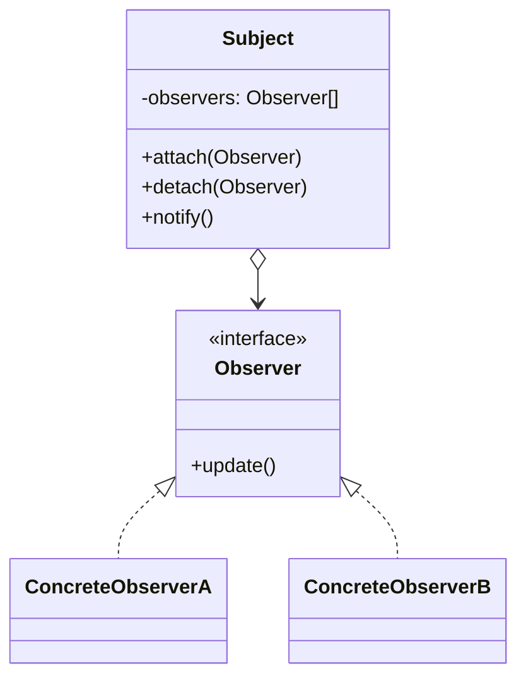
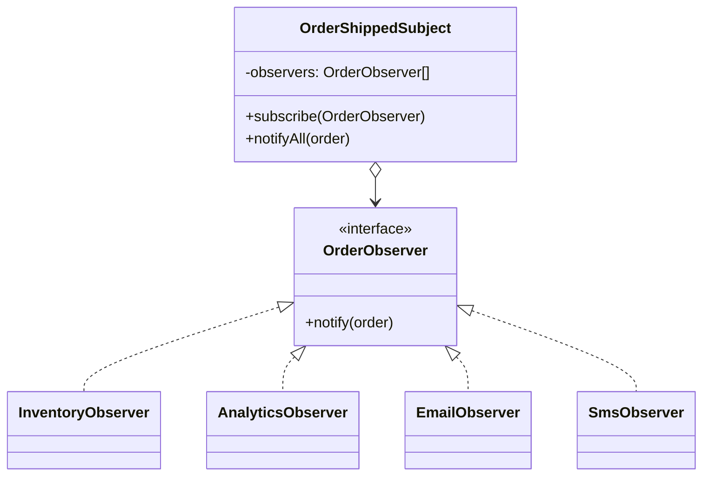

# Walkthrough — Order events at Ravensgate

Read this **after** you have your own version and your own `CHOICE.md`.

---

## The structure, twice

The GoF diagram. A `Subject` holds a list of `Observer`s and notifies every one of them when
something happens, without knowing what any concrete observer actually does:

This exercise's names:

**On the mapping.** The book's `Subject` usually has state a caller can query, and `notify()`
tells subscribers that state changed. `OrderShippedSubject` has no state of its own - it exists
purely to fan an order out to four independent listeners. That's a narrower Subject than the
book's, and it's the right one here: nothing in act 1 needs a subscriber to ask the subject
anything, only to be told an order shipped.

**On the mapping, a second time.** The book has no fixed rule about subscription *order*
mattering - a subject usually just notifies whoever is subscribed, in whatever order `attach()`
happened to be called. This route depends on it anyway: `orderShipped`'s test asserts
`inventory, analytics, email, sms`, in that exact sequence, so `order-events.ts`'s four
`subscribe()` calls have to happen in the act-1 order for the suite to pass. Nothing in
`OrderObserver` or `OrderShippedSubject` enforces that; it's a convention the caller has to get
right.

**On the name.** `OrderShippedSubject`, not `OrderNotifier` or `EventBus`. `EventBus` fails
question 2 from [`docs/NAMING.md`](../../../../../docs/NAMING.md) - a bus implies subscribers
choosing what to listen for, routed by event type; this subject has exactly one kind of event
and notifies everyone about it, so "bus" promises more generality than the code delivers.

**On the name, a second time.** `notify`, the method on `OrderObserver`, not `update` or
`handle`. `update` is the book's own word, and question 1 in `docs/NAMING.md` says the book's
word is only better than inventing one when the domain has none of its own - here the domain
already has a word for what each observer does when an order ships: it's notified. `update`
would say something happened to the observer's own state, which isn't what any of the four
classes do.

**On the name, a third time.** `subscribe`, not `attach` or `register`. `attach` is the book's
own verb, and reads oddly at the call site here - `subject.attach(new EmailObserver())` sounds
like joining two objects physically together, where `subject.subscribe(new EmailObserver())`
says what's actually happening: this observer wants to be told about future orders.

---

## Why this route doesn't absorb act 2

Observer answers act 1's question cleanly: four independent consumers, four small classes, none
of which knows the others exist, and `order-events.ts` doesn't know any consumer's
implementation at all. Act 2 asks a different question - **two of the four need to become
conditional on something none of them, individually, has any reason to know about** - and "a
flat list of equal, independent subscribers" has no way to express "these two are different
from those two." `OrderShippedSubject` itself had to grow a second list
(`subscribeAlways`/`subscribeConditional`) and a second notify path before the distinction
could exist anywhere. `docs/TYPESCRIPT.md`'s own line about this pattern - "when ordering,
unsubscription and error isolation matter... you are writing the pattern anyway" - names the
kind of complexity this pattern earns its keep on; grouping subscribers by a condition on the
subject of the notification is a different kind of complexity, and this route paid for the
grouping by changing the one class every candidate would rather have left alone. See
[ACT2.md](./ACT2.md) for the measured version of this argument.

---

## Where TypeScript changes this

[`docs/TYPESCRIPT.md`](../../../../../docs/TYPESCRIPT.md) points to `EventTarget`, an emitter,
or signals as this pattern's usual TypeScript shape, and reserves the classic hand-rolled
`Subject`/`Observer` pair for when "ordering, unsubscription and error isolation matter." This
route needs exactly the first of those - strict, asserted ordering - which is why it's written
by hand here rather than as an `EventTarget` listener list (which makes no ordering guarantee
at all). What it doesn't need, and still carries, is unsubscription and error isolation:
neither `OrderShippedSubject` nor any of the four observer classes handles a listener throwing,
or ever removes one.

---

## What it cost

- **Four classes for four one-line functions.** `EmailObserver.notify()` does exactly what
  `sendConfirmationEmail` already did - the class exists to satisfy the `OrderObserver`
  interface, not because there's any behaviour worth encapsulating in it yet.
- **Subscription order is load-bearing and invisible.** Nothing in the types says
  `order-events.ts`'s four `subscribe()` calls must happen in the act-1 order; a reviewer has
  to know that, or trust the tests to catch it.
- **See [ACT2.md](./ACT2.md) for the actual price** of the fraud-hold requirement, measured,
  and for how the other two candidates fared against the same requirement.

## What act 2 showed

See [ACT2.md](./ACT2.md) for the numbers: 38 lines and 2 hunks here, against 13 lines and 1
hunk with no pattern at all, and the most expensive of all four measured routes by a wide
margin. The shape of the loss matters as much as the size: the whole cost sits inside
`subject.ts`, which act 1 built as the one file nothing else in this route should ever need to
touch again.
