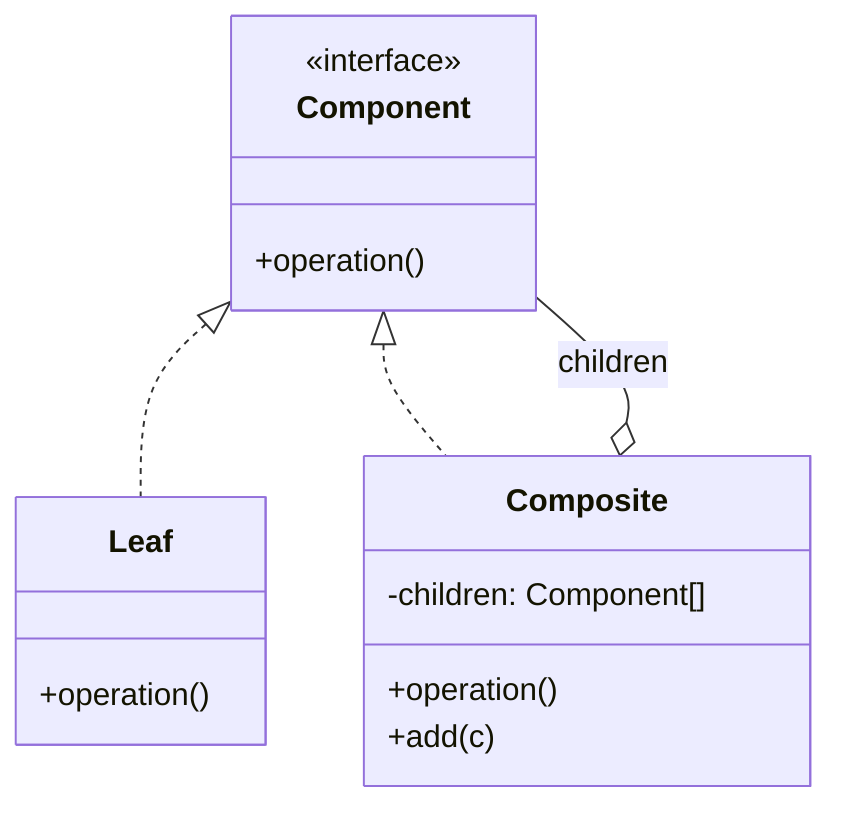
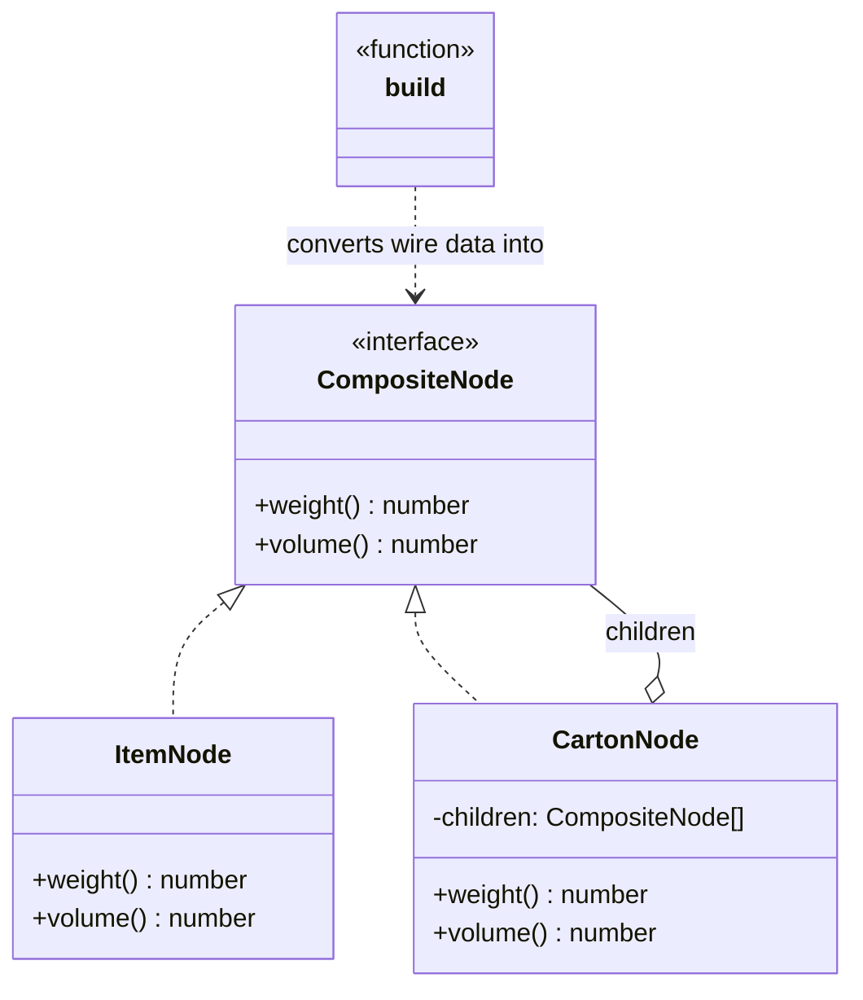

# Walkthrough — Package tree at Ravensgate

Read this **after** you have your own version and your own `CHOICE.md`.

---

## The structure, twice

The GoF diagram. A `Component` interface covers both leaves and composites; a `Composite`
holds a list of `Component` children and implements the interface by delegating to them,
so a caller never has to know which kind of node it's holding:

This exercise's names:

**On the mapping.** The book's `Component` is usually the type callers hold directly - a tree
built once, out of composite objects, and kept that way. Here the tree crosses this exercise's
frozen boundary as plain data (`types.ts`'s `Item`/`Carton`, the same shape `src/` and every
other candidate share), so `build()` exists to convert that data into a real
`ItemNode`/`CartonNode` graph on every call, rather than once. That conversion step isn't in
the book diagram at all - it's the cost of getting real polymorphic dispatch in a codebase
where the tree's *wire* shape has to stay a plain, comparable, testable value.

**On the name.** `CompositeNode`, not `PackageComponent` or `Node`. `Node` fails question 2
from [`docs/NAMING.md`](../../../../../docs/NAMING.md) - `PackageNode` is already the name of
this exercise's *wire* type in every candidate's `types.ts`, and reusing "Node" bare for the
composite-side type would make two different things answer to nearly the same name in the same
file.

**On the name, a second time.** `build`, not `convert` or `fromData`. `convert` fails question
4 - it's true of nearly any function that changes a value's shape, and doesn't say which
direction: `build` says a composite comes out, which is the one thing this function's callers
actually need to know.

**On the name, a third time.** `weight`/`volume`, not `getWeight`/`getVolume`. This repository's
own convention (`docs/NAMING.md`'s notes on the book's role names) prefers a name that reads
well at the call site - `build(node).weight()` reads as a question answered, where
`build(node).getWeight()` adds a verb prefix that promises nothing `weight()` alone doesn't.

---

## Why this route doesn't absorb act 2

Composite answers act 1's question cleanly: every node, leaf or carton, answers `weight()` and
`volume()` the same way, and neither `totalWeight` nor `totalVolume` has to know which kind of
node it's looking at. Act 2 asks for two things at once - a new node kind (`Pallet`) and a new
operation (`itemCount()`) - and this pattern is built to make exactly one of those two changes
free. A new node kind alone would have been one new class, `PalletNode`, satisfying the
existing interface - cheap. A new operation alone would have meant one new method on the
interface and on every existing class - already the expensive direction, but at least bounded
by "the classes that already exist." Act 2 makes both changes land on the *same* new class at
once: `PalletNode` has to exist **and** implement `itemCount()` **and** every pre-existing
class (`ItemNode`, `CartonNode`) has to grow the same method too. `docs/TYPESCRIPT.md`'s own
framing of this trade - "the union makes adding an operation free and adding a variant a
compile error everywhere... polymorphism inverts it" - names precisely why this route pays for
the operation side of that inversion here, three times over. See [ACT2.md](./ACT2.md) for the
measured version of this argument.

---

## Where TypeScript changes this

[`docs/TYPESCRIPT.md`](../../../../../docs/TYPESCRIPT.md) marks Composite "Unchanged. A
discriminated union of node types is the TS-flavoured variant" - which is a direct hint that
the classic class-based form this route uses is the less idiomatic of this exercise's three
candidates in TypeScript specifically. This route pays a cost the union candidates don't:
`build()` exists purely because the frozen wire type has to stay a union (for the tests, and
for every other candidate to share it), so this is the one route doing real conversion work
that a discriminated union sidesteps by simply *being* the data.

---

## What it cost

- **A conversion pass on every call.** `totalWeight`/`totalVolume`/`totalItemCount` each
  rebuild the whole composite graph from scratch via `build()` - real object allocation the
  other two candidates don't pay, for a tree that's already been walked once by whatever
  constructed the wire-format data in the first place.
- **Three classes for three node kinds, each repeating the same shape.** `PalletNode`'s
  `volume()` is byte-for-byte identical to `CartonNode`'s - nothing shares that logic, because
  each class exists to be a self-contained answer to "what is a pallet," not to minimise
  duplication with its siblings.
- **See [ACT2.md](./ACT2.md) for the actual price** of the pallet-and-item-count requirement,
  measured, and for how the other two candidates fared against the same requirement.

## What act 2 showed

See [ACT2.md](./ACT2.md) for the numbers: 50 lines and 6 hunks here, against 26 lines and 4
hunks with no pattern at all, and the most expensive of all four measured routes. The shape of
the loss matters as much as the size: more than half the new lines are `PalletNode`, a whole
new class needed just to hold one extra number (`tareWeightKg`) and reimplement summing logic
every other class already has.
