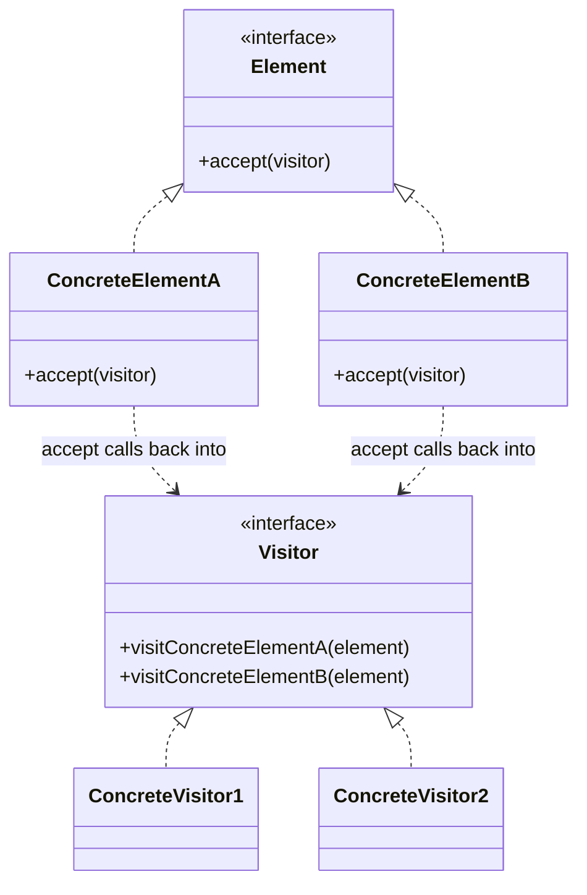
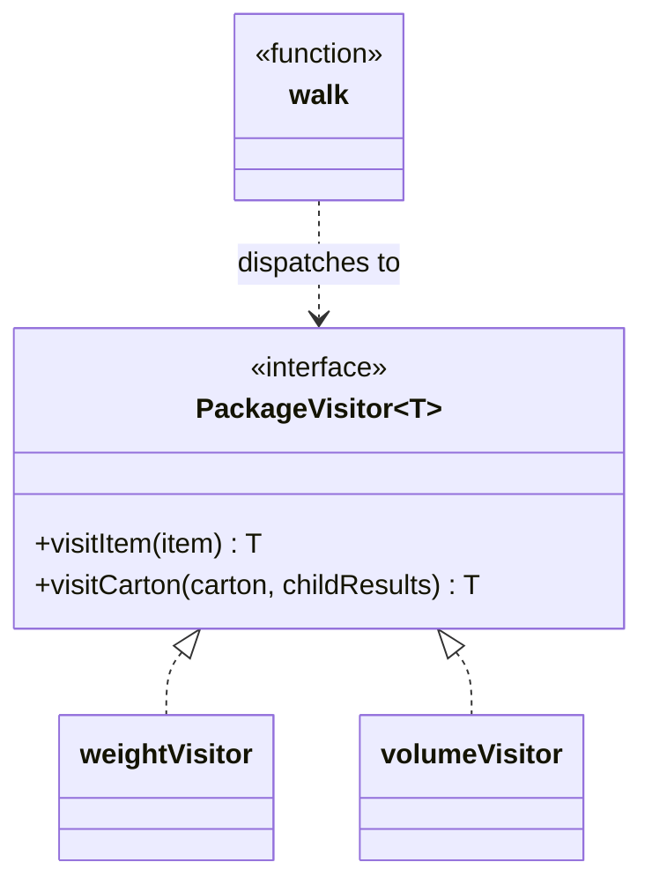

# Walkthrough — Package tree at Ravensgate

Read this **after** you have your own version and your own `CHOICE.md`.

---

## The structure, twice

The GoF diagram. Every `Element` implements `accept(visitor)`, which calls back into the
matching `visit*` method on whatever `Visitor` it's handed - double dispatch, so adding a new
operation means writing one new `Visitor` and touching no `Element` at all:

This exercise's names:

**On the mapping.** The book's elements implement `accept(visitor)` themselves - double
dispatch, decided by the object's own class. Here the tree is plain data crossing this
exercise's frozen boundary (`types.ts`'s `Item`/`Carton`, no methods at all), so there's no
object to call `accept` on. `walk()` does the dispatch instead, with an ordinary
`if (node.kind === ...)` standing in for what the book gets from method resolution. The
*shape* of Visitor - one method per node kind, one object per operation - survives the
translation; the *mechanism* (double dispatch through the elements themselves) doesn't, because
the elements have no methods to dispatch through.

**On the name.** `PackageVisitor`, not `PackageOperation` or `TreeVisitor`. `TreeVisitor`
fails question 2 from [`docs/NAMING.md`](../../../../../docs/NAMING.md) - this repository has
other trees in other exercises, and "tree" alone doesn't say which domain this visitor
belongs to the way "package" does.

**On the name, a second time.** `walk`, not `dispatch` or `visit`. `visit` collides with the
interface's own method names (`visitItem`, `visitCarton`) - question 2 again - and would make
"call `visit`" ambiguous between "call the dispatcher" and "call one of the visitor's own
methods."

**On the name, a third time.** `weightVisitor`/`volumeVisitor`, the two objects, not
`weightOp`/`volumeOp`. `Op` fails question 4 - "operation" is accurate but generic, and this
repository's own convention (visible across its behavioral drills) names a concrete visitor
after what it computes, not after the pattern role it fills.

---

## Why this route doesn't absorb act 2

Visitor answers act 1's question cleanly: `totalWeight` and `totalVolume` are two small,
independent objects, and neither `walk()` nor the tree itself has to change to add a third.
Act 2 asks for two things at once - a new operation (`totalItemCount`) and a new node kind
(`Pallet`) - and this pattern is built to make exactly one of those two changes free. The new
operation alone would have been one new visitor object, `itemCountVisitor` - cheap, and this
route's real strength. But the new node kind means `PackageVisitor<T>` itself grows a third
method, `visitPallet`, and every visitor that already existed - `weightVisitor`,
`volumeVisitor` - has to implement it too, whether or not a pallet means anything special for
that particular total (it doesn't, for volume and item count, which both just ignore the
tare - but the method still has to be written). `docs/TYPESCRIPT.md`'s own framing of this
trade - "the union makes adding an operation free and adding a variant a compile error
everywhere... polymorphism inverts it" - names exactly why this route pays for the node-kind
side of that inversion here. See [ACT2.md](./ACT2.md) for the measured version of this
argument.

---

## Where TypeScript changes this

[`docs/TYPESCRIPT.md`](../../../../../docs/TYPESCRIPT.md) describes Visitor in TypeScript as
"a discriminated union and an exhaustive `switch`, with the compiler as the net" - and that's
almost exactly what `walk()` is here, with `PackageVisitor<T>` standing in for the union's
`switch` arms as named, reusable methods instead of inline `case`s. The same document's note
that this pattern "lives exactly on this line" between the union and the class hierarchy is
the honest summary of this route: closer to the union than Composite is (no object graph to
build), but still paying an interface's cost for every new node kind, which a bare `switch`
inside a single function - this exercise's third candidate - doesn't.

---

## What it cost

- **`PackageVisitor<T>`'s two methods have to be implemented by every visitor, even when one
  of them is nearly a no-op for that total.** `volumeVisitor.visitPallet` exists solely to say
  "ignore the tare, sum the children" - a case `weightVisitor`'s `visitPallet` doesn't share.
- **A visitor object per operation means one more file's worth of boilerplate for every new
  total**, even a trivial one - `itemCountVisitor` is three lines of real logic wrapped in an
  object literal that satisfies a three-method interface.
- **See [ACT2.md](./ACT2.md) for the actual price** of the pallet-and-item-count requirement,
  measured, and for how the other two candidates fared against the same requirement.

## What act 2 showed

See [ACT2.md](./ACT2.md) for the numbers: 34 lines and 5 hunks here, against 26 lines and 4
hunks with no pattern at all, and more expensive than
[`plain-recursion`](../plain-recursion/ACT2.md)'s 44 lines on hunks despite fewer total lines.
The shape of the loss matters as much as the size: most of the five hunks are one-line
`visitPallet` additions, repeated once per existing visitor - the same interface-growth cost
[`solutions/composite/ACT2.md`](../composite/ACT2.md) pays from the opposite direction.
