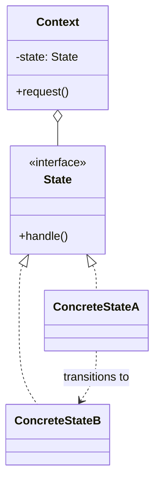
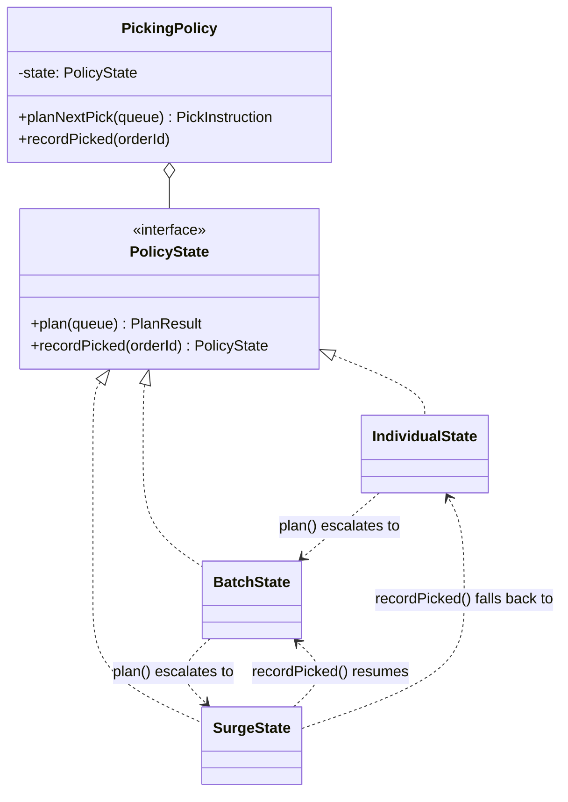

# Walkthrough — Picking policy at Ravensgate

Read this **after** you have your own version and your own `CHOICE.md`.

---

## The structure, twice

The GoF diagram. A `Context` holds a reference to the current `State` and
delegates to it; each `ConcreteState` implements the behaviour for one
mode, and decides for itself when the context should move to a different
state:



This exercise's names:



**On the mapping.** `PickingPolicy` is GoF's `Context`, but it holds
almost no logic of its own - `planNextPick` and `recordPicked` are both
one line of delegation. That's deliberate: the moment `PickingPolicy`
starts making decisions about *when* to change mode, it has taken back
the responsibility the pattern exists to hand off. Every transition in
this exercise - entering batch, escalating to surge, resuming a suspended
batch, falling back to individual - is decided inside a state's own
`plan()` or `recordPicked()`, never inside `PickingPolicy`.

**On the mapping, a second time.** `plan()` returns `{ instruction, next
}` instead of mutating `this.state` on the context directly, which is a
small departure from the textbook shape (where a state typically calls
`context.setState(...)` on the object holding it). The reason: a state
that reaches back into its container to mutate it needs a reference to
that container, which means every state constructor takes a `PickingPolicy`
it mostly ignores. Returning the next state and letting `PickingPolicy`
assign it keeps every state's constructor about the one thing it actually
needs - `BatchState` takes an order-id set, nothing else.

**On the name.** `PolicyState`, not `Mode` or `PickingState`. `Mode` fails
question 2 from [`docs/NAMING.md`](../../../../../docs/NAMING.md) - the
exercise already uses "mode" informally in prose for the *concept* of
individual/batch/surge, so naming the *interface* the same word would let
two different things answer to one name. `PickingState` fails question 1:
it describes what kind of thing it is (a state, belonging to picking) but
not what it's *for* - `PolicyState` says the interface exists to give
`PickingPolicy` states to hold.

**On the name, a second time.** `SurgeState`, not `PriorityState` or
`UrgentState`. `UrgentState` fails question 4 - it would be describing the
instruction's `urgent` flag, not the state itself, and the flag is a
*consequence* of being in this state, not a synonym for it. `SurgeState`
names the domain event (a surge in waiting orders) that causes the
transition, which is the same naming choice `BatchState` already made -
neither is named after what it returns.

**On the name, a third time.** `plan`, not `next` or `compute`. `next`
collides with the field it assigns to (`next: PolicyState` in the very
same return value) badly enough that `state.next()` would read as "the
next state" when it actually means "the next instruction" - question 3
from `docs/NAMING.md` (does it read well at the call site) rules it out.
`plan` matches the noun the whole domain already uses -
`planNextPick`, the frozen function every caller calls.

---

## Why this candidate, over the other two

Both Strategy and Template Method were live options through most of act 1
- either one produces working code that passes every act-1 test, and
`solutions/strategy/` and `solutions/template-method/` in this repo prove
it. What decided it, before act 2 ever showed up: **the behaviour here
depends on a mode, and the mode itself transitions, and the transition
rule is not incidental - it's the entire point of the exercise** ("stay in
batch until *this exact set* of orders is gone," "surge suspends the
batch rather than replacing it"). State is the one candidate whose whole
job is owning a transition. Strategy swaps *behaviour*; it has nothing to
say about *when* to swap it. Template Method varies a *step inside one
algorithm*; it has nothing to say about switching to a different algorithm
at all. Both gaps get filled the same way in both losing routes: a
wrapper class ends up holding the transition logic externally, which is
worth reading in
[`solutions/strategy/WALKTHROUGH.md`](../strategy/WALKTHROUGH.md) and
[`solutions/template-method/WALKTHROUGH.md`](../template-method/WALKTHROUGH.md).

This is also, almost word for word, the comparison GoF's own book draws:
*State*'s *Related Patterns* section discusses Strategy directly, and the
distinction it lands on is the same one act 2 measures here - a `State`
object is expected to know about, and trigger, its own replacement; a
`Strategy` object is not.

---

## Step 1 — the interface that owns its own transitions

```ts
export interface PolicyState {
  readonly name: "individual" | "batch" | "surge";
  plan(queue: readonly Order[]): PlanResult;
  recordPicked(orderId: string): PolicyState;
}
```

Both methods return something the state itself decided - `plan` returns
the state to hold *after* this call (usually itself; `IndividualState`
returns a fresh `BatchState` the moment the threshold is crossed), and
`recordPicked` returns the state to hold after this pick is recorded. A
caller never asks "what mode are we in now?" before deciding what to do
next - it just calls the current state and keeps whatever comes back.

---

## Where TypeScript changes this

[`docs/TYPESCRIPT.md`](../../../../../docs/TYPESCRIPT.md) lists State as
barely changed from the book - "a discriminated union covers the data;
the transitions still want objects" - and this exercise is a clean
illustration of why. `PickInstruction` itself *is* a discriminated union
(`mode: "individual" | "batch"`), and a `switch` over it would happily
replace `IndividualState`/`BatchState`'s *output* shape. What a union
can't express is `BatchState`'s **own decision, mid-call, to hand off to
`SurgeState`** - that's a transition with its own guard condition
(`waiting.length >= SURGE_THRESHOLD`) and its own snapshot to take (`new
Set(waiting.map(...))`), and neither of those belongs in a value type.
Objects earn their keep here specifically because the thing varying is
behaviour-with-memory, not just shape.

---

## What it cost

- **Four files instead of one.** `src/`'s whole picking-policy lives in
  one function; this route's lives in `policy.ts` plus three state
  classes. Reading "what happens when a batch is running and three orders
  pile up outside it" means opening `batch-state.ts`, and reading the
  full state machine end to end means opening all four.
- **`BatchState` and `SurgeState` know about each other by name.** Not a
  large cost - each still only decides its *own* transitions - but it is
  a small crack in the promise that states are independent: `BatchState`
  constructs a `SurgeState` directly, and `SurgeState` constructs
  `BatchState` back.
- **See [ACT2.md](./ACT2.md) for the actual price** of the third mode,
  measured, and for how the other two candidates fared against the same
  requirement.

## What act 2 showed

See [ACT2.md](./ACT2.md) for the numbers: 12 lines and 4 hunks here,
against 31 lines and 5 hunks with no pattern at all, and worse than that
on both of the other two candidates. The shape of the win matters as much
as the size: the new mode is a new *file*, not a wider `if` chain inside
an existing one, and the one existing file it does touch
(`batch-state.ts`) changes for a single, nameable reason - "I might need
to hand off to a surge" - not three unrelated reasons stacked on top of
each other.
