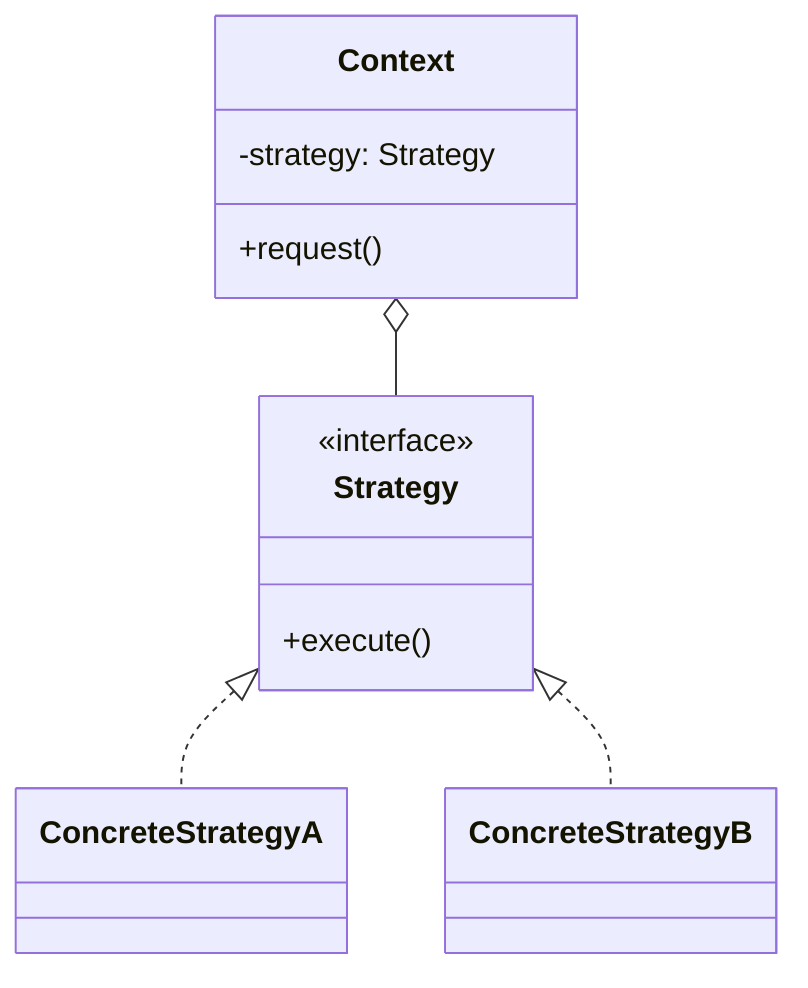

# Walkthrough — Picking policy at Ravensgate, the Strategy route

Read this **after** you have your own version. This route does not absorb
act 2 - [`solutions/state/`](../state/WALKTHROUGH.md) is the one this
repository considers the better fit, and its walkthrough makes the case
for why. This file is here because a candidate you didn't pick is still
worth understanding, in code, not just in the abstract.

---

## The structure, twice

The GoF diagram. A `Context` holds a reference to a swappable `Strategy`
and delegates one operation to it; nothing about `Strategy` knows, or
needs to know, when it gets swapped for a different one:



This exercise's names:

```mermaid
classDiagram
    class PickingPolicy {
        -mode: "individual" | "batch"
        -batchOrderIds: Set~string~
        +planNextPick(queue) PickInstruction
        +recordPicked(orderId)
    }
    class RoutingStrategy {
        <<function type>>
        (queue, orderIds) PickInstruction
    }
    class individual {
        <<function>>
    }
    class batch {
        <<function>>
    }
    PickingPolicy ..> RoutingStrategy : strategies[mode]
    RoutingStrategy <|.. individual
    RoutingStrategy <|.. batch
```

**On the mapping.** This is the diagram's honest shape, and also its
honest limit: `Context` in the book diagram is drawn with no internal
state of its own beyond *which* strategy it holds - the strategy is meant
to be the only thing that varies. Here, `PickingPolicy` keeps `mode` and
`batchOrderIds` as its **own** fields, not because this implementation is
wrong, but because nothing about `RoutingStrategy`'s shape - a pure
function from a queue to an instruction - has anywhere to put "remember
this across calls." `Context` holding real state alongside the swappable
part is the tell that Strategy is answering a narrower question here than
the domain is asking.

**On the name.** `RoutingStrategy`, not `PickingStrategy`. `PickingStrategy`
fails question 2 from
[`docs/NAMING.md`](../../../../../docs/NAMING.md) - "picking" is the
domain this entire exercise lives in, so a type named after it names
everything and nothing. `RoutingStrategy` says what the function actually
decides: which bin, and which orders, a picker is routed to next.

**On the name, a second time.** `strategies`, plural, a `Record`, not
`StrategyFactory` or `StrategyRegistry`. Neither of those nouns would be
true (question 4): nothing here manufactures a strategy per call, and
nothing registers one at runtime - it's a fixed lookup table, two entries,
known at compile time. Naming it a "factory" or "registry" would promise
machinery this code doesn't have.

**On the name, a third time.** `individual` and `batch`, not
`IndividualStrategy`/`BatchStrategy`. Both are already values of the
`RoutingStrategy` function type, so a `Strategy` suffix would repeat
information the declaration site already carries - the same rule
[`docs/NAMING.md`](../../../../../docs/NAMING.md)'s table gives for
`ConcreteStrategy`: name the role from the domain, and let the
declaration (`const individual: RoutingStrategy = ...`) do the mapping.

---

## Why this route doesn't absorb act 2

Strategy answers "which behaviour runs right now," cleanly. It has
nothing to say about the question act 2 turns out to be about: **when does
the behaviour change, and what has to be remembered across that change.**
`individual` and `batch` stayed almost untouched by act 2 - `strategies.ts`
gained a three-line `surge` entry that reuses `batch`'s own body. Every
real cost landed in `PickingPolicy` itself, which was already the one
place holding `mode` and `batchOrderIds`, and which had no narrower unit
to hand the new transition logic to. See [ACT2.md](./ACT2.md) for the
measured version of this argument.

---

## What it cost, even in act 1

- **The strategies are pure and small, but they were never going to be
  where the interesting logic lived.** `individual` is three lines,
  `batch` is four. The entire weight of "which mode are we in, and when
  does that change" sits in `PickingPolicy`, which this pattern doesn't
  touch.
- **`strategies[this.mode]` is a lookup that can't fail at compile time
  for the wrong reason** - `mode`'s type is exactly `"individual" |
  "batch"`, so TypeScript does guarantee the key exists. What it doesn't
  guarantee is that `batchOrderIds` is defined when `"batch"` is selected;
  that's still a runtime invariant this code enforces by construction, not
  by type.

## What act 2 showed

See [ACT2.md](./ACT2.md): 58 lines touched, worse than both
[`state`](../state/ACT2.md)'s 12 and the no-pattern baseline's 31. Nearly
all of it landed in `PickingPolicy.planNextPick` and `.recordPicked`,
which both grew a second mode check on top of the one act 1 already gave
them.
