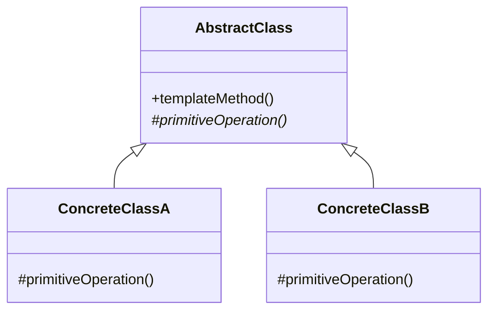
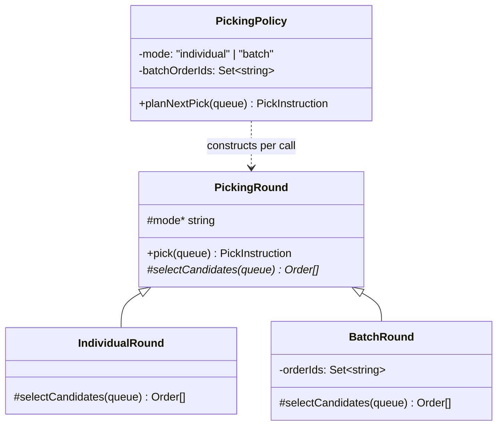

# Walkthrough — Picking policy at Ravensgate, the Template Method route

Read this **after** you have your own version. This route does not absorb
act 2 - [`solutions/state/`](../state/WALKTHROUGH.md) is the one this
repository considers the better fit, and its walkthrough makes the case
for why. This file is here because a candidate you didn't pick is still
worth understanding, in code, not just in the abstract.

---

## The structure, twice

The GoF diagram. An abstract class fixes the shape of an algorithm in one
method and defers individual steps to subclasses:

This exercise's names:

**On the mapping.** `pick()` is the template method - fixed shape, "select
candidates, then group around the oldest" - and `selectCandidates` is the
one step that varies. The mapping is honest and it is also thin: there is
exactly **one** varying step, and the "shared" part of the skeleton
(`oldest`, then filter by matching bin) is three lines. Template Method
earns its keep when a skeleton has several steps and a family of
variants shares most of them; a one-step skeleton is closer to "a
function that takes another function" than to the pattern this diagram is
drawn for.

**On the name.** `PickingRound`, not `PickingTemplate` or
`AbstractPickingStrategy`. `PickingTemplate` fails question 4 from
[`docs/NAMING.md`](../../../../../docs/NAMING.md) - nothing in this
domain calls anything a "template," and borrowing the pattern's own
vocabulary as a class name is exactly what that document's table warns
against for GoF role names. `PickingRound` is a word Ravensgate's own
domain would use: one pass through the queue, computing one instruction.

**On the name, a second time.** `selectCandidates`, not `getCandidates` or
`filter`. `getCandidates` would violate this repo's own convention (from
`docs/NAMING.md`'s "repo's conventions" section: no `get*` that sometimes
fails) - though this one never fails, the convention exists so a reader
never has to check. `selectCandidates` says what the step *does*
(chooses a subset) rather than merely what it returns.

**On the name, a third time.** `mode`, not `kind` or `type`. `type` would
collide with TypeScript's own keyword-adjacent vocabulary badly enough
that `this.type` reads as metadata rather than domain state (question 4 -
is it true - a reader expects `type` to be about the *shape* of the
object, not its *current behaviour*). `mode` is the word act 1's own
`PickInstruction.mode` field already uses for the same concept, so this
class doesn't introduce a second name for one idea.

---

## Why this route doesn't absorb act 2

The round classes look like they might be doing what State's classes do -
one file, one class, per mode - which is exactly the resemblance this
exercise's `README.en.md` asks you to look past before committing to
`--because`. A round answers "given this pool of orders, what's the
instruction?" It has no method for "should we be looking at a different
pool right now?" - that question, and the surge escalation act 2 adds on
top of it, has nowhere to go but `PickingPolicy`, which already held
`mode` and `batchOrderIds` from act 1. Surge didn't even earn a
`SurgeRound` class: it's `BatchRound`, pointed at a different id set, with
`urgent: true` added from outside. See [ACT2.md](./ACT2.md) for the
measured version of this argument.

---

## What it cost, even in act 1

- **The skeleton (`pick()`) is three lines shared between two subclasses
  that only ever differ in one line each.** That's a real but small win -
  `IndividualRound` and `BatchRound` can't drift out of sync on how
  grouping works, because there's only one implementation of it.
- **`PickingPolicy` still had to know how to build the right round** -
  `new IndividualRound()` or `new BatchRound(this.batchOrderIds!)` - and
  still had to track `mode` and `batchOrderIds` itself to know which. The
  pattern moved *how to group a candidate pool* out of the wrapper; it did
  not move *which pool, and when* out of it.

## What act 2 showed

See [ACT2.md](./ACT2.md): 39 lines touched, worse than
[`state`](../state/ACT2.md)'s 12 and worse than the no-pattern baseline's
31, despite editing the same number of files (2) as the baseline.
`rounds.ts` didn't change at all - every line landed in `policy.ts`,
because that's the only file that was ever going to know a third mode
existed.
