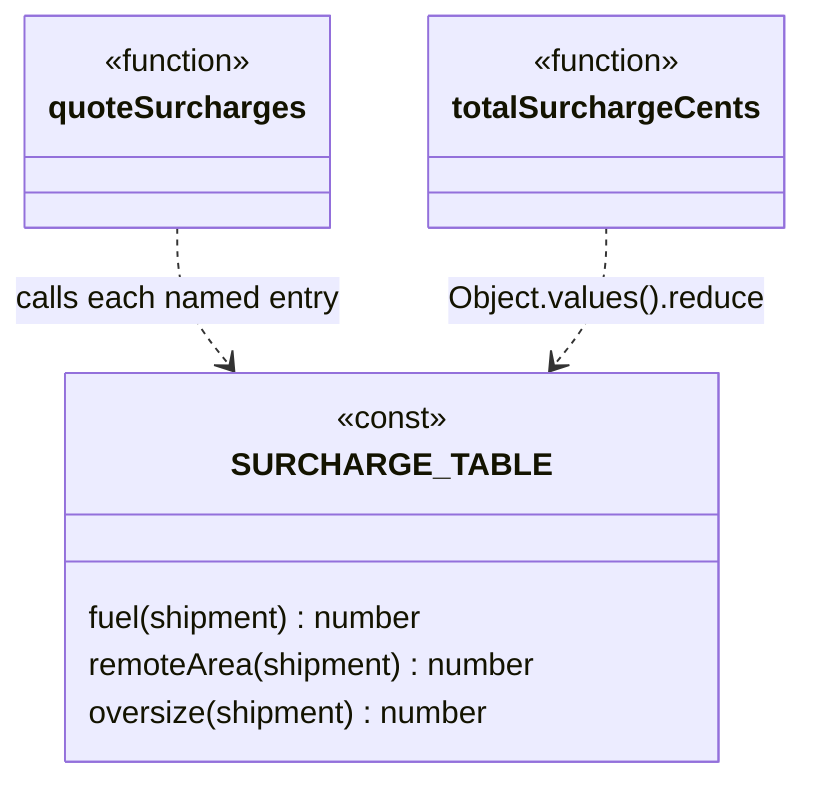

# Walkthrough — Surcharge rules at Ravensgate

Read this **after** you have your own version and your own `CHOICE.md`.

---

## The structure

This candidate isn't one of the 23 GoF patterns, so there's no book diagram to map against -
that's the point of offering it as a candidate at all. What it is: one `Record` maps each
surcharge's name to a pure function of the shipment, and both entry points call into it instead
of repeating the computation:

**On the mapping.** [`docs/TYPESCRIPT.md`](../../../../../docs/TYPESCRIPT.md)'s own "Strategy,
verified" section names this shape directly - "the four-line version," `Record<string, Rank>`
- as the idiomatic TypeScript alternative to a full Strategy hierarchy, for exactly the case
where nothing needs a second member beyond the function itself. This route is that shape,
applied to three surcharges instead of one ranking policy.

**On the name.** `SURCHARGE_TABLE`, not `SURCHARGES` or `RULES`. `SURCHARGES` fails question 2
from [`docs/NAMING.md`](../../../../../docs/NAMING.md) - [`solutions/strategy`](../strategy/WALKTHROUGH.md)
already uses that exact name for its own list, and a reader comparing routes needs each name to
say which shape it is, not just what it's a collection of. `TABLE` says this one is a
lookup, not a strategy list or a rules list.

**On the name, a second time.** `.fuel`/`.remoteArea`/`.oversize`, not `.calcFuel`/`.calcRemote`.
Question 3 - `SURCHARGE_TABLE.remoteArea(shipment)` reads as "look up the remote-area rule and
call it"; a `calc` prefix on every key would repeat what's already obvious from being a value
in this particular table.

**On the name, a third time.** `SURCHARGE_TABLE`, not `SURCHARGE_FUNCTIONS`. Question 4 -
`FUNCTIONS` would be true of any collection of functions in this file, including ones that
aren't surcharges at all (`isOversize`, the shared helper); `TABLE` is specific to the one
`Record` this file is actually organised around.

---

## Why this candidate doesn't absorb act 2

Every entry in `SURCHARGE_TABLE` is a pure function of the shipment alone - the same isolation
[`solutions/strategy`](../strategy/WALKTHROUGH.md) has, without the class ceremony. Act 2's
hazmat surcharge needs to know whether two *other* entries already produced a non-zero amount,
and nothing in this shape lets one entry call another's result rather than the raw shipment -
so `hazmat`'s function re-derives `destination === "remote"` and re-derives the oversize check,
duplicating logic `remoteArea` and `oversize` already have. See
[`solutions/rules-list`](../rules-list/WALKTHROUGH.md) for the candidate built specifically to
avoid that duplication - it **would have absorbed** the requirement without re-deriving
anything, by giving each rule access to what ran before it.

---

## Where TypeScript changes this

[`docs/TYPESCRIPT.md`](../../../../../docs/TYPESCRIPT.md)'s own framing of Strategy - "a bet
that the varying thing will grow a second member" - applies to this route too, and the bet
looks won at first glance: no class, no interface, four lines per surcharge. But act 2 isn't
asking for a second *member* on any one surcharge; it's asking one surcharge to see another's
*result*, which a table of isolated functions doesn't provide any more than a table of isolated
classes would. The measured numbers below show the real, narrower saving this shape still
buys over Strategy - no class ceremony - without the shape solving the actual problem either
way.

---

## What it cost

- **The `hazmat` entry duplicates `remoteArea`'s and `oversize`'s conditions** rather than
  reading their results - a real, silent maintenance risk: if either threshold or condition
  ever changes, this entry has to be remembered and changed too, with nothing enforcing that.
- **`Object.values(SURCHARGE_TABLE)` has no guaranteed order** a reader can rely on for
  anything - which is fine while every entry is independent, and would become a real problem if
  a future rule needed to read a sibling's *value* rather than re-derive it.
- **See [ACT2.md](./ACT2.md) for the actual price** of the hazmat-surcharge requirement,
  measured, and for how the other two candidates fared against the same requirement.

## What act 2 showed

See [ACT2.md](./ACT2.md) for the numbers: 14 lines and 3 hunks here - cheaper than
[`strategy`](../strategy/ACT2.md)'s 16 lines and 4 hunks, but more lines and one more file than
the no-pattern baseline's 10 lines and 2 files, and more lines than the winning
[`rules-list`](../rules-list/ACT2.md)'s 8. Ties the baseline on hunks - both this route and
`src/` land the whole change in a small number of contiguous edits, just spread across one more
file here.
