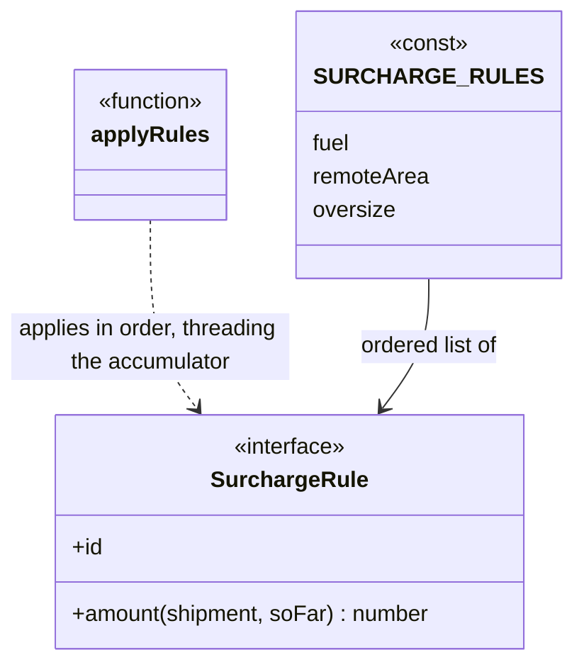

# Walkthrough — Surcharge rules at Ravensgate

Read this **after** you have your own version and your own `CHOICE.md`.

---

## The structure

This candidate isn't one of the 23 GoF patterns, so there's no book diagram to map against -
that's the point of offering it as a candidate at all. What it is: an ordered array of rules,
applied one at a time, where each rule's `amount` function receives an accumulator of every
surcharge already computed earlier in the list - not just the raw shipment:

**On the mapping.** There's no `Strategy` interface here, and no `Record` of isolated
functions either - the one thing this shape adds over
[`solutions/lookup-table`](../lookup-table/WALKTHROUGH.md) is the `soFar` parameter, threading
every prior result forward. That's closer to `Array.prototype.reduce`'s own shape than to any
GoF pattern: an accumulator, and a function that reads it.

**On the name.** `SurchargeRule`, not `Strategy` or `SurchargeHandler`. `Handler` fails
question 2 from [`docs/NAMING.md`](../../../../../docs/NAMING.md) - Chain of Responsibility,
used elsewhere in this repository (`order-events`), already uses "handler"/"link" for something
with a materially different capability (stopping the rest of the chain, which this shape
doesn't do - every rule always runs). `Rule` says what these actually are: a named computation,
nothing more.

**On the name, a second time.** `soFar`, not `context` or `accumulator`. Question 3 - `amount:
(shipment, soFar) => ...` reads as "the shipment, and what's happened so far," where `context`
or `accumulator` are generic words that say nothing about *what* has accumulated.

**On the name, a third time.** `applyRules`, not `reduceRules` or `runRules`. `reduceRules`
fails question 1 - it says *how* the function works (a reduce) rather than *what* it does
(applies each rule to produce a full breakdown); a caller of `quoteSurcharges` never needs to
know a `reduce` is involved.

---

## Why this candidate, over the other two

Both Strategy and a lookup table were live options through all of act 1 - either one produces
working code that passes every act-1 test, and `solutions/strategy/` and
`solutions/lookup-table/` in this repository prove it. What decided it, once act 2 arrived:
**act 2's hazmat surcharge needs to read two other surcharges' results**, and neither Strategy
nor the lookup table has a place for one entry to read another's output - each is built so
every entry only ever sees the raw shipment. This candidate's `soFar` parameter exists for
exactly that: the `hazmat` rule reads `soFar.remoteArea` and `soFar.oversize` directly, instead
of re-deriving `destination === "remote"` and the dimension check the way both other candidates
have to. See [`solutions/strategy/WALKTHROUGH.md`](../strategy/WALKTHROUGH.md) and
[`solutions/lookup-table/WALKTHROUGH.md`](../lookup-table/WALKTHROUGH.md) for how each of those
routes actually fared against the same change - and for what **would have absorbed** the
requirement more cheaply in raw line count than either of them managed.

---

## Where TypeScript changes this

[`docs/TYPESCRIPT.md`](../../../../../docs/TYPESCRIPT.md) doesn't have a row for "an ordered
rules list with an accumulator" - it isn't a pattern - but its "Strategy, verified" section's
warning generalises here too: structure is a bet on what the varying thing will need later.
This route's bet was specifically that a future rule might need to see a sibling's result, not
just the shipment - and act 2 paid that bet off directly, unlike the other two candidates'
narrower "isolated function" bet.

---

## What it cost

- **`soFar`'s type is a loose `Record<string, number>`**, not a typed shape naming exactly
  which prior fields exist - a rule can read `soFar.anything` and get `undefined` silently if
  it asks for a key that doesn't exist yet at its position in the list, rather than a compile
  error.
- **Rule order is now load-bearing in a way it wasn't for the other two candidates.** `hazmat`
  has to sit after `remoteArea` and `oversize` in `SURCHARGE_RULES` - correct here because
  that's also how the array reads naturally, but nothing enforces it, and a rule reordered
  above its dependencies would silently read stale zeros.
- **See [ACT2.md](./ACT2.md) for the actual price** of the hazmat-surcharge requirement,
  measured, and for how the other two candidates fared against the same requirement.

## What act 2 showed

See [ACT2.md](./ACT2.md) for the numbers: 8 lines here - fewer than any of the other three
measured routes, including the no-pattern baseline's 10 - but 4 hunks, one more than the
baseline's 3. The shape of the win and the shape of the loss are both real: the actual business
logic (a new rule, reading two fields instead of re-deriving them) is genuinely the smallest of
any route, but it's spread across three separate touch points (the `id` union, the rules array,
the return literal) rather than landing inside two self-contained function bodies the way the
baseline's duplicated-but-contiguous edits do.
