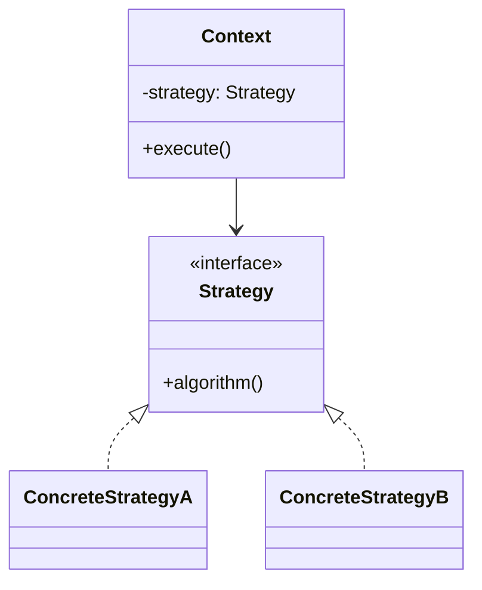
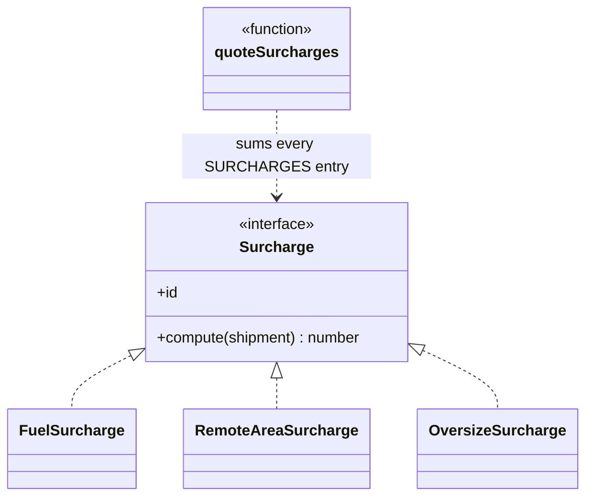

# Walkthrough — Surcharge rules at Ravensgate

Read this **after** you have your own version and your own `CHOICE.md`.

---

## The structure, twice

The GoF diagram. A `Context` holds exactly one `Strategy` and delegates to it; every
`ConcreteStrategy` satisfies the same interface, so the context never needs to know which one
it's holding:

This exercise's names:

**On the mapping.** The book's canonical `Context` holds *one* strategy and picks which
`ConcreteStrategy` to delegate to. `quoteSurcharges` and `totalSurchargeCents` don't pick -
they sum over *all* of `SURCHARGES`, every time. That's a real variant on the pattern: less
"choose an algorithm at runtime," more "apply every rule in a fixed set and combine the
results" - closer to how this module's other choice exercises use Composite or Chain of
Responsibility than to Strategy's usual sorting-algorithm example.

**On the name.** `Surcharge`, not `Strategy`. `Strategy` fails question 2 from
[`docs/NAMING.md`](../../../../../docs/NAMING.md) - it's already the name of the pattern
itself, and reusing it bare for the interface would make the pattern and the interface answer
to the same word in conversation. `Surcharge` says what each implementation actually
represents in this domain.

**On the name, a second time.** `.compute()`, not `.calculate()` or `.getAmount()`. Question 3
- `surcharge.compute(shipment)` reads as a question answered at the call site; `.getAmount()`
adds a verb that doesn't change what the call returns.

**On the name, a third time.** `SURCHARGES`, not `RULES` or `ALL_SURCHARGES`. `RULES` fails
question 2 - this exercise's other two candidates each have their own list of essentially the
same things, named `SURCHARGE_TABLE` and `SURCHARGE_RULES`; a reader comparing all three
routes side by side needs each list's name to say what shape it is, not just that it's a
collection.

---

## Why this route doesn't absorb act 2

Strategy's whole design point is that concrete strategies don't know about each other - that
isolation is exactly what makes them safe to swap independently, and it's a real strength for
act 1's three surcharges, which genuinely are independent of one another. Act 2's hazmat
surcharge breaks that assumption: it needs to know whether *two other* strategies already
applied. Nothing about adding a fourth `Surcharge` implementation is expensive on its own - the
expense is that `HazmatSurcharge.compute(shipment)` has no way to ask `RemoteAreaSurcharge` or
`OversizeSurcharge` what they computed, because the interface was built specifically to prevent
that kind of coupling. It re-derives both conditions from the raw shipment instead, the same
workaround [`solutions/lookup-table`](../lookup-table/WALKTHROUGH.md) needs for the same
reason. See [ACT2.md](./ACT2.md) for the measured cost.

---

## Where TypeScript changes this

[`docs/TYPESCRIPT.md`](../../../../../docs/TYPESCRIPT.md)'s "Strategy, verified" section:
"Strategy is a bet that the varying thing will grow a second member. Lose that bet and you
wrote five files where four lines would have done." That bet was never really on offer here -
what act 2 needed wasn't a second *member* on the `Surcharge` interface (a config value, a
description), it was visibility into sibling results, which neither the class form nor
[`solutions/lookup-table`](../lookup-table/WALKTHROUGH.md)'s four-line `Record` form provides.
The measured cost difference between the two isn't about which one made a better bet - it's
that this route pays class ceremony for a bet that was never winnable either way.

---

## What it cost

- **A fourth class for one re-derived check.** `HazmatSurcharge` exists entirely to answer one
  boolean, and duplicates logic `RemoteAreaSurcharge` and `OversizeSurcharge` already computed
  moments earlier in the same loop.
- **The shared `id` union type has to grow every time**, in lockstep with the class that uses
  it - one more place a fourth surcharge has to be named correctly.
- **See [ACT2.md](./ACT2.md) for the actual price** of the hazmat-surcharge requirement,
  measured, and for how the other two candidates fared against the same requirement.

## What act 2 showed

See [ACT2.md](./ACT2.md) for the numbers: 16 lines and 4 hunks here, the most expensive of all
four measured routes on every dimension - more than the no-pattern baseline (10 lines, 3
hunks), more than [`lookup-table`](../lookup-table/ACT2.md) (14 lines, 3 hunks), and more than
the winning [`rules-list`](../rules-list/ACT2.md) (8 lines, 4 hunks). Isolation that's a real
strength in act 1 has no payoff once the new requirement is specifically about surcharges
*not* being isolated from each other.
