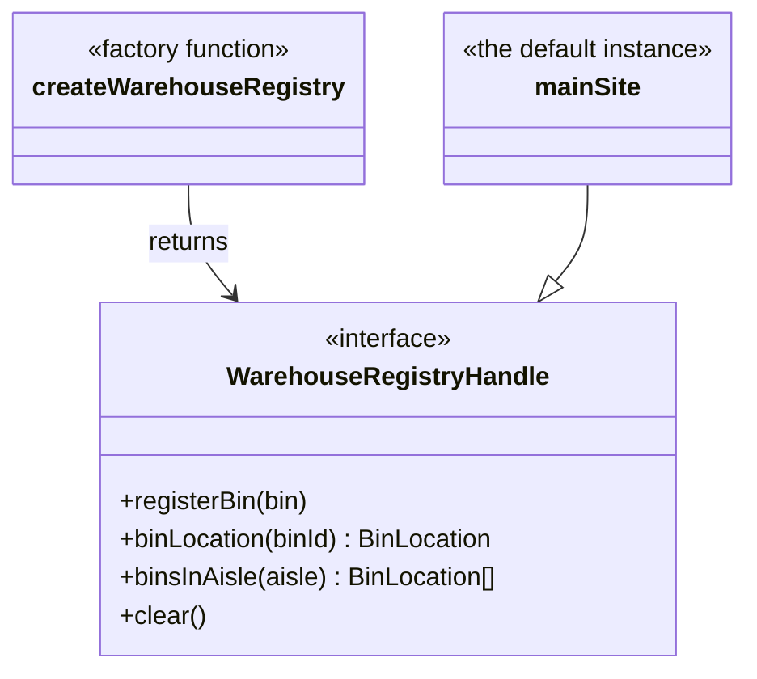

# Walkthrough — Warehouse registry at Ravensgate

Read this **after** you have your own version and your own `CHOICE.md`.

---

## The structure

No GoF diagram to map this candidate against either - `createWarehouseRegistry`
is a plain factory, and `mainSite` is just the one instance the frozen API
happens to reach for by default:

**On the mapping.** There's nothing here that plays Singleton's role, on
purpose: this candidate keeps neither half of the bundle
[`docs/TYPESCRIPT.md`](../../../../../docs/TYPESCRIPT.md) describes -
"there is exactly one" and "anyone can reach it" - because both halves are
exactly what act 2 needs undone.

**On the name.** `WarehouseRegistryHandle`, not `Registry` or
`RegistryInstance`. Question 2 from [`docs/NAMING.md`](../../../../../docs/NAMING.md)
- `Registry` alone reads like it could name the factory function itself or
a static collection; `Handle` signals this is a value a caller holds onto
and passes around, not a thing they reach for globally.

**On the name, a second time.** `mainSite`, not `defaultRegistry` or
`instance`. Question 1 - `mainSite` says *what* this is (the fulfilment
site the frozen API answers on behalf of by default), where
`defaultRegistry` would only restate *how* it's wired up, and `instance`
would smuggle back the "there is exactly one, and this is it" framing this
route is specifically avoiding.

**On the name, a third time.** `clear()`, not `resetForTests()` like
[`solutions/singleton`](../singleton/WALKTHROUGH.md)'s instance method.
Question 4 - here it's true: every registry this factory builds might
legitimately need clearing, in production code as much as in a test, since
nothing marks any one registry as "the" special one whose reset is only
ever a testing escape hatch.

---

## Why this candidate doesn't need to absorb anything

It already has. `createWarehouseRegistry()` existed since act 1 - it just
wasn't part of the frozen public API yet, because act 1 never asked for a
second registry. Act 2 costs exactly one export line, in `index.ts`,
because the shape act 2 needs was already sitting there, unexported, the
whole time. See [ACT2.md](./ACT2.md) for the measured cost.

---

## Why this candidate, over the other two

[`solutions/singleton`](../singleton/WALKTHROUGH.md) has a private
constructor whose entire job is preventing a second instance from existing
- so satisfying act 2 means writing code whose purpose is working around a
guarantee the class makes to everyone else, even though the class itself
makes that workaround relatively cheap (32 lines, see its [ACT2.md](../singleton/ACT2.md)).
[`solutions/module`](../module/WALKTHROUGH.md) has no reusable unit at
all - no class, no factory, just one array wired directly into four
functions - so it pays close to the no-pattern baseline's full price (39
lines, see its [ACT2.md](../module/ACT2.md)) to build a second
implementation from scratch. This route was never built around "exactly
one" to begin with: `registerBin` and friends were always thin bindings to
*a* registry, not privileged access to *the* registry, so there was never
anything to walk back.

---

## What it cost

- **In act 1, this is the most indirection of the three candidates** - a
  reader has to follow `registerBin` through `mainSite.registerBin` through
  `createWarehouseRegistry()`'s closure to find the actual array, where
  [`solutions/module`](../module/WALKTHROUGH.md) puts it one hop away and
  [`solutions/singleton`](../singleton/WALKTHROUGH.md) at least names the
  class holding it.
- **Nothing in act 1 signals that a second registry is coming** - the
  interface and factory are there because building the one default
  registry this way happens to be cheap, not because anyone announced act 2
  in advance.

## What act 2 showed

See [ACT2.md](./ACT2.md) for the numbers: 3 lines and 1 hunk - a single
export line, because `createWarehouseRegistry()` and
`WarehouseRegistryHandle` already existed. Compare
[`singleton`](../singleton/ACT2.md)'s 32 lines (a class to reuse, but a
private constructor to route around) and [`module`](../module/ACT2.md)'s
39 lines (nothing to reuse at all, same as the no-pattern baseline's 38).
