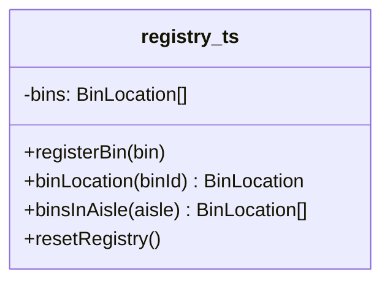

# Walkthrough — Warehouse registry at Ravensgate

Read this **after** you have your own version and your own `CHOICE.md`.

---

## The structure

There's no GoF diagram to map this candidate against - a module isn't a
pattern with a name and an *Intent* section, just a file with state at the
top and functions below it that close over that state:

**On the mapping.** Nothing to map: this route was never trying to be
Singleton. It keeps Singleton's guarantee - "exactly one, shared" - without
the class ceremony, because [`docs/TYPESCRIPT.md`](../../../../../docs/TYPESCRIPT.md)
says a module gives you *exactly one, for free*, no lazy-init dance
required.

**On the name.** `bins`, not `_bins` or `registryBins`. Question 2 from
[`docs/NAMING.md`](../../../../../docs/NAMING.md) - nothing else in this
file could plausibly be called `bins`, so the short name costs nothing.

**On the name, a second time.** `registerBin`/`binLocation`/`binsInAisle`
are exported with the exact names the frozen public API uses - not
`register`/`lookup`/`byAisle`. Question 3: at the call site, `import {
binLocation } from "./registry.ts"` already carries "a location, keyed by
bin" without the module name doing any of that work, so shortening it
further would only save characters, not meaning.

**On the name, a third time.** `resetRegistry()`, not `clear()` or
`reinit()`. Question 4 - it has to stay true across every candidate this
exercise ships, since the frozen tests call it by that name regardless of
which route is active.

---

## Why this candidate doesn't absorb act 2

A module gives you *exactly one* instance per process, for free - the same
half of Singleton's bundle that [`solutions/singleton`](../singleton/WALKTHROUGH.md)
keeps. But a module has no reusable unit to build a second instance from:
there's no class to instantiate a second time, and no way to point the
existing `registerBin`/`binLocation`/`binsInAisle` at anything other than
the one shared `bins` array they were written to close over. So act 2's
`createWarehouseRegistry()` has to be written from scratch, hand-duplicating
`registerBin`/`binLocation`/`binsInAisle`/`resetRegistry`'s logic into a
fresh closure - the same cost the no-pattern baseline pays, for the same
reason. See [ACT2.md](./ACT2.md) for the measured cost.

---

## Why not this candidate, over the other two

[`solutions/singleton`](../singleton/WALKTHROUGH.md) pays less for act 2
than this route does, because a class - even one built around a private
constructor - is still a reusable unit: its `createIndependent()` can build
a second instance from inside the class, reusing the class's own methods.
This route has nothing equivalent to reuse. [`solutions/injection`](../injection/WALKTHROUGH.md)
avoids the cost entirely, because it was never built around one shared
instance to begin with - `createWarehouseRegistry()` already existed in
act 1, just not exported yet.

---

## What it cost

- **Cheapest of the three candidates in act 1** - no class, no private
  constructor, no `getInstance()` indirection, just a variable and four
  functions.
- **See [ACT2.md](./ACT2.md) for what that cheapness didn't buy**: this
  route ties the no-pattern baseline on lines touched, because "exactly
  one, for free" has no reusable unit behind it when act 2 asks for two.

## What act 2 showed

See [ACT2.md](./ACT2.md) for the numbers: 39 lines and 2 hunks here - worse
than [`singleton`](../singleton/ACT2.md)'s 32 lines, because there's no
class to reuse, and worse than [`injection`](../injection/ACT2.md)'s 3
lines by a wide margin, because this route, like the baseline, never had a
`createWarehouseRegistry()` to begin with.
