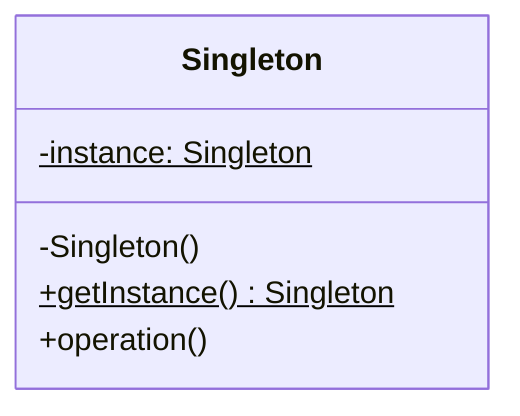
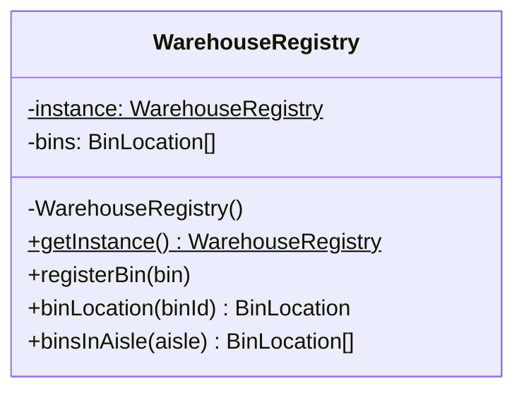

# Walkthrough — Warehouse registry at Ravensgate

Read this **after** you have your own version and your own `CHOICE.md`.

---

## The structure, twice

The GoF diagram. A private constructor means the class itself is the only thing that can call
`new`; `getInstance()` builds the one instance on first use and hands back the same one after
that:

This exercise's names:

**On the mapping.** About as close to the book diagram as this repository gets: `bins` is the
private state the pattern exists to guard, and `registerBin`/`binLocation`/`binsInAisle` are
the book's generic `operation()`, spelled out for this domain.

**On the name.** `WarehouseRegistry`, not `Singleton`. `Singleton` fails question 2 from
[`docs/NAMING.md`](../../../../../docs/NAMING.md) - it's already the name of the pattern
itself, and reusing it bare for the class would make the pattern and the implementation answer
to the same word in conversation.

**On the name, a second time.** `getInstance()`, kept exactly as GoF names it, rather than a
shorter `.instance()`. Question 3 - a bare `.instance()` reads like a property access, which
would hide that this call can build the whole thing lazily on first use; `getInstance()`
signals "this does work" the way a getter's name shouldn't have to.

**On the name, a third time.** `resetForTests()`, not `reset()`. Question 4 - `reset()` alone
would suggest a normal operational method a caller might reach for; naming it `resetForTests`
is honest that this method exists only to defeat the pattern's own guarantee, for test
isolation, and nothing else should ever call it.

---

## Why this route doesn't absorb act 2

`docs/TYPESCRIPT.md`'s own framing: "GoF's Singleton bundles 'there is exactly one' with
'anyone can reach it'." Act 2 needs exactly the first half undone - a second, independent
instance, live at the same time as the first - and that's precisely the guarantee the private
constructor exists to prevent from the outside. This route isn't as expensive as
[`solutions/module`](../module/WALKTHROUGH.md) or the no-pattern baseline, though: because
there's an actual class here, `createIndependent()` can build a second instance **from inside
the class itself**, reusing `registerBin`/`binLocation`/`binsInAisle` exactly as written,
without touching the private constructor's guarantee for anyone else. What it still costs: a
new `clear()` method (the class never needed one before - `resetForTests()` only ever nulled
the *cached* instance, never reset one in place), and a wrapper function to adapt the class
instance to the same plain handle shape every other candidate returns. See [ACT2.md](./ACT2.md)
for the measured cost.

---

## Where TypeScript changes this

[`docs/TYPESCRIPT.md`](../../../../../docs/TYPESCRIPT.md)'s "Singleton solved two problems;
TypeScript splits them" section: "*exactly one* is what a module gives you, for free, with no
lazy-init dance; *anyone can reach it* is the part that makes tests impossible to isolate, and
the answer is to pass the thing in." This route keeps both halves of that bundle - the same
choice [`solutions/module`](../module/WALKTHROUGH.md) makes, just with class syntax around it.
The measured numbers below show that the class syntax isn't free, but it isn't the deciding
cost either: both routes pay for keeping "anyone can reach it," which is the actual axis this
act 2 tests.

---

## What it cost

- **A private constructor exists to stop exactly the thing act 2 needs** - so satisfying act 2
  means adding a way around it, even if that way is written from inside the class and doesn't
  relax the constructor's visibility for anyone else.
- **`clear()` had to be added before it could be reused** - `resetForTests()` was never a
  per-instance method, because there was never more than one instance to reset in place.
- **See [ACT2.md](./ACT2.md) for the actual price** of the second-site requirement, measured,
  and for how the other two candidates fared against the same requirement.

## What act 2 showed

See [ACT2.md](./ACT2.md) for the numbers: 32 lines and 3 hunks here - cheaper than the
no-pattern baseline (38 lines) and [`module`](../module/ACT2.md) (39 lines), because there was
a class to reuse instead of logic to hand-duplicate - but far more than the winning
[`injection`](../injection/ACT2.md) (3 lines), which never had "exactly one" to walk back in
the first place.
