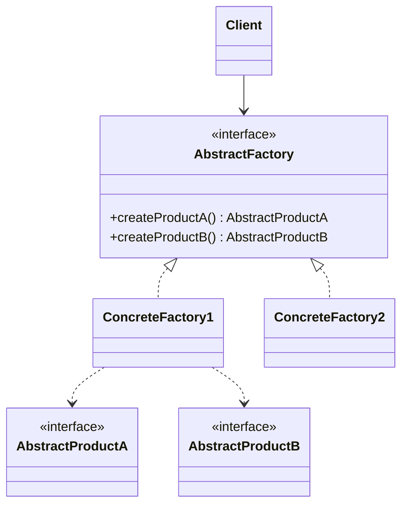
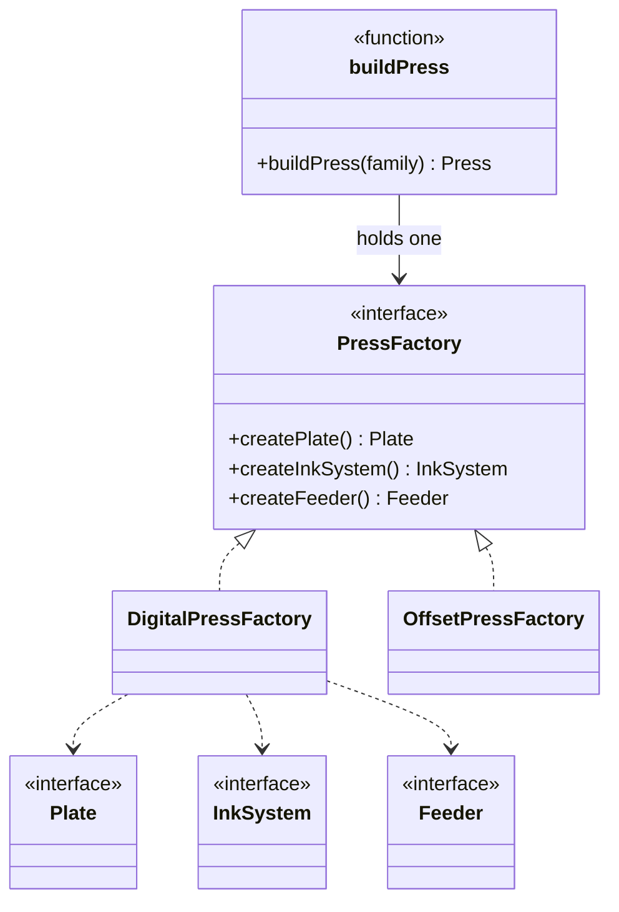

# Walkthrough — Abstract Factory at Thornbury

Read this **after** you have your own version.

---

## The structure, twice

The GoF diagram. An `AbstractFactory` declares one creation method per
product kind; each `ConcreteFactory` implements all of them, always
returning products from the same family, and a `Client` holding one
factory can never mix families by accident:



This exercise's names:



**On the mapping.** GoF's `AbstractProductA`/`AbstractProductB` become
three interfaces here, not two - `Plate`, `InkSystem`, `Feeder` - because
this domain's families have three related parts, not two. The book's own
diagram is drawn for two only because two is the minimum that makes the
mismatch bug possible; nothing about the pattern caps the count. GoF's
`Client` is `buildPress`, the one function in this exercise that holds a
`PressFactory` reference and calls all three of its methods.

**On the name.** `PressFactory`, not `AbstractFactory`. Question 1 - what,
not how - decides it, same as `JobFactory` did in the Factory Method
drill: `AbstractFactory` names a role in a book; `PressFactory` names
what the interface actually promises, standing alone.

**On the name, a second time.** `getPressFactory`, not `factoryFor` or
`resolve`. `factoryFor` reads fine at its one call site but fails
question 4 the moment someone reads it without the argument name in
view - `factoryFor(x)` promises nothing about what `x` is. `getPressFactory
(family)` is longer and tells the truth completely: a family goes in, a
factory for that family comes out.

**On the name, a third time.** `parts/digital.ts` and `parts/offset.ts`,
not `plate.ts`/`ink-system.ts`/`feeder.ts`. This is a file-naming
decision, not a class or method name, but it answers the same question
this pattern is about: what groups together? Grouping by family, not by
part kind, is the file-system's version of what `PressFactory` does at
the type level - and act 2 is where the difference in that choice
actually gets measured (see ACT2.md).

---

## Why this order

**`PressFactory` (step 1) is written before any concrete factory
exists.** Three method signatures, no bodies - which means step 4's
`DigitalPressFactory` is provably complete the moment it compiles, with
nothing left to double-check by hand.

**The parts are regrouped by family (steps 2-3) before either concrete
factory is written**, as pure file moves with no logic change, each
checked against the full suite. By the time `DigitalPressFactory` (step
4) is written, `DigitalPlate`, `DigitalInkSystem` and `DigitalFeeder`
already live together - the factory class has nothing to do but
reference three classes already in the same file.

**The three independent constructors are rewritten as thin wrappers
(step 6) before `buildPress` itself changes (step 7)**, as separate
commits. This keeps "does `createPlate(family)` still return the right
thing" and "does `buildPress` hold one factory reference instead of
calling three functions" as two questions a reviewer can check
independently.

## Step 4 — a factory the compiler checks for completeness

```ts
class OffsetPressFactory implements PressFactory {
  createPlate(): Plate {
    return new OffsetPlate();
  }
  createInkSystem(): InkSystem {
    return new OffsetInkSystem();
  }
  createFeeder(): Feeder {
    return new OffsetFeeder();
  }
}
```

Delete any one of these three methods and the file does not compile -
`implements PressFactory` is not advisory. This is the guarantee GoF's
own text singles out for Abstract Factory: swapping product families is
as easy as swapping which concrete factory a client holds, *provided*
every factory really does implement every product.

## Step 7 — one factory reference, not three separate calls

```ts
export function buildPress(family: PressFamily): Press {
  const factory = getPressFactory(family);
  return assemblePress(factory.createPlate(), factory.createInkSystem(), factory.createFeeder());
}
```

Compare this to act 1's version, which called `createPlate(family)`,
`createInkSystem(family)` and `createFeeder(family)` as three separate
lookups repeating the same `family` value. Here there is only one lookup
- `getPressFactory(family)` - and everything downstream comes from the
one object it returned. There is no second `family` value anywhere in
this function to disagree with the first.

---

## Where TypeScript changes this

Worth being precise about what this pattern actually guarantees in a
structurally-typed language, because it is less than it sounds like.
`implements PressFactory` guarantees a *factory* provides all three
parts. It does not, and cannot, stop `createPlate`, `createInkSystem`
and `createFeeder` - the thin wrappers kept for anyone who wants a
single part - from being called with three different `family` arguments
and combined by hand into a mismatched set; `assemblePress`'s runtime
check is what catches that, exactly as it did in act 1, and it is the
only thing that still can. The pattern's real contribution here is
narrower and more honest than "mismatching becomes impossible": it is
"the one function this codebase actually uses to build a press,
`buildPress`, cannot mismatch by accident, because it never has two
factories in scope to mix." That is a meaningfully smaller claim than
GoF's language suggests for a language without nominal types walling off
who gets to hold which product - and it is still worth having.

---

## What it cost

- **A caller wanting one part now goes through one more layer**
  (`getPressFactory(family).createPlate()`, or the thin wrapper around
  it) than a direct switch would need.
- **The guarantee is call-site discipline, not a type-level wall.**
  `createPlate`, `createInkSystem` and `createFeeder` remain
  independently callable with independent family arguments - see "Where
  TypeScript changes this" above.
- **Three files became four** (two family files plus `factory.ts`,
  replacing three part-kind files) for two families - the ratio improves
  as families are added, but it costs a file up front.

## If you took a different route

- **A single factory function returning a plain object of three
  closures** - `function pressFactory(family): { createPlate, ... }` -
  would skip the class ceremony entirely and still give a caller "one
  thing to hold, three parts to get from it." Worth it the moment none
  of the three concrete factories needs a constructor parameter or
  shared state of its own, which is the case here.
- **A branded family tag on every part**, checked by a generic helper
  instead of `assemblePress`'s manual `!==` chain - would generalize past
  three fixed fields, at the cost of a type parameter threading through
  every product interface for a domain that, today, has exactly three
  parts and no plan to add a fourth kind of part (only a fourth family).

## What would change my mind

This drill's verdict is `situational` - the mismatch bug Abstract
Factory prevents is real, but it only shows up when a codebase actually
builds *families* of related objects through more than one call site,
which is a narrower situation than "creating objects" in general. If
this codebase only ever built presses in one place, a single `buildPress
(family)` function with one switch inside it would have prevented the
same mismatch with no pattern at all - the bug here comes from multiple
independent construction sites, not from object creation itself. What
would change my mind toward `essential`: if Thornbury's own two other
call sites for print jobs (the ones Factory Method's drill introduced)
also needed matched *sets* of related objects, rather than one object
each - at that point, "more than one call site, families of related
parts" stops being the situational case and starts being how this
codebase builds things by default.

## What act 2 showed

See [ACT2.md](./ACT2.md) for the numbers. The short version: a third
family cost one new file and two small edits on this route, against
four files and nearly double the lines on the counterfactual - every
dimension moved, not just one, because organizing parts by family
instead of by kind pays off exactly when a new family arrives. Read
ACT2.md's note on the name collision between offset's and wide-format's
ink systems before assuming the two routes' risk is only about line
count.
