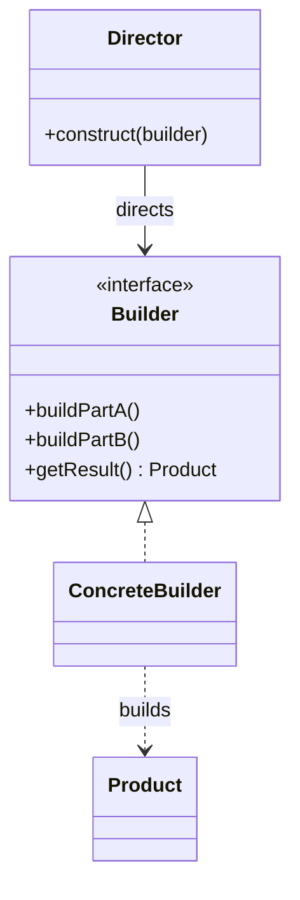
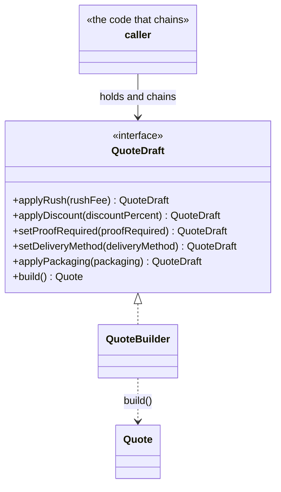

# Walkthrough — Builder at Thornbury

Read this **after** you have your own version.

---

## The structure, twice

The GoF diagram. A `Director` calls a fixed sequence of steps on whatever
`Builder` it holds; each `ConcreteBuilder` accumulates its own
representation and hands back a finished `Product` when asked:



This exercise's names:



**On the mapping.** GoF's `Builder` interface is `QuoteDraft` here - the
name says what it promises (a quote taking shape), not what role it
plays in a book. `ConcreteBuilder` is `QuoteBuilder`, the one class that
implements it. `Product` is `Quote`. There is **no `Director` class** in
this exercise, and that is not an omission: GoF's own text treats the
Director as optional, needed only when the *same* construction sequence
gets reused across more than one caller. Here, every caller decides its
own sequence of stages by writing the chain out - the caller *is* its
own director, one call at a time. A `Director` would earn its place the
moment two different call sites needed to reproduce the exact same chain
of stages; nothing in this exercise does that yet.

**On the name.** `QuoteDraft`, not `Builder`. Question 1 - what, not how
- decides it: `Builder` names a role in a book, and every class in every
codebase that uses this pattern would be tempted to reuse it, which
fails question 2 (could it name something else in this file? - anything
under construction, anywhere). `QuoteDraft` names what the interface
actually is at every point before `build()`: a quote, still being
decided.

**On the name, a second time.** `applyRush` and `applyDiscount`, not
`withRushFee`/`withDiscountPercent` or `rush()`/`discount()`. The
`apply*` prefix reads as "do this thing to the draft," which is true
of a rule check *and* a plain field write - question 4 matters here
specifically because the pattern route's `applyRush` no longer validates
anything, so a name that promised "validates and applies" would go false
the moment the refactor landed. `set*` is used instead for the two
stages (`setProofRequired`, `setDeliveryMethod`) that just assign a
value with no notion of "applying" one thing on top of another - the
split isn't decorative, it is the same distinction the repo's `format*`
vs `render*` convention makes for a different pair of verbs.

**On the name, a third time.** `startQuote`, not `newQuoteBuilder` or
`QuoteBuilder.create`. The frozen entry point has to read the same on
both routes - `src/`'s closure-based version and `solutions/builder/`'s
class-based version - and `startQuote` says what happens (a quote is
being started) without committing to *how* it's represented internally,
which a name mentioning "Builder" or "Draft" explicitly would.

---

## Why this order

**`QuoteState` (step 1) is written before `QuoteBuilder` has a single
method body.** Every field the finished `Quote` needs, required and
optional alike, lives on one interface before any stage touches it -
which means step 3's mutations are provably complete field-by-field
assignments, not guesses about what the class will eventually need to
hold.

**Every stage is rewritten to a trivial one-line mutation (step 3)
*before* any validation logic is moved (step 4), as separate commits.**
This keeps "does the chain still produce the right final state" and
"is every business rule still enforced, just from a new location" as two
questions a reviewer can check independently - and it is the same
discipline Abstract Factory's walkthrough used for its constructors and
its factories.

## Step 4 — a rule spanning two fields, written once

```ts
build(): Quote {
  const { discountPercent, rushFee, deliveryMethod, quantity, baseUnitCost, packaging } = this.state;

  if (discountPercent > 0 && rushFee > 0) {
    throw new Error("a rush job cannot also receive a discount");
  }
  if (deliveryMethod === "courier" && quantity < 50) {
    throw new Error("courier delivery is not available for orders under 50 units");
  }
  if (packaging === "gift-wrap" && rushFee > 0) {
    throw new Error("gift-wrap packaging is not available for rush jobs");
  }

  const totalCost = baseUnitCost * quantity * (1 - discountPercent / 100) + rushFee;
  return { ...this.state, totalCost };
}
```

Compare this to `src/quote-draft.ts`'s version of the same two rules,
where the rush/discount conflict is written once in `applyRush` and
again, mirrored, in `applyDiscount` - and where act 2's new rule repeats
the pattern, once in `applyRush` and again in `applyPackaging`. Every
rule here is written exactly once, at the one point every field's final
value is already known.

---

## Where mutability changes this

Worth being precise about what actually moved when validation
centralized, because "one check instead of two" undersells what changed
underneath it. `src/`'s `applyRush` returns a **new** draft, closed over
a **copy** of the old state (`draftFrom({ ...state, rushFee })`) - the
draft you called it on is untouched, and two variables holding two
drafts from before and after a call are genuinely two different values.
`solutions/builder/`'s `applyRush` mutates `this.state` and returns
`this` - the draft you called it on is *the same object*, now changed.
This is not an incidental implementation detail: it is what makes
`build()`'s centralization possible in the first place. If every stage
kept returning a fresh, independent draft the way the baseline route
does, deferring all validation to `build()` would mean the *last* draft
in the chain is the only one that ever gets checked - which is exactly
what happens here, and exactly why two references to an
earlier point in the chain, kept around and reused, is now a real risk
in a way it never was on the baseline route. See "What it cost," below.

---

## What it cost

- **A draft is no longer a value.** Two variables can point at "the same
  quote under construction" and one caller's `.applyRush(15)` is visible
  through the other's reference - a persistent, immutable draft (the
  baseline's shape) never allowed that.
- **The state object is allowed to be transiently inconsistent.** Between
  `startQuote` and `build()`, nothing stops `this.state` from holding a
  rush fee and gift-wrap packaging at once; only `build()` ever notices.
- **Nine methods and a class replace five free functions and a plain
  object shape** - more ceremony for a caller who only ever wanted one
  quote and never intended to hold onto an intermediate draft.

## If you took a different route

- **A single object-literal parameter plus one validating function** -
  `createQuote({ customerName, ..., rushFee?, packaging?, ... })` - would
  skip the chain entirely and centralize validation exactly as well,
  provided every field can be supplied at once. This is worth it the
  moment nothing about the domain requires *staged* decisions (a
  quantity confirmed before delivery method is even offered, say) - which
  is arguably true here, and is this drill's honest tension: see
  ACT2.md's note on why this exercise's axis is orthogonal rather than a
  clean win.
- **A `Director` function wrapping a fixed sequence of stage calls**
  would earn its place if Thornbury ever needed the *same* chain
  reproduced at more than one call site - `standardRushQuote(draft)`
  calling `applyRush(25).setProofRequired(true)` in that order, every
  time. Nothing in this exercise reuses a sequence, so it stays out.

## What act 2 actually showed, and what would have absorbed it

See [ACT2.md](./ACT2.md) for the numbers. The short version: the two
routes tied exactly - same files, same lines, same hunks - because this
exercise's act 2 asked for the *minimum* spanning case (a rule touching
two fields), which is exactly where "one check in build()" and "two
mirrored checks in two stages" cost about the same to write: one check
moved from two stages into one method, but that one method now carries
what both of them used to.

What would have absorbed this act 2 at a real, measurable discount is a
rule spanning **three** fields instead of two - a fifth stage whose
validity depends on packaging, delivery method, *and* proof, say. On the
baseline route, a three-way rule needs a mirrored copy of the same check
written into every one of the three stages it touches (three sites,
climbing linearly with every field the rule spans); on the pattern
route, `build()` still needs exactly one `if`, no matter how many fields
the rule reads, because every field's final value is already sitting on
`this.state` by the time `build()` runs. Two fields is the case where
"once" and "twice" cost about the same to write out; three or more is
where "once, regardless of how many fields" starts pulling away from
"once per field the rule touches."
