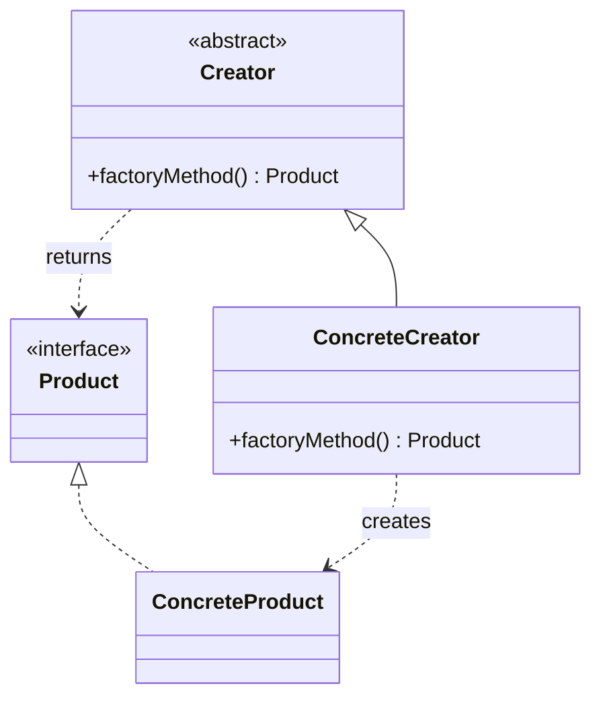
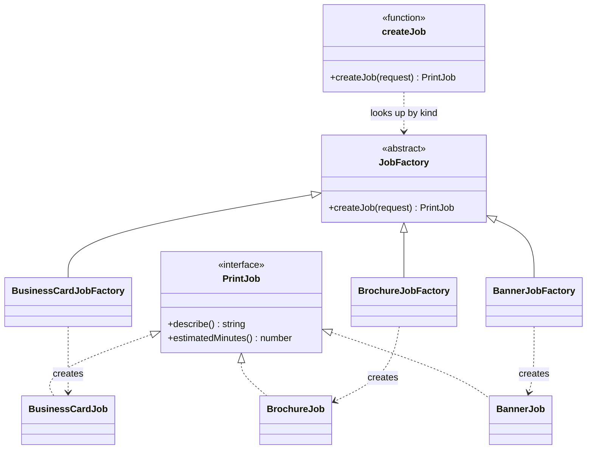

# Walkthrough — Factory Method at Thornbury

Read this **after** you have your own version.

---

## The structure, twice

The GoF diagram. A `Creator` declares a factory method that returns a
`Product`; `ConcreteCreator` subclasses override it to return a
`ConcreteProduct` of their own choosing, and the code that calls the
factory method never names a concrete class:



This exercise's names:



**On the mapping.** GoF's own worked example (a document editor's
`Application`/`Document`) has *subclasses of the caller* each hard-wired
to their own product - a `DrawApplication` always makes a `DrawDocument`,
decided once, at compile time, by which `Application` subclass you are.
This exercise uses the variant the book itself names in its
*Implementation* section: a **parameterized** factory method, where one
caller picks a `ConcreteCreator` at runtime from a value it has on hand
(`request.jobKind`), rather than being one at compile time. `createJob`
plays the part GoF's text calls "a parameterized factory method" — not a
role with its own name in the diagram, which is why it appears here as a
plain function rather than a class.

**On the name.** `JobFactory`, not `Creator`. Question 1 - what, not how
- decides it: `Creator` says a role in a pattern; `JobFactory` says what
the object actually does, standing alone. A reader who has never heard
of Factory Method can still guess what a `JobFactory` is for.

**On the name, a second time.** `createJob`, not `factoryMethod`. GoF's
own name for the method is generic on purpose - it has to read the same
whether the product is a document, a connection, or a print job. This
domain already has a word for what the method returns (a job), so using
it beats the book's placeholder: `createJob` reads correctly at every
call site without the reader needing to know this is Factory Method at
all.

**On the name, a third time.** `JOB_FACTORIES`, not `factories` or
`registry`. `factories` fails question 2 - `JobFactory` the class and
`factories` the table would both plausibly be called "the factories" in
conversation, and a reader hearing that word would not know which is
meant. `registry` fails question 4 for this domain: a registry usually
implies things can be added or removed at runtime, and nothing here ever
mutates `JOB_FACTORIES` after module load - it is a fixed table, and the
name should not promise more than that.

---

## Why this order

**`JobFactory` (step 1) is written with zero implementations.** No
product knowledge, no table yet - just the shape every factory will
share. By the time step 2 writes `BusinessCardJobFactory`, there is
nothing left to invent about the base class.

**Each concrete factory (steps 2-4) is extracted in the same order the
original switch already checked kinds in**, one per commit, each run
against the full act-1 suite before the next starts. Reusing the
existing order means each commit's diff is new code, not rearranged
code.

**The table (step 5) is written only after all three factories exist**,
and the call sites are rewired (step 6) as a separate, final commit -
the same split this repo uses whenever "does the new structure work" and
"does the public function still return the right thing" are two
different questions worth isolating.

## Step 5 — the one place a kind becomes a factory

```ts
const JOB_FACTORIES: Record<JobKind, JobFactory> = {
  "business-cards": new BusinessCardJobFactory(),
  brochure: new BrochureJobFactory(),
  banner: new BannerJobFactory(),
};

export function createJob(request: OrderRequest): PrintJob {
  return JOB_FACTORIES[request.jobKind].createJob(request);
}
```

Every factory is constructed once, at module load, and reused for every
request - there is exactly one `BusinessCardJobFactory` in the whole
program, which is fine, because the factories hold no state of their
own. `TypeScript`'s `Record<JobKind, JobFactory>` is doing real work
here: leaving a kind out of this table is a compile error, not a
runtime surprise the first time someone orders that kind.

## Step 6 — a call site with nothing left to decide

```ts
export function createJobFromCounter(request: OrderRequest): PrintJob {
  return createJob(request);
}
```

`counter.ts` no longer imports `BusinessCardJob`, `BrochureJob` or
`BannerJob` - it does not know, and does not need to know, that those
classes exist. The three call sites now differ only in their doc comment
and their exported name; nothing about *how* a job gets built lives in
any of them.

---

## Where TypeScript changes this

[TYPESCRIPT.md](../../../../../../docs/TYPESCRIPT.md) suggests a plain
function often replaces Factory Method outright in TypeScript - and for
a single call site, that is right: `createJob` alone, without
`JobFactory` or three subclasses, would be a `Record<JobKind, (request:
OrderRequest) => PrintJob>` of functions, not classes, and it would do
exactly the same job in fewer files. This exercise keeps the class
hierarchy because the drill asks for the GoF shape on purpose - but it
is worth being honest that the *table* is doing the real work here
(centralizing the kind-to-constructor decision), and the class layer on
top of it is close to ceremony the moment none of the three factories
ever needs a second method or a constructor of its own.

---

## What it cost

- **A one-branch decision became four files** (three factories, one
  table) to replace three copies of one switch - correct the moment more
  than one caller needs the decision, needless the moment only one ever
  did.
- **The kind-to-class mapping is no longer visible at any call site.**
  Reading `counter.ts` alone no longer tells you what a `"banner"` order
  actually builds; that answer moved to `factory.ts`.
- **Every factory is a class with one method**, which is exactly the
  shape [TYPESCRIPT.md](../../../../../../docs/TYPESCRIPT.md)'s note
  above is skeptical of - a function would say the same thing in less
  code, for as long as none of them needs more than one method.

## If you took a different route

- **A table of plain functions**, `Record<JobKind, (request:
  OrderRequest) => PrintJob>`, instead of a table of `JobFactory`
  instances - would cost four fewer lines (no `class ... extends
  JobFactory` boilerplate) and lose nothing this exercise's act 2 needed.
  Worth reaching for the classes the moment a factory needs to carry its
  own configuration (a default paper stock per kind, say) or needs to be
  swapped for a test double by identity rather than by replacing an
  entry in a `Record`.
- **A single `createJob` function with its own `switch`**, i.e. moving
  act 1's problem into one place instead of solving it - would still fix
  the "three copies" pressure (one switch instead of three), at the cost
  of the switch itself growing one case per kind forever, which is
  exactly what act 2 measures the cost of avoiding.

## What act 2 showed

See [ACT2.md](./ACT2.md) for the numbers. The short version: a fourth
job kind cost one new file and two small edits to an existing file on
this route, and never touched any of the three call sites. The
counterfactual had to repeat the same two-line edit identically in all
three of them - twice the files, twice the hunks, for barely more lines,
which is the opposite imbalance from most of this repo's other act 2s.
Read ACT2.md before assuming lines touched is always the number that
resolves the comparison.
