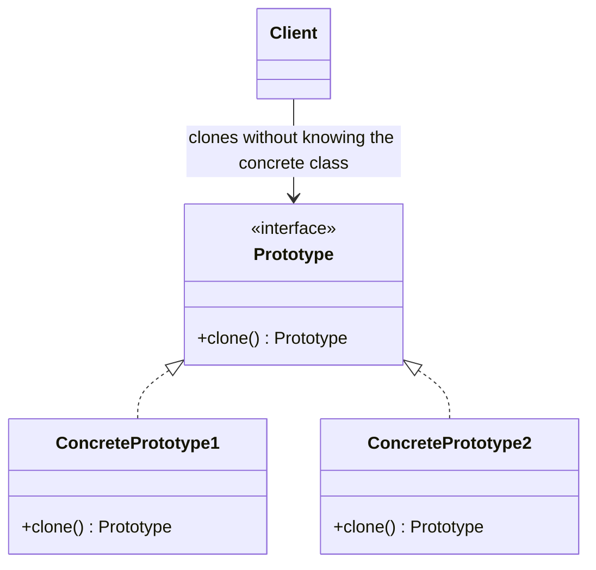
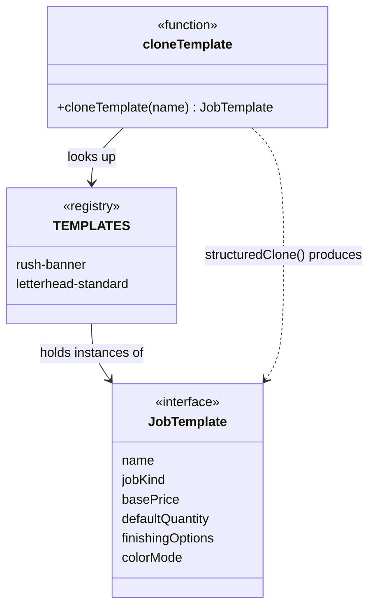

# Walkthrough — Prototype at Thornbury

Read this **after** you have your own version.

---

## The structure, twice

The GoF diagram. A `Prototype` interface declares `clone()`; each
`ConcretePrototype` implements it by copying itself, however it needs to;
a `Client` calls `clone()` on whatever prototype it holds, without ever
naming the concrete class:



This exercise's shape:



**On the mapping.** `TEMPLATES` is GoF's small library of prototypes -
the thing a real Prototype system usually keeps a registry of, keyed by
name, exactly as `TEMPLATES` is keyed by `TemplateName`. But look closely
at what is missing: there is no `clone()` **method** anywhere, and no
second concrete shape. `JobTemplate` is the only kind of thing in this
registry, so `cloneTemplate` never needs to copy "whatever this object
happens to be" polymorphically - it always knows the exact shape,
statically, at the call site. `structuredClone` plays the role GoF gives
to a hand-written `clone()` method, but it does it for a different
reason: not "so a caller can copy an object without knowing its concrete
class," but "so nobody has to enumerate this object's fields by hand."
Those are related but not identical benefits - see "What would change my
mind," below.

**On the name.** `cloneTemplate`, not `clone` or `copy`. `clone` alone
would pass question 3 badly: `clone("rush-banner")` reads like it clones
the *string*. `cloneTemplate("rush-banner")` says what is being cloned
and reads correctly at the one call site that matters.

**On the name, a second time.** `TEMPLATES`, not `PROTOTYPES`. Question 1
- what, not how - decides it: the book's word describes the *role* an
object plays (something copied from), not what Thornbury actually calls
the thing. A print shop keeps templates; calling the same constant
`PROTOTYPES` would tell a reader which pattern was used and nothing
about the domain.

**On the name, a third time.** `TemplateName`, not `TemplateKey` or
`TemplateId`. Every value in this union - `"rush-banner"`,
`"letterhead-standard"` - reads as a name a person at Thornbury would
actually say out loud, not a generated identifier. `Key`/`Id` would be
true of a database row; `Name` is true of how this registry is actually
addressed.

---

## Why this order

**The ambient declaration (step 1) lands before `cloneTemplate`'s body
changes**, as its own commit. This keeps "does the type checker know
about this global at all" separate from "does the function's logic
change" - a reviewer can confirm the first compiles with no behavior
difference before looking at the second.

## Step 2 — a clone operation with nothing to enumerate

```ts
declare function structuredClone<T>(value: T): T;

export function cloneTemplate(name: TemplateName): JobTemplate {
  return structuredClone(TEMPLATES[name]);
}
```

Compare this to `src/clone.ts`'s version, which names all five fields of
`JobTemplate` explicitly, including the one line (`finishingOptions:
[...template.finishingOptions]`) that exists only because someone once
forgot to write it that way. This version has no field-shaped surface
for that mistake to land on.

---

## Where the ambient declaration comes from, and why it is not cheating

`structuredClone` is a platform global - every current Node runtime and
every browser has it - not a feature of the ECMAScript language itself,
which is what this repo's cheap exercise typecheck (`tsconfig.exercises.json`,
`"types": []`, `"lib": ["ES2023"]`) actually checks against, deliberately,
so that gate needs no `@types/node` installed. One ambient `declare
function` is the honest fix: it tells the type checker about a global
that genuinely exists at runtime, without pulling in the DOM lib (and
everything else that library brings) for the whole repo just to name one
function.

---

## What it cost

- **Cloning became opaque.** No line of code in this file says what a
  clone contains. A field that should NOT be deep-copied as-is - an
  identity, an open file handle, a WebSocket - would be copied anyway,
  silently, and nothing here is positioned to stop it. `structuredClone`
  itself will throw on genuinely unclonable values (functions, most
  class instances with private state), which catches the worst cases,
  but "did not throw" is not the same guarantee as "copied correctly."
- **The manual version's one real defect (the forgotten field, once)
  becomes structurally impossible - but so does the manual version's one
  real virtue: a reader could see, in `cloneTemplate` itself, exactly
  what a clone was made of.**

## If you took a different route

- **A `clone()` method on `JobTemplate` itself**, closer to GoF's literal
  interface, would matter the moment Thornbury's templates stop being one
  shape - a `DigitalTemplate` and an `OffsetTemplate` with different
  fields, say, cloned through a shared `Prototype` interface by code that
  does not know which one it is holding. Nothing in this exercise has
  more than one shape, so that machinery would be pure ceremony here.
- **A deep-clone library with per-field customization hooks** (skip this
  field, transform that one) would answer "What it cost," above, directly
  - at the cost of a dependency, for a domain with exactly one field
  (none, today) that would ever need special handling.

## What would change my mind

This drill's verdict is `situational`. What actually got cheaper here is
narrower than GoF's own pitch for the pattern: the book's Prototype earns
its place by letting a `Client` copy an object **without knowing its
concrete class** - useful the moment a system has several different
`ConcretePrototype` shapes behind one interface. This exercise has
exactly one shape, `JobTemplate`, so that specific payoff never comes up;
what `structuredClone` actually bought was narrower and more mundane -
"stop enumerating fields by hand," which is a real win but a smaller
claim. What would change my mind toward `essential`: if Thornbury's
template registry grew a second, differently-shaped kind of template -
say, one for a multi-page catalog job with nested sections a banner
template does not have - and code needed to clone "whichever template
this is" without a switch on its kind. At that point GoF's actual
guarantee (polymorphic copying, one shared interface, no downcasting)
starts doing work this drill never asked it to do.

## What act 2 showed

See [ACT2.md](./ACT2.md) for the numbers. The short version: every
dimension favored the pattern route - one fewer file, one fewer line,
one fewer hunk - because `clone.ts` does not appear in the pattern's
patch at all. The baseline's extra file is not incidental churn; it is
`cloneTemplate` being forced to learn the new field's name or return an
object TypeScript's own structural check on the return type would
refuse to compile.
