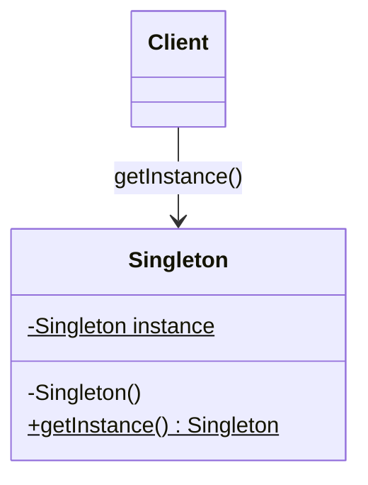
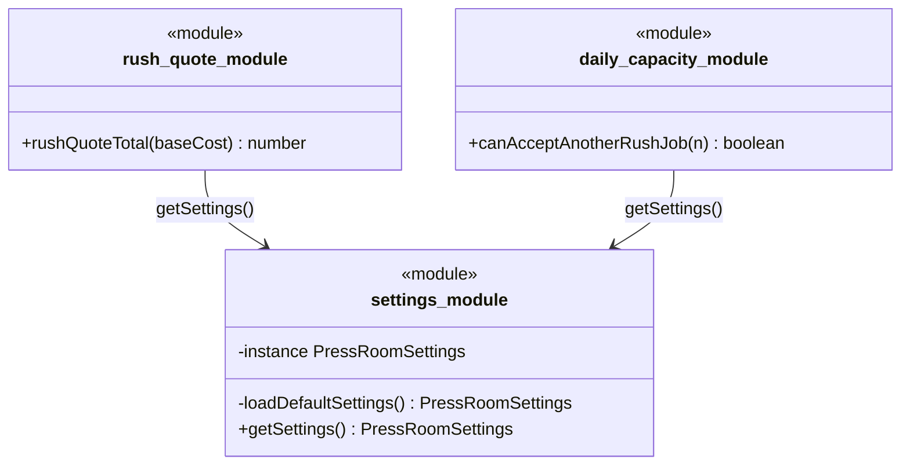

# Walkthrough — Singleton at Thornbury

Read this **after** you have your own version.

---

## The structure, twice

The GoF diagram. `Singleton` hides its own constructor, keeps a private
static reference to its one instance, and hands it out through
`getInstance()` - the only door in:



This exercise's act-1 shape (the naive TypeScript equivalent - a module
plays the role of the class, since TypeScript has no private
constructors that block `new` at every call site the way GoF assumes):



**On the mapping.** GoF's private static field is this module's private
`let instance`; GoF's `getInstance()` is `getSettings()`; GoF's `Client`
is any of the five consumer modules. The one thing GoF's diagram cannot
show and this one has to: **there is no `private constructor` in
TypeScript.** A class-based `Singleton` in this language can still be
constructed directly with `new Singleton()` from anywhere, defeating the
whole guarantee at compile time with zero warning - which is exactly why
this exercise (and idiomatic TypeScript generally) reaches for a *module*
instead of a class the moment "there is exactly one" matters: a module's
top-level `let` is genuinely private to that file, in a way a class
field guarded only by a naming convention or a runtime check is not.

**On the name.** `createPressRoom`, not `PressRoomFactory` or
`makeSingleton`. Question 1 - what, not how - decides it: the function
builds a press room; that it happens to enable more than one is not part
of its name's job. `Factory` would additionally fail question 2 in a repo
that already has an actual Abstract Factory drill using that word for a
different, more specific shape.

**On the name, a second time.** `mainFloor`, not `defaultInstance` or
`theSingleton`. A name describing the *pattern* (`Instance`, `Singleton`)
fails question 4 the moment a second press room exists - it would keep
saying "the only one" about something that is now demonstrably one of
several. `mainFloor` names the actual place, and stays true no matter how
many other press rooms get built alongside it.

**On the name, a third time.** `PressRoom`, not `PressRoomSettings`
(already taken, correctly, by the plain configuration data) and not
`PressRoomInstance`. The interface describes *what a built press room can
do* - quote, check capacity, describe itself - which is a different thing
from the data it was built out of. Reusing `Settings` for both would
blur a distinction the whole exercise depends on: a `PressRoomSettings`
is inert data; a `PressRoom` is behavior closed over that data.

---

## Why this order

**`createPressRoom` (step 1) is written and tested before the five old
files are deleted (step 2)**, so the suite is green against the *old*
five-module shape and the *new* factory at the same time, briefly. This
is the same discipline every other drill in this repo uses for a
reason: a reviewer can confirm the new implementation is correct on its
own before trusting the deletion that follows it.

**`mainFloor` (step 3) is built by calling the exact same
`createPressRoom` any other caller would call (step 4)** - not a special
internal path. This is the detail that makes act 2 nearly free: the
"default" press room was never structurally different from any other
one that might get built later.

## Step 1 — one function, not five files reading a shared getter

```ts
export function createPressRoom(settings: PressRoomSettings): PressRoom {
  return {
    rushQuoteTotal(baseCost) {
      return baseCost * (1 + settings.rushSurchargePercent / 100);
    },
    // ...
    setMaintenanceMode(maintenanceMode) {
      settings.maintenanceMode = maintenanceMode;
    },
  };
}
```

Every method closes over the same `settings` parameter - there is no
`getSettings()` call anywhere in this file, and therefore nothing that
could reach past the object this closure was built from to find a
*different* one.

---

## Where TypeScript changes this

`docs/TYPESCRIPT.md` puts a module-level `const` (or, here, a factory
plus one default instance) ahead of a class with a private constructor
and a static `getInstance()` for exactly this pattern - and the reason
above (no real private constructor) is why. What TypeScript's module
system does NOT do is stop you from writing the naive version: `let
instance` at module scope is just as easy to reach for as `getInstance()`
would be in Java, and this exercise's `src/` is what that looks like -
correct, idiomatic-*looking* TypeScript, and still a singleton with every
one of the pattern's real costs.

---

## What it cost

- **There is no longer one well-known place every part of the app is
  guaranteed to agree with.** `mainFloor` is a convention now, not a
  guarantee - nothing stops a second `createPressRoom(loadDefaultSettings())`
  from being called by accident somewhere else, silently producing a
  press room that looks identical to `mainFloor` but is a different
  object, out of sync the moment either one's `setMaintenanceMode` is
  called.
- **`PressRoomSettings` is a mutable object passed by reference into
  `createPressRoom`.** Two press rooms built from the *same* settings
  object (rather than two separately-constructed ones) would still alias
  each other - the isolation this route provides depends on callers
  actually constructing independent settings, which nothing enforces at
  the type level.

## If you took a different route

- **A class with a truly private constructor**, in a language that
  enforces it (unlike TypeScript), would give GoF's actual guarantee -
  not "there is a name everyone happens to use," but "the compiler
  refuses a second one." Worth knowing this exercise's fix is a
  TypeScript-shaped answer to a TypeScript-shaped absence, not the only
  possible fix in every language.
- **A dependency-injection container** managing `PressRoom` as a
  registered "singleton-scoped" service would give the same one-per-
  container guarantee `mainFloor` gives here, plus the ability to swap in
  a *different* default for a whole test run without touching this file
  at all - at the cost of a framework, for a codebase with exactly one
  configuration value worth injecting.

## What would change my mind

This drill's verdict is `avoid` - not because a shared, lazily-built
instance is never right, but because *this* one was solving a problem
("read the same configuration everywhere") that an explicitly-passed
value solves just as well, with none of the isolation cost. The
DESIGN.md §9.2 question is narrower and worth answering directly: when
would the singleton still be the least bad answer, in this very
codebase?

If Thornbury's press room were not a configuration object but a **literal
hardware interface** - one physical press controller, wired to one serial
port, where a second `PressController` instance would not just be
untested but actively wrong, two objects contending to write to a port
that can only listen to one writer at a time - a shared, guarded single
instance stops being a convenience and starts being a correctness
requirement the hardware itself imposes. Dependency injection does not
remove that requirement; it just moves "there must be exactly one" from
an accident of this module's shape to an explicit fact the composition
root has to uphold (construct the one `PressController` once, at
startup, and pass that same reference everywhere it is needed - which is
itself the injection route, just injecting something that is genuinely
unique for a reason outside the code). The failure mode this drill
teaches is reaching for `let instance` out of habit for something that,
unlike a serial port, was never actually singular - Thornbury's press-room
*settings* are just data, and two press rooms disagreeing about rush
surcharges is a Tuesday, not a hardware fault.

## What act 2 showed

See [ACT2.md](./ACT2.md) for the numbers. The short version: 1 line
against 37, because the factory that act 2 needed already existed from
act 1 - `mainFloor` was already built by calling it once, so "build a
second, independent one" was already possible before the requirement
arrived. The counterfactual's 37 lines are not padding: they are a
second, working implementation of the same five functions, because the
five original files only know how to read one shared instance and
cannot be pointed at a different one without a signature change that
would break every existing caller.
