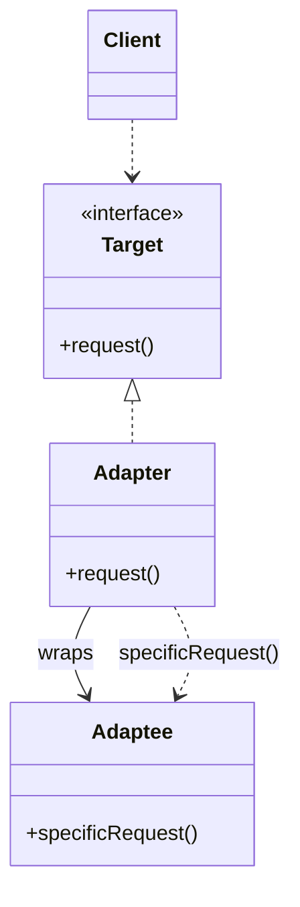
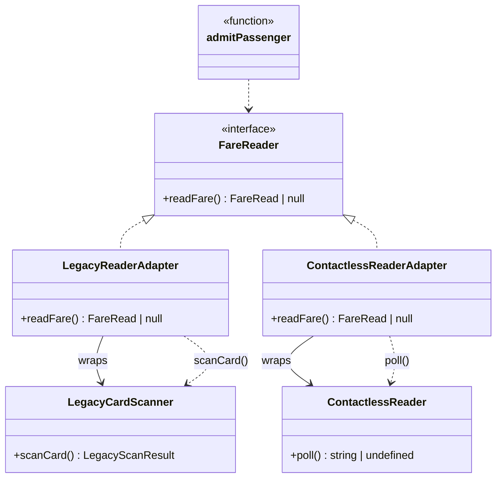

# Walkthrough — Adapter at Caldermoor

Read this **after** you have your own version.

---

## The structure, twice

The GoF diagram. A `Client` talks to a `Target` interface; an `Adapter`
implements `Target` by wrapping an `Adaptee` and translating each call
into whatever the `Adaptee` actually understands:



This exercise's names:



**On the mapping.** GoF distinguishes class adapters (adapt by
inheriting from the Adaptee) and object adapters (adapt by holding one).
Both `LegacyReaderAdapter` and `ContactlessReaderAdapter` are object
adapters - each holds its adaptee in a private field and delegates to it
- because TypeScript's adaptees here are plain interfaces with no shared
base to inherit from, and because an object adapter can wrap an adaptee
it received at runtime rather than one fixed at compile time. `Client`
has no class of its own in this exercise; it is every caller of
`admitPassenger`, and none of them know an adapter is involved.

**On the name.** `LegacyReaderAdapter`, not `LegacyReaderWrapper` or
`LegacyCardScannerToFareReader`. Question 3 - does it read well at the
call site - decides between the first two: `new
LegacyReaderAdapter(scanner)` tells a reader what role this object plays
in the surrounding code; `Wrapper` says only that something is inside
something else, which is true of nearly every object in the program.
The fully-descriptive third option is more precise but fails question 3
for a different reason: a name that long stops reading as a name and
starts reading as a sentence.

**On the name, a second time.** `readFare`, not `getFare` or `scan`.
Question 4 - does the name promise more than the code delivers - rules
out `getFare`: "get" implies a value already sits somewhere waiting to
be returned, but reading a physical card reader is an action with a
side effect (the hardware actually polls), not a lookup. `scan` was
rejected for the opposite reason: it is the *adaptee's* verb
(`scanCard`), and reusing it on the adapter would blur which side of the
translation a reader is looking at.

**On the name, a third time.** `FareRead`, not `FareReading` or
`CardData`. `FareReading` fails question 2 in this codebase: `readFare`
the method and `FareReading` the type would both plausibly be called
"the reading" in conversation, and question 2 asks whether a shorter,
more obvious name is already taken by something else in the file -
`FareRead` sidesteps the collision while staying just as clear.
`CardData` fails question 1 (what vs. how): "data" describes storage,
not the specific two fields (`cardId`, `balanceCents`) a caller actually
needs.

---

## Why this order

**`LegacyReaderAdapter` (step 1) is written and proven before
`admit.ts` changes at all.** Nothing about the fare rule is at stake
while the adapter is being written - only whether it translates
correctly - so it is checked in isolation, the same way this repo checks
a new class before wiring it into a caller.

**`admitLegacyPassenger` (step 2) changes only by deletion.** Its own
copy of the fare rule is removed, not edited; what replaces it is a
constructor call and a delegate to `admitPassenger`. There is no
intermediate state where both the old logic and the new adapter coexist
inside the same function.

## Step 2 — a call site with nothing left to decide

```ts
export function admitLegacyPassenger(scanner: LegacyCardScanner): AdmissionResult {
  return admitPassenger(new LegacyReaderAdapter(scanner));
}
```

`admitLegacyPassenger` no longer knows what a dollar is, what
`"no-card"` means, or what `FARE_CENTS` equals - all of that lives
exactly once, in `admitPassenger` and `LegacyReaderAdapter`
respectively. Adding `admitContactlessPassenger` later is the same move,
proven a second time: a new adapter class, then a one-line delegate that
looks identical in shape to this one.

---

## Where TypeScript changes this

[TYPESCRIPT.md](../../../../../../docs/TYPESCRIPT.md) notes that
structural typing often makes a formal `implements FareReader` optional
- an object literal with a matching `readFare` method already satisfies
the interface, no class required. This exercise keeps the classes
because both adapters hold state (`scanner`, `reader`) that a
constructor is the natural place to receive, and because `implements`
here is documentation a reader benefits from, not ceremony: it is the
one line that states, in one place, "this class's whole job is to be a
`FareReader`." A stateless adapter - one with nothing to hold between
calls - would be a fair place to drop the class entirely in favor of a
plain function returning an object literal.

---

## What it cost

- **Every incompatible reader shape is one more file**, whose only job
  is translation. That is the point, not a side effect - but it means
  the number of files in this module grows with the number of hardware
  generations Caldermoor has ever deployed, not with the number of
  admission rules (there is only one).
- **A reader has to trust `admitPassenger` is the only place the fare
  rule lives**, the same trust act 1's target asked for at a smaller
  scale. Nothing in the type system enforces it; a future contributor
  could still write a fourth `admitSomethingPassenger` that reimplements
  the check instead of adapting.

## If you took a different route

- **A single adapter class parameterized by a "kind" and a translation
  function**, instead of one class per shape, would cost fewer files at
  the price of a constructor argument that is itself a small dispatch
  table - worth it the moment adapters start sharing real logic beyond
  "wrap and translate," not before.
- **Adapting at the boundary once, into a list of `FareRead` values,
  instead of adapting each reader object individually** would remove the
  adapter classes entirely in exchange for three translation *functions*
  called at the point each reader is first obtained - a reasonable
  variant when nothing about a reader needs to be polled more than once
  per admission.

## What act 2 showed

See [ACT2.md](./ACT2.md) for the numbers. The short version: files and
hunks tied between the two routes, because a brand-new reader shape
costs the same `types.ts`/`index.ts` overhead either way. The gap is in
`admit.ts` itself - a one-line delegate against a third full copy of the
fare rule - and that is where the pattern's actual claim lives: not
"fewer files touched," but "the rule itself is written exactly once, no
matter how many reader shapes arrive."
