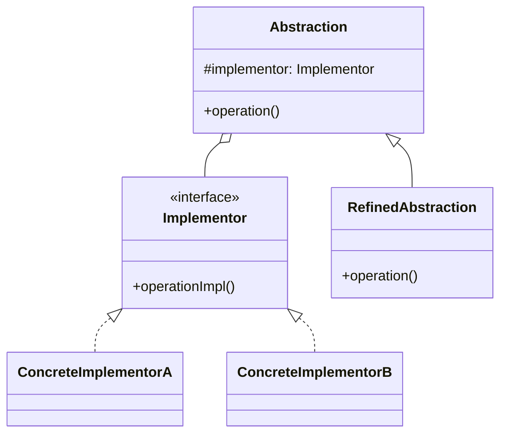
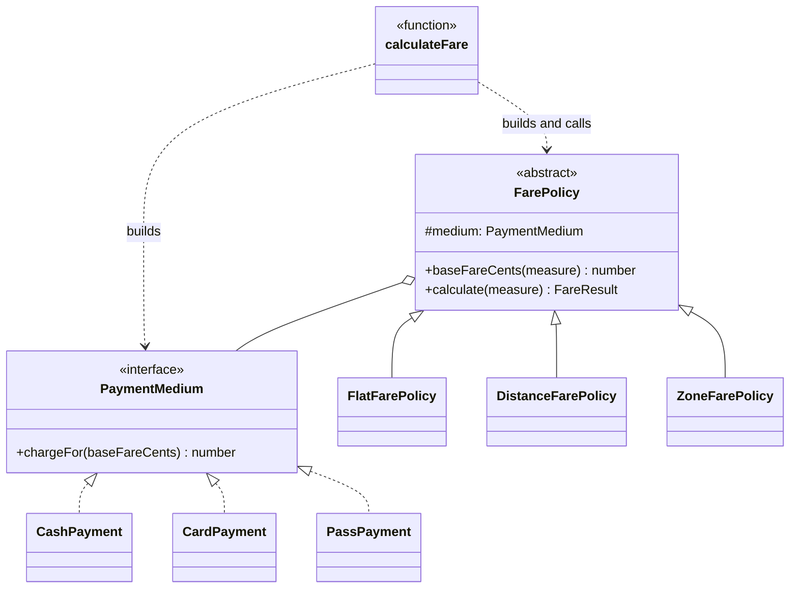

# Walkthrough — Bridge at Caldermoor

Read this **after** you have your own version.

---

## The structure, twice

The GoF diagram. An `Abstraction` holds a reference to an
`Implementor` and delegates to it; `RefinedAbstraction` and
`ConcreteImplementor` each vary on their own axis, and any refined
abstraction can be paired with any concrete implementor at construction
time:



This exercise's names:



**On the mapping.** GoF's own worked example is a `Window`/`WindowImp`
pair, where the abstraction is the thing an application programmer
touches and the implementor is a thin wrapper over a specific windowing
system's primitives - deliberately asymmetric, because a `Window` has
many operations and a `WindowImp` has few, low-level ones.
`FarePolicy`/`PaymentMedium` is close to symmetric instead: both sides
have exactly one meaningful operation (`baseFareCents`,
`chargeFor`), because this domain's two axes are genuinely peers, not an
application layer over a platform layer. Bridge does not require the
asymmetry GoF's own example happens to have - only that the two sides
vary independently and one holds the other by composition, which this
exercise has either way.

**On the name.** `PaymentMedium`, not `PaymentImpl` or
`PaymentImplementor`. Question 1 - what, not how - rules out both: they
say this object's role in a pattern, not what it represents in the
domain. A rider, a driver, or a maintenance script reading
`PaymentMedium` in code learns something true about Caldermoor's fare
system; reading `PaymentImplementor` would only teach them the name of a
GoF role.

**On the name, a second time.** `chargeFor`, not `apply` or `process`.
Question 4 - does the name promise more than the code delivers - rules
out `process`: nothing here processes a transaction, calls a payment
gateway, or has any side effect at all; the method is a pure function
from a base amount to a charged amount. `chargeFor` says exactly that
and no more.

**On the name, a third time.** `measure`, not `distanceKm` or `zones`.
This is the one name in the exercise chosen for a cost that hasn't
happened yet at the time it's written: at act 1, only `distance` needs a
number, so `distanceKm` would read better *today*. `measure` is chosen
because act 2's own premise - a policy this codebase hasn't imagined yet
- needs a parameter whose unit isn't decided by the policy calling it.
Question 4 cuts the other way here: `measure` promises less than
`distanceKm` would, on purpose, because the code genuinely does not know
what unit it's about to receive until a specific `FarePolicy` subclass
says so.

---

## Why this order

**The medium side (steps 1-3) is extracted before the policy side
exists at all.** `PaymentMedium`'s two methods are provably correct on
their own - `CashPayment` and `CardPayment` are pure functions from a
number to a number - so they can be checked in isolation, by hand,
before `FarePolicy` has anywhere to plug them in.

**`FarePolicy` (step 4) is written with zero concrete policies.** Like
`JobFactory` in this module's Factory Method drill, the base class is
finished before there is any product knowledge to tempt it into
carrying more than one responsibility.

**`calculateFare` (step 6) is rewritten only after both hierarchies are
complete and proven**, as a single commit that deletes the four old
classes and replaces them with the two-table dispatch - the same
"structure first, wire the public function last" split every drill in
this module uses.

## Step 6 — a dispatcher with nothing left to decide

```ts
const MEDIA: Record<PaymentMediumKind, () => PaymentMedium> = {
  cash: () => new CashPayment(),
  card: () => new CardPayment(),
};

const POLICIES: Record<FarePolicyKind, (medium: PaymentMedium) => FarePolicy> = {
  flat: (medium) => new FlatFarePolicy(medium),
  distance: (medium) => new DistanceFarePolicy(medium),
};

export function calculateFare(
  policyKind: FarePolicyKind,
  mediumKind: PaymentMediumKind,
  measure: number,
): FareResult {
  const medium = MEDIA[mediumKind]();
  const policy = POLICIES[policyKind](medium);
  return policy.calculate(measure);
}
```

Every policy and every medium is constructed fresh per call - neither
holds state across requests, so there is no shared-instance question
here the way Singleton's drill had to answer one. `TypeScript`'s
`Record<K, V>` does the same job it did in Factory Method: leaving a
kind out of either table is a compile error, not a runtime surprise.

---

## Where TypeScript changes this

[TYPESCRIPT.md](../../../../../../docs/TYPESCRIPT.md) notes that
generics cover part of what Bridge does in TypeScript - true when the
implementor side is a single type parameter threaded through, rather
than a full interface with its own hierarchy. This exercise keeps both
sides as class hierarchies because each side has more than one concrete
member with actual behavioral differences (not just a type parameter
standing in for "whatever T is"), which is exactly the case
[TYPESCRIPT.md](../../../../../../docs/TYPESCRIPT.md) names as the one
where generics alone stop being enough.

---

## What it cost

- **Two hierarchies instead of one flat list of classes.** Act 1's four
  classes were flat and easy to enumerate by reading one file; the
  bridge trades that for two shorter files, neither of which shows a
  complete combination on its own.
- **A reader who wants "what does zone-by-pass cost" has to run the
  code, or trace it by hand through two tables and two method calls** -
  there is no single line in the source that says `243`. The four-class
  version had exactly that line, once, for every combination that
  existed at the time - it just needed a new one for every new
  combination.

## What would change my mind

If Caldermoor only ever had **one** payment medium in practice - if
`card` and `pass` were both hypothetical and only `cash` ever shipped -
the second hierarchy would be pure ceremony: one `PaymentMedium`
implementation with nowhere for a second one to plausibly appear is a
constructor parameter that never varies, and `FarePolicy` should just
compute the charge itself. The situational verdict on this drill is
particular to **two axes that are each independently plausible** to
grow; a domain with a real axis and a decorative one is better served by
letting the real axis be a class hierarchy and the decorative one be a
plain function.

## If you took a different route

- **One class with a `(FarePolicyKind, PaymentMediumKind) => number`
  lookup table of pure functions**, instead of two hierarchies, would
  remove all four classes above `FarePolicy`/`PaymentMedium` in exchange
  for a table with as many entries as combinations actually used - N+M
  functions instead of N+M classes, doing the same composition without
  the `extends`/`implements` machinery. Worth it the moment neither side
  needs to hold its own state or be swapped for a test double by
  identity.
- **Currying instead of composition** - `calculateFare` could build a
  `(measure) => FareResult` by composing two plain functions directly,
  skipping the `FarePolicy` base class's `calculate` method entirely.
  This removes one layer of indirection at the cost of losing the one
  place (`FarePolicy.calculate`) that documents, in one line, how the
  two sides are meant to compose.

## What act 2 showed

See [ACT2.md](./ACT2.md) for the numbers. The short version: files and
hunks favor the baseline (2 against 5, 4 against 6) - opening two
hierarchies costs a fixed tax the four-class version never pays. Lines
touched favors the pattern decisively (48 against 29), because the
baseline's five new classes each duplicate a formula the pattern route
writes exactly once. Whichever number you read first here tells a
different story; read both before deciding which one the pattern
actually bought.
