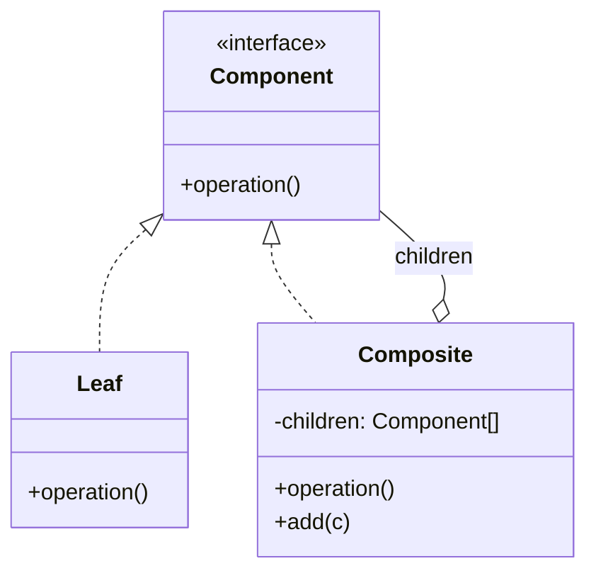
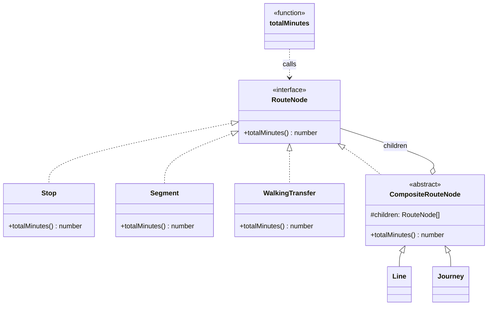

# Walkthrough — Composite at Caldermoor

Read this **after** you have your own version.

---

## The structure, twice

The GoF diagram. A `Component` declares an operation every node - leaf
or composite - answers; `Leaf` implements it directly, `Composite`
implements it by delegating to its own children, and a `Client` calls
the operation on any `Component` without knowing which kind it has:



This exercise's names:



**On the mapping.** GoF's own `Composite` typically exposes child
management (`add`, `remove`, `getChild`) on the `Component` interface
itself, so a client can build a tree without knowing whether it's
holding a leaf or a composite - at the cost of a `Leaf` having to throw
or no-op on `add`. This exercise leaves `add`/child-management off
`RouteNode` entirely: every tree here is built once, from a literal
array passed to a constructor, never mutated afterward. `Component`'s
child-management responsibility genuinely has no work to do in this
domain, so `RouteNode` stays a single method - the leaner shape GoF's
own *Implementation* section names as reasonable "when the safety [of
uniformity] is more important than transparency."

**On the name.** `RouteNode`, not `Component` or `Totalable`.
`Component` fails question 1 - it says a role in a pattern, not
anything about what this object represents. `Totalable` fails question
4: it promises the interface is *only* about totaling, which happens to
be true today but would mislead the moment a second operation (say,
`describe(): string`) joined it - `RouteNode` says what the object is,
which stays true regardless of how many methods it grows.

**On the name, a second time.** `CompositeRouteNode`, not `Group` or
`Branch`. Question 3 - does it read well at the call site - is what
decides here, but the call site in question is `class Line extends
CompositeRouteNode`, read by someone who already knows GoF's vocabulary
for this exercise's audience. `Group` and `Branch` are both plausible
domain words, but neither tells a reader familiar with the pattern which
GoF role this class fills; `CompositeRouteNode` does, at the cost of
being a worse name for someone who has never heard of the pattern at
all - a tradeoff this exercise accepts on purpose, unlike `RouteNode`
itself, which has to work for both audiences because it's the one type
name that appears in every file.

**On the name, a third time.** `totalMinutes`, not `getDuration` or
`sum`. `getDuration` implies a stored value being returned, not a
recursive computation being performed fresh on every call - question 4
again. `sum` was rejected for being generic to the point of meaningless
outside this one file: a reader skimming an import list sees `sum` and
learns nothing about what's being summed.

---

## Why this order

**`RouteNode` (step 1) is written with zero implementations**, the same
discipline this module's other base-then-extract drills use: no product
knowledge yet, just the one obligation every node will share.

**Leaves (step 2) are extracted before the composite base exists.**
`Stop.totalMinutes()` and `Segment.totalMinutes()` are provably correct
on their own - each just returns one field - so they're checked in
isolation before anything depends on them.

**`CompositeRouteNode` (step 3) is written once, generically, before
either `Line` or `Journey` exists.** By the time step 4 extracts
`Journey`, the pattern of "a composite sums whatever children it has" is
already proven by `Line` - there is nothing left to invent, only to
repeat.

**The free `totalMinutes` function (step 5) is rewritten last**, as a
pure deletion once every node kind already knows how to total itself -
the same "structure first, wire the public function last" split this
whole module uses.

## Step 5 — a client with nothing left to check

```ts
export function totalMinutes(node: RouteNode): number {
  return node.totalMinutes();
}
```

This function does not grow when a sixth node kind arrives - it already
works for anything that implements `RouteNode`, which is the entire
claim Composite makes. Compare `CompositeRouteNode.totalMinutes`, the
one place the actual recursion lives:

```ts
totalMinutes(): number {
  return this.children.reduce((sum, child) => sum + child.totalMinutes(), 0);
}
```

`child.totalMinutes()` is a virtual dispatch, not a re-check of what
`child` is - the recursion terminates naturally at whichever leaf each
branch bottoms out at, without `CompositeRouteNode` ever needing to
distinguish a `Stop` from a nested `Journey`.

---

## Where TypeScript changes this

[TYPESCRIPT.md](../../../../../../docs/TYPESCRIPT.md) notes that a
discriminated union plus a recursive function covers Composite in many
TypeScript codebases, with the compiler's exhaustiveness check standing
in for the interface's guarantee. This exercise keeps the class
hierarchy specifically because act 2 is the point being taught: a
`switch` over a `kind` field is exhaustiveness-checked, which is real
value, but it still requires editing the `switch` itself for every new
kind - the union and the function must both learn about `"walking-
transfer"`. The interface route pays no equivalent tax, which is
Composite's actual argument over the union in TypeScript, and is worth
stating plainly rather than only demonstrating in `ACT2.md`.

---

## What it cost

- **Six files instead of three**, for a domain whose act-1 shape was
  four `instanceof` checks in fourteen lines. The uniformity Composite
  buys is not free at the file-count level, even though it is close to
  free at the future-change level.
- **No single file lists every `RouteNode` in the program.** The
  baseline's union type was a complete inventory; this route's inventory
  only exists as a grep for `implements RouteNode`, and nothing forces
  that grep to be run.

## If you took a different route

- **A discriminated union with a `kind` tag**, `{ kind: "stop";
  dwellMinutes: number } | { kind: "line"; children: RouteNode[] } |
  ...`, plus one recursive function with an exhaustive `switch` - would
  keep the "one complete inventory" property the class hierarchy loses,
  at the cost of the union and the function both needing an edit for
  every new kind (see [TYPESCRIPT.md](../../../../../../docs/TYPESCRIPT.md)
  above). Worth it the moment "can I see every kind that exists in one
  place" matters more than "can I add a kind without touching existing
  files."
- **Letting `Line` and `Journey` share a single class**, parameterized
  by a `label` string instead of being two distinct types, would remove
  one file (`journey.ts` collapses into `line.ts`, or vice versa) at the
  cost of losing the type-level distinction between "a fixed transit
  line" and "a rider's specific trip" - a distinction this exercise's
  domain cares about even though `totalMinutes` itself never needs it.

## What act 2 showed

See [ACT2.md](./ACT2.md) for the numbers. The short version: every
dimension favored the pattern (1 file/1 line/1 hunk against 3 files/7
lines/5 hunks), because a `RouteNode` implementation only has to be
true, never registered - the free `totalMinutes` function, the
`CompositeRouteNode` base, and every existing leaf were all correct
about `WalkingTransfer` before `WalkingTransfer` existed.
