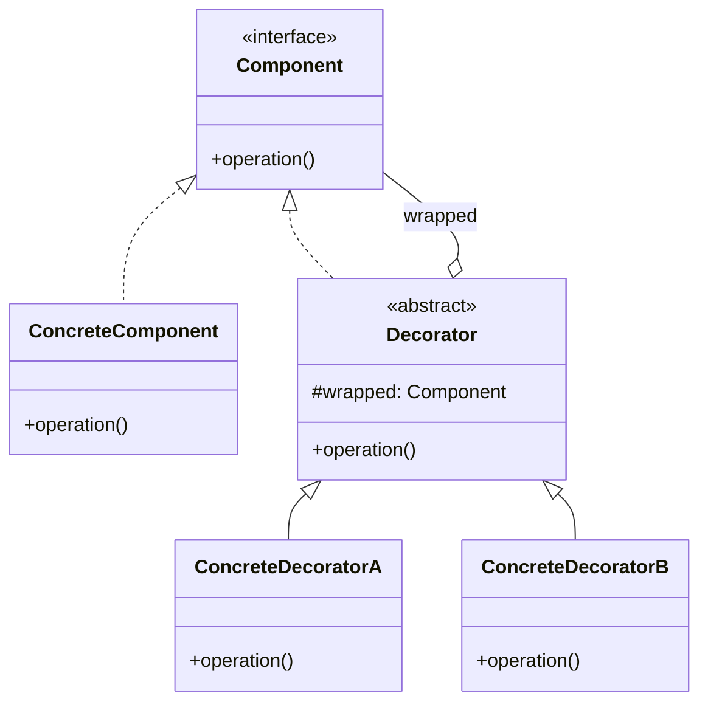
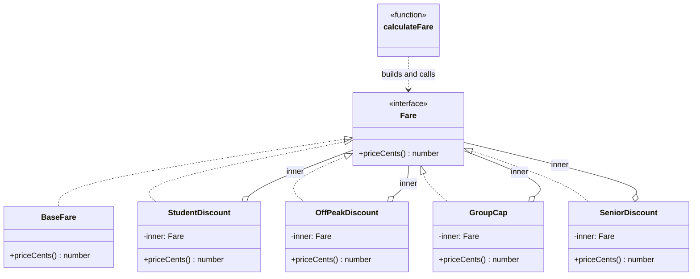

# Walkthrough — Decorator at Caldermoor

Read this **after** you have your own version.

---

## The structure, twice

The GoF diagram. A `Component` declares the operation every wrapped
object shares; `ConcreteComponent` is the unwrapped base case;
`Decorator` holds a reference to a `Component` and implements the same
interface, so any number of decorators can wrap any `Component` -
including another decorator - and a client never has to know how many
layers deep it's calling:



This exercise's names:



**On the mapping.** GoF's own base `Decorator` class is a single
abstract class that every concrete decorator extends, holding the
wrapped `Component` once so subclasses don't repeat that field. This
exercise skips that shared base - `StudentDiscount`, `OffPeakDiscount`,
`GroupCap` and `SeniorDiscount` each declare their own `private readonly
inner: Fare` - because with four decorators and nothing else in common
(no shared helper method, no shared construction logic), a one-line
constructor parameter repeated four times costs less than a fifth file
whose only job is to hold that one field once.

**On the name.** `inner`, not `wrapped` or `component`. GoF's own
diagram calls this field by the role name (`component`), which is fine
in the book's own vocabulary but fails question 1 in this codebase -
"component" describes the field's *pattern role*, not what it *is* to
someone reading `StudentDiscount` without the diagram open. `wrapped`
was close but rejected on question 4: it emphasizes the mechanism
(something is wrapped) over the relationship (this is the fare being
adjusted) - `inner` reads as "the fare this discount is a layer on top
of," which is closer to how a reader actually uses the field.

**On the name, a second time.** `GroupCap`, not `GroupCapDiscount` or
`MaxFare`. `GroupCapDiscount` fails question 4 - a cap is not a
discount; it doesn't reduce a fare proportionally or by a fixed amount,
it clips one that would otherwise be too high, and calling it a discount
would mislead a reader about what happens to a fare that's already under
the cap (nothing). `MaxFare` fails question 2: `GROUP_CAP_CENTS` is
already the constant that holds "the max fare," so a class also called
`MaxFare` would leave a reader unsure which one is meant in
conversation.

**On the name, a third time.** `priceCents`, not `total` or
`getPrice`. This is the one method name every `Fare` implementation
shares, so it was chosen for the widest audience: `total` fails question
4 by implying a sum of parts is being added up, when a leaf `BaseFare`
has nothing to total; `getPrice` implies a stored value, the same
objection `readFare` settled in this module's Adapter drill.

---

## Why this order

**`Fare` and `BaseFare` (step 1) exist before any modifier does.** A
`BaseFare` with no decorators wrapping it is provably correct on its
own - it returns one constant - so it's checked in isolation first, the
same discipline every drill in this module starts with.

**Each modifier (steps 2-4) is extracted and checked against the act-1
suite's own values before the next one starts.** By the time `GroupCap`
is extracted, the pattern of "wrap, read `inner.priceCents()`, adjust"
has been proven twice already, so there is nothing left to invent about
the third one.

**`calculateFare` (step 5) is rewritten last**, as the one place that
still has to know all four modifiers exist and in what order they
matter - the same "structure first, wire the public function last" split
this module's other drills use, and the reason act 2 is entirely a
change to this one function's body.

## Step 5 — the one function that still knows the order

```ts
export function calculateFare(options: FareOptions): number {
  let fare: Fare = new BaseFare();
  if (options.isSenior) fare = new SeniorDiscount(fare);
  if (options.isStudent) fare = new StudentDiscount(fare);
  if (options.isOffPeak) fare = new OffPeakDiscount(fare);
  if (options.isGroupCapped) fare = new GroupCap(fare);
  return fare.priceCents();
}
```

Every decorator class is provably correct in isolation - `SeniorDiscount`
subtracts 50 cents from whatever it's given, full stop. **Nothing about
any individual class's correctness says anything about whether this
specific sequence of four `if` statements is the sequence policy
requires.** That fact lives nowhere but here, in the order these lines
happen to be written - which is exactly the weakness act 2 exists to
surface.

---

## Where TypeScript changes this

[TYPESCRIPT.md](../../../../../../docs/TYPESCRIPT.md) notes that
function composition often replaces Decorator outright for single-method
interfaces like this one - `type FareModifier = (priceCents: number) =>
number`, with each modifier a plain function and `calculateFare`
reducing an array of them. That would remove four small classes at the
cost of losing anything a modifier might someday need to hold as its own
state (a per-rider fare-capping history, say) - a real cost only once a
modifier actually needs it, and this exercise's four modifiers never do.
The class route here is closer to ceremony than the composition
alternative for exactly the reason
[TYPESCRIPT.md](../../../../../../docs/TYPESCRIPT.md) names, and act 2's
own numbers (an extra file, an extra export line, for one more stateless
modifier) are the visible cost of that ceremony.

---

## What it cost

- **Four files instead of four `if` branches in one function**, for
  modifiers whose entire logic is one line each. The isolation Decorator
  buys - each modifier independently constructible and testable - was
  never exercised by act 1's own tests, which only ever call
  `calculateFare` and check the combined result.
- **Composability with no way to say "these two must compose in this
  order."** Nothing in `Fare`'s type, or in any decorator's
  constructor, prevents `new StudentDiscount(new SeniorDiscount(fare))`
  from compiling and running - the wrong order is exactly as legal as
  the right one, at every level except the one function that happens to
  get it right today.

## What act 2 actually showed, and what would have absorbed it

See [ACT2.md](./ACT2.md) for the measured numbers. The short version:
the pattern route is not cheaper here - one more file and one more
export line than the no-pattern route needed, for a requirement neither
route's own type system did anything to enforce. **Neither route is
clearly better**, and the ordering requirement itself was satisfied
identically on both: one line, inserted in the right position, in a
function that already existed.

What would have absorbed this act 2 at genuinely lower risk is an
**ordered pipeline with an explicit stage list**: instead of four
independent decorator classes composed by hand in `calculateFare`, a
single ordered array, `const STAGES: readonly FareStage[] =
[seniorDiscount, studentDiscount, offPeakDiscount, groupCap]`, with a
runner that folds a starting price through whichever stages apply. The
order would then be a property of the array's own literal order - a
single, greppable list, reorderable by moving one line, instead of an
order that has to be inferred from reading `calculateFare`'s `if`
statements top to bottom and trusting nothing reorders them later. That
design would not eliminate the *policy* work of getting the order right
the first time - it would make the order a fact about one array instead
of a fact implied by four independent classes' construction order,
which is a smaller, more honest claim than Decorator makes about this
axis.
