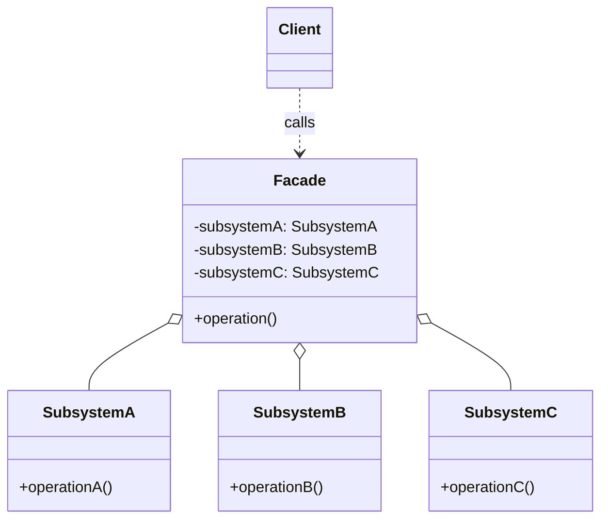
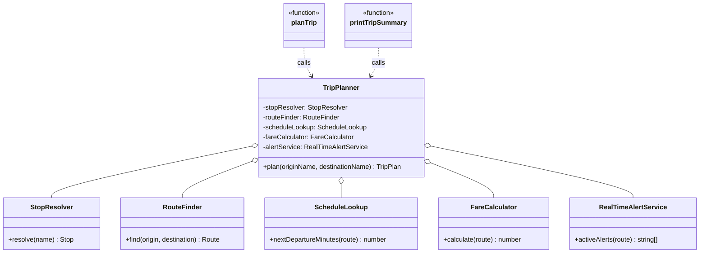

# Walkthrough — Facade at Caldermoor

Read this **after** you have your own version.

---

## The structure, twice

The GoF diagram. A `Facade` holds references to every class in a
`Subsystem` and exposes one simplified operation that sequences calls
across them; a `Client` talks only to the `Facade`, never touching a
subsystem class directly:



This exercise's names:



**On the mapping.** GoF's own `Facade` is deliberately thin on
obligations - the pattern's entire *Structure* section is one box with
references out to a subsystem, and no interface of its own, because a
facade is not supposed to be substitutable. This exercise follows that
exactly: `TripPlanner` implements no shared interface, because nothing
in this domain ever needs a second kind of trip planner. The one
liberty taken is holding the five subsystems as `private readonly`
fields built at construction, rather than GoF's looser "knows which
subsystem classes are responsible for a request" - TypeScript's
constructor-property shorthand makes "owns and builds these five
things" cheaper to write than to leave implicit.

**On the name.** `TripPlanner`, not `TripFacade` or `TripCoordinator`.
`TripFacade` fails question 1 - it says the GoF role, not what the
object does for a caller planning a trip. `TripCoordinator` was close
but rejected on question 4: "coordinator" implies the five subsystems
might run concurrently or negotiate with each other, when what actually
happens is a fixed, sequential handoff - `plan` is a more honest verb
for what the one public method does.

**On the name, a second time.** `plan`, not `run` or `execute`.
`run` and `execute` are both generic enough to fit almost any method on
almost any class - question 2, could this name mean something else in
this file, and for both the answer is yes, in a way `plan` isn't:
`TripPlanner.plan(originName, destinationName)` reads as "produce a
plan for this trip," which is the actual return value, not a side
effect being triggered.

**On the name, a third time.** `RealTimeAlertService`, not
`AlertServiceV2` or `LiveAlertService`. `AlertServiceV2` fails question
4 by promising nothing about what changed - a reader has no way to know
"V2" means "reads a live feed" without opening the file. `LiveAlertService`
was a close second; `RealTimeAlertService` won on question 3 - it reads
better at the one call site that constructs it, next to the feed URL
that's the actual reason this class exists.

---

## Why this order

**`TripPlanner` (step 1) is written with fields but no `plan` method
yet** - the same discipline this module's other extraction drills use:
prove the five subsystems can be held together before proving anything
about the order they run in.

**The coordination logic (step 2) moves as a single cut-and-paste**,
unchanged, from `planTrip` into `TripPlanner.plan`. Nothing about *how*
the five subsystems are called is rewritten here - only *where* that
sequence lives.

**`planTrip` (step 3) is reduced first, `printTripSummary` (step 4)
second**, each checked against the act-1 suite before the next step
starts. By the time step 4 touches `printTripSummary`, the pattern of
"one line, delegate to `tripPlanner.plan`" has already been proven once
- there is nothing left to invent, only to repeat, which is exactly the
repetition act 1 existed to remove.

## Step 3 — a caller with nothing left to coordinate

```ts
const tripPlanner = new TripPlanner();

export function planTrip(originName: string, destinationName: string): TripPlan {
  return tripPlanner.plan(originName, destinationName);
}
```

This function does not grow when a sixth subsystem joins `TripPlanner`,
and it does not need to change when `ScheduleLookup`'s constructor
grows a parameter - compare the act-1 version, where every one of the
five subsystem names had to appear, in order, inside this exact
function.

---

## Where TypeScript changes this

[TYPESCRIPT.md](../../../../../../docs/TYPESCRIPT.md) notes that a
facade in TypeScript is often just a module - a file that imports the
subsystems and re-exports one simplified function, no class required.
This exercise keeps `TripPlanner` as a class specifically because it
holds constructed state (five subsystem instances, each with its own
constructor arguments) that a lone module-level function would have to
recreate on every call, or hoist into module-level `const`s anyway -
at which point the class and the module differ only in whether "the
subsystems this facade owns" has a name (`this`) or doesn't. The
module route becomes the better default the moment `plan` is the
*only* thing being exported and none of the five subsystems need
per-call configuration; this exercise's subsystems are built once, at
module load, which is already halfway to that shape.

---

## What it cost

- **Two callers lost the ability to skip a subsystem.** Act 1's
  `planTrip` and `printTripSummary` happened to call all five in the
  same order, but nothing stopped a third caller from calling only
  three. `TripPlanner.plan` forecloses that - every caller gets all
  five, in this order, or has to bypass `TripPlanner` entirely.
- **One more file between "I want a trip plan" and the five subsystems
  that produce one.** Reading what `planTrip` actually does now means
  opening `trip-planner.ts` - a real cost for a codebase with exactly
  one caller, and an increasingly cheap one as more callers arrive.

## What act 2 showed

See [ACT2.md](./ACT2.md) for the numbers. Every dimension favored the
pattern (5 files/28 lines/5 hunks against 6 files/37 lines/6 hunks),
and the gap is exactly one call site's worth of duplicated construction
work - `trip-planner.ts` paid it once, `trip-planning-api.ts` and
`trip-summary-cli.ts` each paid it once in the baseline. Four of the
five files every route touches are identical between the two patches:
the tax two subsystems changing their internals impose is not what
Facade removes. What it removes is the second bill for a coordination
sequence that only ever needed to be written down once.
