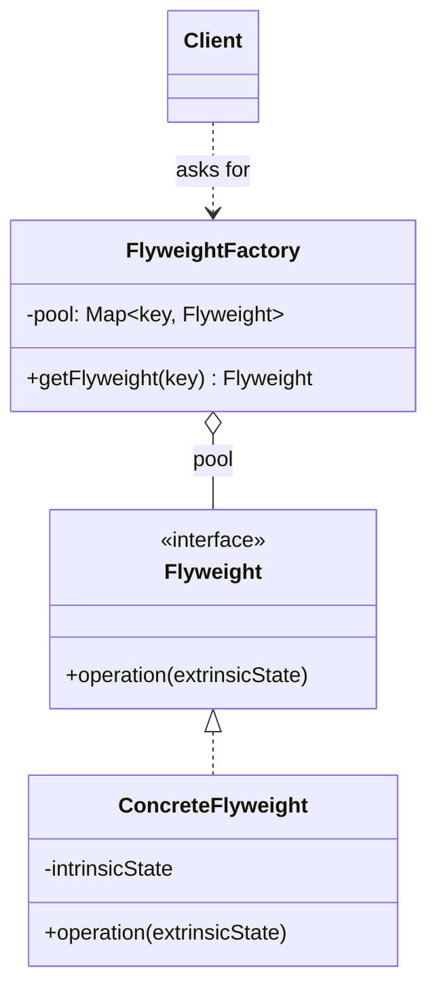
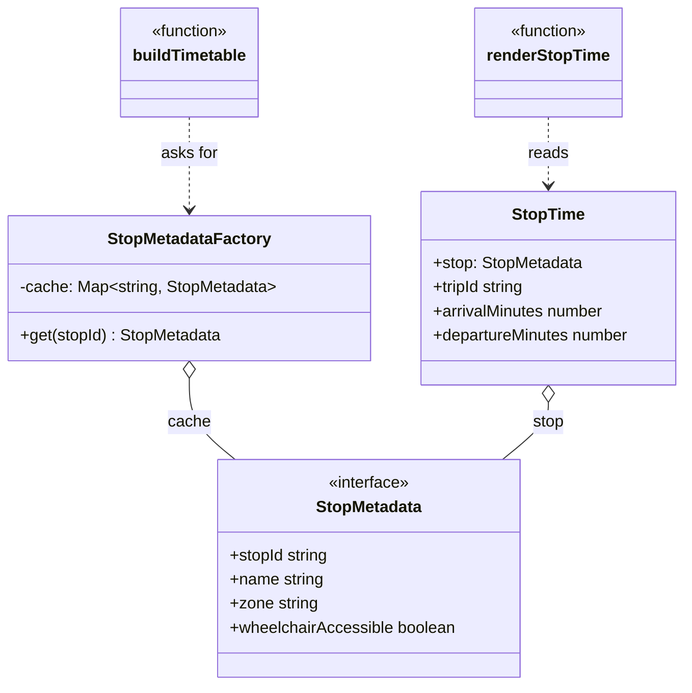

# Walkthrough — Flyweight at Caldermoor

Read this **after** you have your own version.

---

## The structure, twice

The GoF diagram. A `Flyweight` declares an operation that takes
whatever extrinsic state a client provides; a `FlyweightFactory` holds
a pool of flyweights keyed by their intrinsic state, and either returns
an existing one or builds and caches a new one; a `Client` never
constructs a `Flyweight` directly:



This exercise's names:



**On the mapping.** GoF's `Flyweight` is usually drawn as its own
interface, separate from `ConcreteFlyweight`, because the pattern
expects more than one flyweight *kind* sharing one pool. This exercise
has exactly one kind of shared value, so `StopMetadata` is a plain
interface with no implementing class of its own - a `StopMetadataFactory`
that only ever builds object literals shaped like `StopMetadata`. The
factory itself plays GoF's `FlyweightFactory` role precisely: one
`Map`, one method, one job.

**On the name.** `StopMetadata`, not `Stop` or `StopInfo`. `Stop`
collides with a name this domain's other Caldermoor drills already use
for a different, more complete concept (a `Stop` with its own identity
in the network, in the Composite drill). `StopInfo` fails question 4:
"info" promises nothing about *what kind* of information, where
`StopMetadata` says plainly that this is data *about* a stop, not the
stop itself.

**On the name, a second time.** `StopMetadataFactory`, not `StopCache`
or `StopMetadataPool`. `StopCache` fails question 1 - it names the
mechanism (a cache), not the role this class plays for its callers,
which is "the thing you ask for a stop's metadata." `StopMetadataPool`
was close; `Factory` won on question 3, since `stopMetadataFactory.get(id)`
reads like asking a factory for a product, where `.get` on a "pool"
reads more like reaching into a cache you're expected to manage
yourself.

**On the name, a third time.** `recordStopMetadataAllocation`, not
`trackAllocation` or `countStop`. `trackAllocation` fails question 4 by
promising to track *any* allocation, when it only ever counts one very
specific kind. `countStop` was rejected on question 2 - "count" reads
as a query in this codebase (`stopMetadataAllocationCount` already
plays that role), and reusing the verb for a mutation invites a reader
to expect a return value this function doesn't have.

---

## Why this order

**`StopMetadataFactory` (steps 1-2) is written with its cache logic
complete before `buildTimetable` ever calls it.** A factory that
sometimes forgets to check its own cache is worse than no factory -
Flyweight's entire promise rests on the cache check happening first,
every time, so it's proven correct in isolation before anything depends
on it.

**`buildTimetable` (step 3) is rewritten last**, as a near-total
deletion: `buildStopMetadata` disappears, and the one line that
replaces it just asks the factory. This is the same "structure first,
wire the public function last" split this whole module uses - by the
time step 3 runs, there is nothing left to design, only a call to
redirect.

## Step 3 — a caller with nothing left to build

```ts
const stopMetadataFactory = new StopMetadataFactory();

export function buildTimetable(entries: readonly TripStopEntry[]): StopTime[] {
  return entries.map((entry) => ({
    stop: stopMetadataFactory.get(entry.stopId),
    tripId: entry.tripId,
    arrivalMinutes: entry.arrivalMinutes,
    departureMinutes: entry.departureMinutes,
  }));
}
```

`buildTimetable` no longer knows what a `StopMetadata` is made of, or
how many distinct ones exist - it only knows to ask. Compare the act-1
version, where this same function's neighbor, `buildStopMetadata`, had
to reconstruct one from `STOP_DIRECTORY` on every single call.

---

## Where TypeScript changes this

[TYPESCRIPT.md](../../../../../../docs/TYPESCRIPT.md) notes that a
Flyweight in TypeScript is often just a `Map` of interned values - no
class required, and this exercise's `StopMetadataFactory` is close to
that already, one method around one `Map`. What TYPESCRIPT.md is
careful to add is the real point of this whole drill: **the pattern is
only ever justified with a measurement.** A `Map` that caches values
nobody counted is pure ceremony over the plain object-literal version -
the type system cannot see the difference between a cache that's
saving real allocations and one that's saving zero, and neither can a
reader. `act2/tests/allocation-budget.test.ts` is not optional
decoration on this exercise; it is the only evidence in the entire
repository that this file is worth having.

---

## What it cost

- **A guarantee the type system doesn't enforce.** Nothing stops a
  fourth file from building a `StopMetadata` object literal directly,
  bypassing `StopMetadataFactory` entirely - the sharing this route
  promises is a discipline, not a compile error.
- **One more indirection between "I need this stop's data" and the
  data itself.** For a `STOP_DIRECTORY` this small, a reader could
  previously see the entire mapping in one file; now they have to trust
  that `StopMetadataFactory.get` is the only path to it.

## What act 2 showed

See [ACT2.md](./ACT2.md) for the numbers. Every dimension favored the
pattern (1 file/1 line/1 hunk against 2 files/15 lines/2 hunks) - but
the honest reading is narrower than that gap suggests. `timetable.ts`
never appears in the pattern's own patch at all, because the sharing
act 2 measures was already true the moment act 1's refactor finished.
The fourteen extra lines the baseline pays aren't a competing design -
they're `StopMetadataFactory`, unnamed and inlined, invented on the
spot because the requirement forced it. Flyweight's argument here isn't
that the caching trick is hard to think of. It's that naming it once,
in one file, means every future caller inherits the guarantee instead
of having to reinvent it.

## What would change my mind

This drill's verdict is `niche`, and the case for that verdict is
`STOP_DIRECTORY`'s own size: three stops, a number small enough that
`STOP_DIRECTORY` itself already **is** a flyweight pool, indexed by a
plain object instead of a class. What would change my mind is a domain
where the intrinsic-state pool is itself large and expensive to look
up - not "there are many fine-grained objects," but "there are many
fine-grained objects **and** building one of the shared values is
itself costly enough that memoizing it, not just deduplicating it,
matters." A stop's metadata here is four fields and a dictionary
lookup; if it were instead the parsed, validated result of a slow
computation - a compiled regular expression, a decoded image, a
resolved DNS lookup - the factory would be doing real work beyond
deduplication, and the pattern would earn its file on that alone, even
before anyone measured allocation counts.
