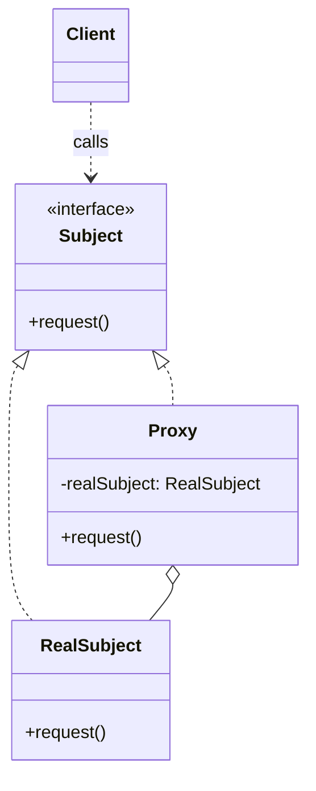
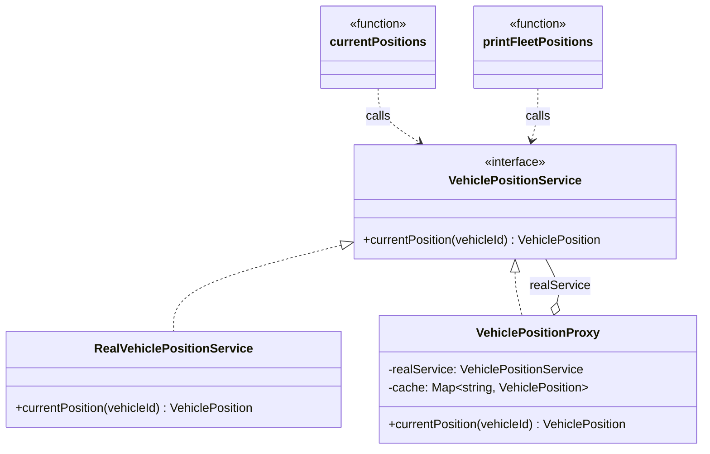

# Walkthrough — Proxy at Caldermoor

Read this **after** you have your own version.

---

## The structure, twice

The GoF diagram. A `Subject` interface declares the operation both the
`RealSubject` and the `Proxy` implement; the `Proxy` holds a reference
to the `RealSubject` and controls access to it, so a `Client` calling
through the `Subject` interface can't tell which one actually answered:



This exercise's names:



**On the mapping.** GoF actually names three proxies under one word,
and this exercise deliberately plays two of them against each other.
Act 1's `VehiclePositionProxy` is a **virtual proxy**: it stands in for
a resource - the real, slow lookup - that's worth deferring or caching,
the same family as lazy-loading a large image. Its constructor argument
already leans **remote proxy**, too: `RealVehiclePositionService` is
named and shaped like a stand-in for a call that leaves the process,
even though this exercise stubs it in memory. Act 2 adds a third role
to the *same* class - a **protection proxy**, refusing a request before
it ever reaches the real subject. GoF treats these as three different
patterns that happen to share a name and a diagram; this exercise
deliberately collapses two of them into one class to make a point: nothing
about the `Subject` interface changes when a proxy takes on a second
job. A caller talking to `VehiclePositionService` has no way to know,
and no reason to care, whether the object behind it is caching,
guarding, or both.

**On the name.** `VehiclePositionProxy`, not `VehiclePositionCache` or
`VehiclePositionGuard`. Either of those would have been an honest name
for *one* of this class's two jobs after act 2 - and that's exactly why
neither was chosen. `Proxy` names the role, not the current mechanism,
which is question 4: a name that says "cache" stops being true the
moment access control is added beside it, without the class itself
changing shape.

**On the name, a second time.** `realService`, not `inner` or `target`.
This module's Decorator drill uses `inner` for an analogous wrapped
field, and Proxy could have reused it - but `realService` was chosen
because question 3, does it read well at the call site, favors
specificity here: `this.realService.currentPosition(vehicleId)` tells a
reader which of the two `VehiclePositionService` implementations is
underneath, where `this.inner.currentPosition(vehicleId)` would not.

**On the name, a third time.** `RESTRICTED_VEHICLE_IDS`, not `BLOCKLIST`
or `DENIED`. `BLOCKLIST` fails question 2 - it's generic enough to mean
almost any kind of blocking, in a codebase that has no other kind.
`DENIED` fails question 1: it describes an outcome, not the set of
things the outcome applies to - `RESTRICTED_VEHICLE_IDS` says plainly
what's in the set and what it's a set *of*.

---

## Why this order

**`VehiclePositionProxy` (step 1) is written and proven correct in
isolation** - constructed with a real service, checked against the
act-1 suite on its own - before either caller depends on it. A cache
that's wrong is worse than no cache, so its correctness can't be an
accident of how a caller happens to use it.

**`currentPositions` (step 2) and `printFleetPositions` (step 3) are
each reduced to "build a proxy, delegate to it" in turn**, checked
against the suite before the next one starts. By the time step 3
touches the CLI, the pattern of "the proxy is a drop-in
`VehiclePositionService`" has already been proven once by the
dashboard - there's nothing left to design, only to repeat.

## Step 1 — a class two callers can't tell apart from the real thing

```ts
export class VehiclePositionProxy implements VehiclePositionService {
  private readonly cache = new Map<string, VehiclePosition>();

  constructor(private readonly realService: VehiclePositionService) {}

  currentPosition(vehicleId: string): VehiclePosition {
    const cached = this.cache.get(vehicleId);
    if (cached) return cached;

    const position = this.realService.currentPosition(vehicleId);
    this.cache.set(vehicleId, position);
    return position;
  }
}
```

Nothing about this signature differs from `RealVehiclePositionService`'s
own - which is the entire property Proxy trades on. A caller holding a
`VehiclePositionService` cannot tell, by type or by call shape, which
one it has.

---

## Where TypeScript changes this

[TYPESCRIPT.md](../../../../../../docs/TYPESCRIPT.md) is careful to
separate two things this exercise's name could be confused with:
JavaScript's built-in `Proxy` object, and the GoF pattern. The built-in
covers the *general* case - intercepting arbitrary property access on
an arbitrary object - with `get`/`set`/`has` traps, at the cost of losing
most static typing on the result. This exercise's `VehiclePositionService`
has exactly one method, known ahead of time, so a hand-written class
implementing that one interface is both simpler and fully typed - the
built-in `Proxy` earns its keep on objects with a large or dynamic
surface, which `VehiclePositionService` deliberately isn't.

---

## What it cost

- **Every caller now depends on an object that isn't the real thing.**
  For a resource this cheap to construct, that's one file of pure
  indirection - it only pays for itself once there's a real reason
  (caching, guarding, deferring construction) to have it.
- **The type system doesn't enforce that every caller goes through the
  proxy.** A third file could still `new RealVehiclePositionService()`
  and call it directly, silently opting out of both the cache and the
  restriction - nothing here stops that but discipline and code review.

## What act 2 showed

See [ACT2.md](./ACT2.md) for the numbers. Every dimension favored the
pattern (3 files/13 lines/3 hunks against 4 files/14 lines/4 hunks),
and the shape of the gap matters more than its size: two of the three
files every route touches are identical between the two patches - the
tax of exporting a measurement and adding one data row. The one file
that differs is the whole argument. Without a shared proxy, access
control had nowhere to live but the caller, and this exercise has two
of them.

## What would change my mind

This drill's verdict is `situational`, and the case for that is
`RealVehiclePositionService`'s own simplicity: one method, no state
worth guarding beyond what a `Set` and a `Map` already cover. What
would change my mind toward `essential` is a domain where the subject
is genuinely expensive or genuinely dangerous to construct at all - a
database connection opened eagerly, a licensed resource with a limited
pool of handles, a remote call with real latency and a real failure
mode. There, a proxy isn't optional indirection over a cheap
alternative; it's the only place *construction itself* can be deferred,
pooled, or retried, which a caller calling the real subject directly
has no way to express. This exercise's subject is fast enough that a
caller calling it directly costs almost nothing extra - which is
exactly why act 2, not act 1, is where this pattern's argument actually
lands.
