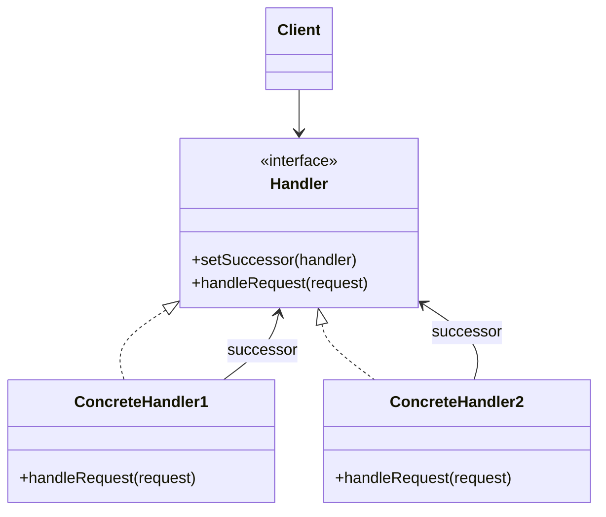
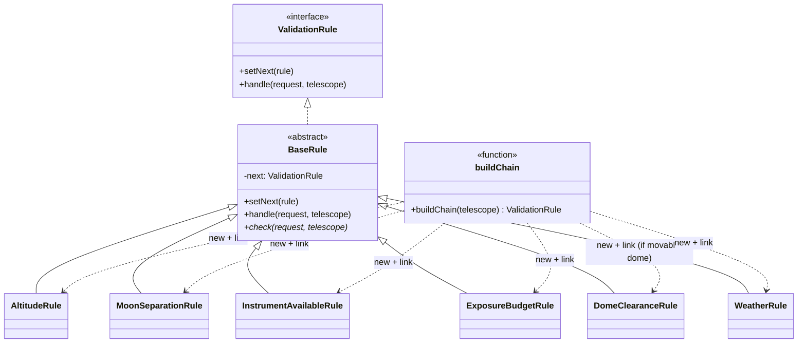

# Walkthrough — Chain of Responsibility at Hollowell

Read this **after** you have your own version.

---

## The structure, twice

The GoF diagram. A client sends a request to the first handler in a chain;
each handler either handles it or passes it to its successor, and no
handler needs to know how long the chain is or what comes after it:



This exercise's names:



**On the mapping.** GoF's `Handler` is split here across two things: the
`ValidationRule` interface (`setNext`/`handle`) and `BaseRule`, the abstract
class that actually implements both, leaving concrete rules with nothing to
write but `check`. The book's own text allows this — it calls the
successor-holding behavior a "default implementation" a `Handler` subclass
gets access to, which is exactly what `BaseRule` is. GoF's `Client` — the
code that kicks the chain off — has no class of its own here; it is just
whatever calls `validateRequest`, because the exercise never needed a
`Client` object to hold state of its own.

**`buildChain`, not a role from the book.** GoF's own examples usually wire
the chain once, by hand, wherever the objects are constructed — a help
system links `Button → Dialog → Application` in one place and never
rebuilds it. This exercise's chain has to be different *per telescope*
(dome clearance only for movable domes, and — after act 2 — a whole
different order for Ridgeline), so the wiring itself needed a name and a
single place to live, rather than being inlined at every call site.

---

## Why this order

**The base class (step 1) is written before any rule exists.** `setNext`
and `handle` are the same on every rule; writing them once, against an
interface with zero implementations yet, means step 2's `AltitudeRule` is
provably just a `check` method and nothing else — there is no delegation
logic left to get subtly wrong per rule.

**Rules are extracted one per commit (steps 2–7), in the same order they
already ran in `src/validate.ts`.** Reusing the existing order rather than
alphabetizing or grouping them means each commit's diff is almost entirely
new code, not rearranged code — the reviewer diff for step 4
(`InstrumentAvailableRule`) does not also need to explain why step 3's rule
moved down a page. `DomeClearanceRule` (step 6) is deliberately extracted
*without* the `hasMovableDome &&` guard — the guard is a wiring decision,
not a fact about what dome clearance means, and it does not belong inside
the one method whose job is "does this pointing risk the dome."

**`buildChain` (step 8) is written only after all six rules exist**, and
`validateRequest` is rewired to call it (step 9) as a separate, final
commit. Doing steps 8 and 9 together would make one commit responsible for
both "does the chain build correctly" and "does the public function still
return the right thing," and a mistake in either would be harder to isolate
than it needs to be.

## Step 1 — the shared base, before any rule exists

```ts
export abstract class BaseRule implements ValidationRule {
  private next: ValidationRule | undefined;

  setNext(rule: ValidationRule): ValidationRule {
    this.next = rule;
    return rule;
  }

  handle(request: ObservationRequest, telescope: Telescope): string | null {
    const failure = this.check(request, telescope);
    if (failure !== null) return failure;
    return this.next?.handle(request, telescope) ?? null;
  }

  protected abstract check(request: ObservationRequest, telescope: Telescope): string | null;
}
```

**On the name.** `ValidationRule`/`BaseRule`, not `Handler`/`AbstractHandler`.
This is [NAMING.md](../../../../../../docs/NAMING.md)'s own worked example
for this exact pattern (`Handler` → `ValidationRule` in its GoF-roles
table), and it passes question 1 for a reason worth restating here: `Handler`
says *how* the object participates (it is asked to handle something),
`ValidationRule` says *what* it is (a fact about a request that must hold).
A reader who has never heard of Chain of Responsibility can still guess what
`ValidationRule` does; `Handler` alone tells them nothing until they find
the chain it belongs to.

**On the name, a second time.** `check`, not `handle`, for the one method
every concrete rule actually writes. Question 2 rules out reusing `handle`
for it: `handle` already means something specific and different on
`BaseRule` (test this rule, *then delegate*), and giving the same word to
"test this rule, full stop" on the abstract method would make the two
impossible to tell apart from the name alone at a subclass definition site.
`check` also passes question 3 — `protected abstract check(...)` reads, at
every one of the six subclasses, as "the thing this class checks."

**On the name, a third time.** `setNext`, not `chain` or `link`. `chain`
fails question 2 immediately — it is also the natural name for the whole
linked structure (`buildChain` needs that word), so reusing it for "attach
one successor" would make `chain.chain(next)` plausible and wrong. `setNext`
survives question 3 at every call site in `chain.ts`:
`altitude.setNext(moon).setNext(instrument)` reads left to right as the
actual order requests are checked in, which `altitude.link(moon)` does not
make as obvious.

## Step 6 — a rule with an exception that isn't its own

```ts
export class DomeClearanceRule extends BaseRule {
  protected check(request: ObservationRequest): string | null {
    if (request.altitudeDegrees > 85) return "near-zenith pointing risks dome slit clearance";
    return null;
  }
}
```

Nothing in this file mentions `hasMovableDome`. The exception from act 1's
`src/validate.ts` — "only check this for telescopes whose dome moves" — is
not a fact about *what dome clearance means*; it is a fact about *which
telescopes need the check at all*, and that fact lives in exactly one place:

## Step 8 — the one place order is a fact, not a sequence of statements

```ts
export function buildChain(telescope: Telescope): ValidationRule {
  const altitude = new AltitudeRule();
  const moon = new MoonSeparationRule();
  const instrument = new InstrumentAvailableRule();
  const exposure = new ExposureBudgetRule();
  const weather = new WeatherRule();

  altitude.setNext(moon).setNext(instrument).setNext(exposure);

  if (telescope.hasMovableDome) {
    exposure.setNext(new DomeClearanceRule()).setNext(weather);
  } else {
    exposure.setNext(weather);
  }

  return altitude;
}
```

`DomeClearanceRule` only gets constructed, only gets linked in, for a
telescope with a movable dome — the rule class itself never has to ask.

---

## Where TypeScript changes this

[TYPESCRIPT.md](../../../../../../docs/TYPESCRIPT.md)'s general note on
Chain of Responsibility: `protected abstract check(...)` is doing real work
that a dynamically-typed version of this pattern cannot get for free —
every concrete rule is *required* by the compiler to implement `check` with
exactly this signature, and `handle`/`setNext` are not overridable by
accident (they are not `abstract`, so a subclass that defines its own
`handle` shadows rather than fulfills a contract, and a reviewer would
immediately ask why). The six rule files in this exercise never call
`instanceof` or check a `kind` field on each other — the whole chain is
built and walked through the one shared `ValidationRule` interface, which
is the polymorphism this pattern is named for working exactly as GoF
describes it, with TypeScript's structural typing adding nothing beyond
what the abstract class already guarantees.

---

## What it cost

- **A request that used to be "read one function top to bottom" is now "read
  one function, then also open `chain.ts` to find out which of six other
  files actually run, and in what order."** Nothing about any individual
  rule tells you where it sits in the sequence — that is by design, but it
  means the six rule files cannot be understood in isolation from
  `buildChain`.
- **Six small files replaced one function.** Each does exactly one job, but
  "one job per file" is six imports where act 1 needed zero.
- **A rule chain built with a single rule and no `setNext` call still has to
  work** — `BaseRule.handle` falls through to `this.next?.handle(...) ??
  null` specifically so that a one-rule chain (or the last rule in any
  chain) does not need special-casing.

## If you took a different route

- **An ordered array of rule objects or functions, checked with a loop or
  `Array.prototype.find`,** instead of a linked chain — a reasonable, often
  *better*, alternative when nothing needs to build a genuinely different
  order or subset per caller. The array route reads as "here is the list,
  in order" at a single glance, where the linked-chain route makes you
  follow `setNext` calls to reconstruct the same list. This exercise chose
  the classic linked form because act 2 asks for two things an array
  handles less cleanly: reusing the *same* rule instances in two different
  orders for two different telescopes (an array can do this too, by
  building two arrays from the same objects — `[weather, altitude, moon,
  warmup, instrument, exposure]` for Ridgeline — so the real difference is
  smaller than the GoF diagram suggests), and inserting a rule in the
  middle of an existing sequence without renumbering anything (an array
  insert is one `splice` or one rebuilt literal — also not harder). Honestly,
  for *this* exercise's act 2, the array form would have cost about the same
  as the linked form; the linked form earns its keep more clearly the moment
  a rule needs to make its *own* decision about whether to delegate at all
  (skip the rest of the chain on some condition, not just "pass or fail"),
  which GoF's `Handler.handleRequest` supports directly and a plain
  `array.find` does not without extra plumbing.
- **A single rule class parameterized by a check function**, rather than one
  subclass per rule — would cut the file count from six to one, at the cost
  of losing named types for each rule (harder to reference "the moon
  separation rule" from a test or from `buildChain` without a string key or
  an index).

## What act 2 showed

See [ACT2.md](./ACT2.md) for the numbers. The short version: relinking five
already-correct rule objects into a new order, and slotting a sixth rule in
between two existing ones, touched two files and twelve lines with no
existing rule class changed. The honest part is in ACT2.md's hunk count,
not its line count — read that section before deciding hunk count is a
reliable proxy for change size.
