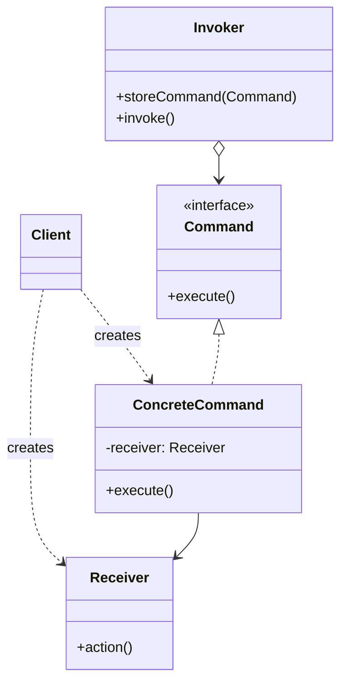
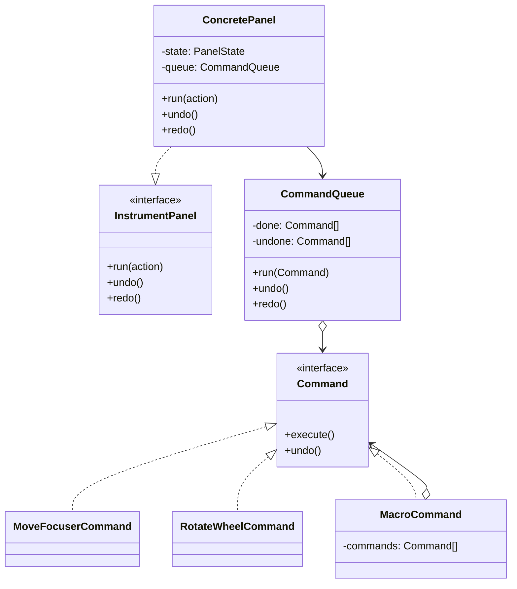

# Walkthrough — Command at Hollowell

Read this **after** you have your own version.

---

## The structure, twice

The GoF diagram. A `Client` configures a `Command` with a `Receiver`; an
`Invoker` holds the command and calls `execute()` without knowing what it
does or what it is for:



This exercise's names:



**On the mapping.** `CommandQueue` plays **`Invoker`** — it calls `execute()`
and `undo()` without knowing what a `MoveFocuserCommand` actually moves.
`ConcretePanel` plays **`Client`** in one respect (it owns the `PanelState`
the commands share, playing a muted `Receiver`) and **`Invoker`**'s public
face in another (`panel.undo()` just forwards to `queue.undo()`) — the book
draws these as three separate objects; this exercise's panel does two of
those three jobs because there is only one kind of receiver (`PanelState`)
and no reason yet to let a client build a command without a panel to hand it
to. `toCommand`, the factory, has no role in the GoF diagram at all — the
book's `Client` constructs `ConcreteCommand`s directly, by hand, one at a
time. A factory function standing in for that by-hand construction is this
exercise's only real structural addition to the book's shape, and it exists
because `ActionRecord` values arrive from outside (not written by hand in
application code the way GoF's examples assume) and something has to turn
them into commands before the queue ever sees them.

**`MacroCommand` is GoF's "macro command," named in the book's own
Implementation section**, not a thing this exercise invented. The book treats
it as an afterthought worth one paragraph; this exercise's act 2 makes it the
entire point, which is the right amount of attention for something that adds
no new concept — a `MacroCommand` is just a `Command` whose `execute()` and
`undo()` delegate to other `Command`s, recursively. That recursion is also why
nesting "just works": `MacroCommand` never checks what kind of `Command` it
is holding.

---

## Why this order

**Writing the two concrete commands (steps 2, 3) before the factory (step 4)**
means the factory's job is purely mechanical by the time you write it — match a
tag, call a constructor — rather than a place where you are simultaneously
inventing `MoveFocuserCommand`'s shape and trying to write a switch around it.
Write the factory first and it is tempting to let it do more than dispatch:
compute values, validate input, reach into `PanelState` directly. None of
that is the factory's job.

**`CommandQueue` (step 5) is written before it has any undo/redo to manage.**
Act 1 never asks for undo, so the act-1 `CommandQueue` only has `run()` and
`history`. This is deliberate, not an oversight: building the `undone` stack
now, before act 2 names the exact rule for when it clears, would mean
guessing that rule and then defending the guess later. The act-1 suite staying
green through step 5 is proof the queue's act-1 shape really doesn't need it
yet.

## Step 3 — the one with a timing decision

```ts
export class RotateWheelCommand implements Command {
  private fromSlot = 0;
  // ...
  execute(): void {
    this.fromSlot = this.state.filterSlot;
    this.state.filterSlot = this.toSlot;
  }
  undo(): void {
    this.state.filterSlot = this.fromSlot;
  }
}
```

**On the name.** `fromSlot`, not `previousSlot` or `oldSlot`. Question 2 of
[NAMING.md](../../../../../../docs/NAMING.md) rules out `oldSlot` — "old"
could describe almost any stale value in this file, where `fromSlot` only
describes one thing: the slot this specific rotation started from. Question 3
settles it against `previousSlot`: `this.state.filterSlot = this.fromSlot`
reads as "go back to the slot this came from," which is what `undo()` does;
`previousSlot` reads fine too, but says nothing about *whose* previous value
it is once this command sits inside a macro next to three others.

Capturing `fromSlot` inside `execute()` rather than the constructor is the
detail act 1's tests cannot distinguish from the alternative — both pass
every act-1 test, because in act 1 every command runs the instant it is
built. Act 2 is what makes the two choices observably different: a macro
built once and run later, or a macro built from sub-actions and run
immediately but whose sub-commands are constructed before any of them
execute, needs each command's "what do I undo back to" captured at the moment
it actually ran, not the moment it was created.

## Step 6 — the factory, and what it is not

```ts
export function toCommand(state: PanelState, action: ActionRecord): Command {
  switch (action.type) {
    case "move-focuser":
      return new MoveFocuserCommand(state, action.deltaMicrons);
    case "rotate-wheel":
      return new RotateWheelCommand(state, action.toSlot);
    case "macro":
      return new MacroCommand(action.actions.map((sub) => toCommand(state, sub)));
  }
}
```

**On the name.** `toCommand`, not `createCommand` or `buildCommand`. This one
came down to question 1: `createCommand` and `buildCommand` both say *how*
(construction) when what the reader needs at the call site — `toCommand(state,
action)` — is *what*: an `ActionRecord` going in, a `Command` coming out. The
`to*` prefix already has exactly this meaning elsewhere in the Strategy and
State drills' domains (`toCommand` reads the same way `String(x)` does), which
is question 4's "is it true" check passing for free: the name promises a
conversion, and a conversion is all this function does.

This function switching on `action.type` is not a relapse into the original
smell. The original switch decided a *side effect* directly; this one decides
which *object* to hand back, and every caller past this one line treats that
object the same way regardless of which case produced it. One switch,
confined to the one place that has to exist for any of this to work, is the
acceptable remainder — see [DESIGN.md §12](../../../../../../docs/DESIGN.md)
on why this repository does not chase switch statements to zero.

---

## Where TypeScript changes this

[TYPESCRIPT.md](../../../../../../docs/TYPESCRIPT.md)'s general claim about
Command is that an interface with two methods is not really asking for a
class hierarchy — and this drill is a fair test, because the **functional
alternative** is genuinely competitive here:

```ts
interface Command {
  readonly description: string;
  execute(): void;
  undo(): void;
}

function moveFocuserCommand(state: PanelState, deltaMicrons: number): Command {
  return {
    description: `move-focuser(${deltaMicrons})`,
    execute: () => { state.focuserPosition += deltaMicrons; },
    undo: () => { state.focuserPosition -= deltaMicrons; },
  };
}
```

A closure over `state` and the constructor arguments replaces a class with
private fields, and for `MoveFocuserCommand` — no captured timing state — the
two are a wash. `RotateWheelCommand` is where they stop being equivalent in
comfort: the closure version needs a `let fromSlot` captured by both
`execute` and `undo`, which reads less obviously as "this command's own
state" than a private class field does, precisely because a closure variable
has no name standing next to it the way `private fromSlot` does in the class
version. Neither is wrong. The class version is what this solution ships,
and a function-based Command is worth building as a second pass once the
class one has nothing further to teach — the roadmap calls this out as one of
only two drills (with Strategy) worth a second, function-shaped solution.

---

## What it cost

- **Two files and a factory now stand between an `ActionRecord` and its
  effect**, for two action kinds that a six-line switch handled fine on its
  own. See [ACT2.md](./ACT2.md) for what that cost bought back.
- **`RotateWheelCommand`'s execute-time capture is a convention, not something
  the `Command` interface can enforce.** A reviewer who has not read this
  walkthrough could reasonably write a new command that captures its undo
  data at construction time, pass every act-1 test, and only discover the bug
  inside a macro.
- **The factory is the one place that still has to change every time a new
  `ActionRecord` variant is added** — which is correct and unavoidable (`toCommand`
  can exist precisely because exactly one function decides), but it means the
  pattern does not remove the "add a case" cost of a new action kind, only
  the cost of *using* one once it exists.

## If you took a different route

- **The functional/closure form**, discussed above — a real alternative for
  this exercise's simple command shapes, weaker once a command needs to carry
  named internal state like `fromSlot` that other code might want to inspect.
- **Storing the inverse action as data** (`{ type: "move-focuser", deltaMicrons: -delta }`)
  instead of an object with an `undo()` method, then re-running it through the
  same factory to undo. This works for `move-focuser` and `rotate-wheel`
  (both have a computable inverse action) and breaks down for any future
  action whose undo is not itself expressible as a forward action — the
  `Command` interface's separate `undo()` method does not have that
  limitation, at the cost of writing two methods instead of one inverse value.

## What act 2 showed

See [ACT2.md](./ACT2.md) for the numbers, and read it in full rather than
skimming the totals: this is the one drill so far where file count and hunk
count point one way and lines-touched points the other, and the walkthrough's
job is to say *why*, not just which number to trust. Short version: the
pattern route spreads a small amount of total change across more files
because the work was already separated by concern; the no-pattern baseline
concentrates a much larger amount of change into fewer files because there
was only one object left to put it in. The macro nesting inside a macro,
working with zero extra code in `MacroCommand`, is the part of this act 2
that a switch-based baseline has to earn by hand — and its baseline patch
does earn it, honestly, at the cost named above.
