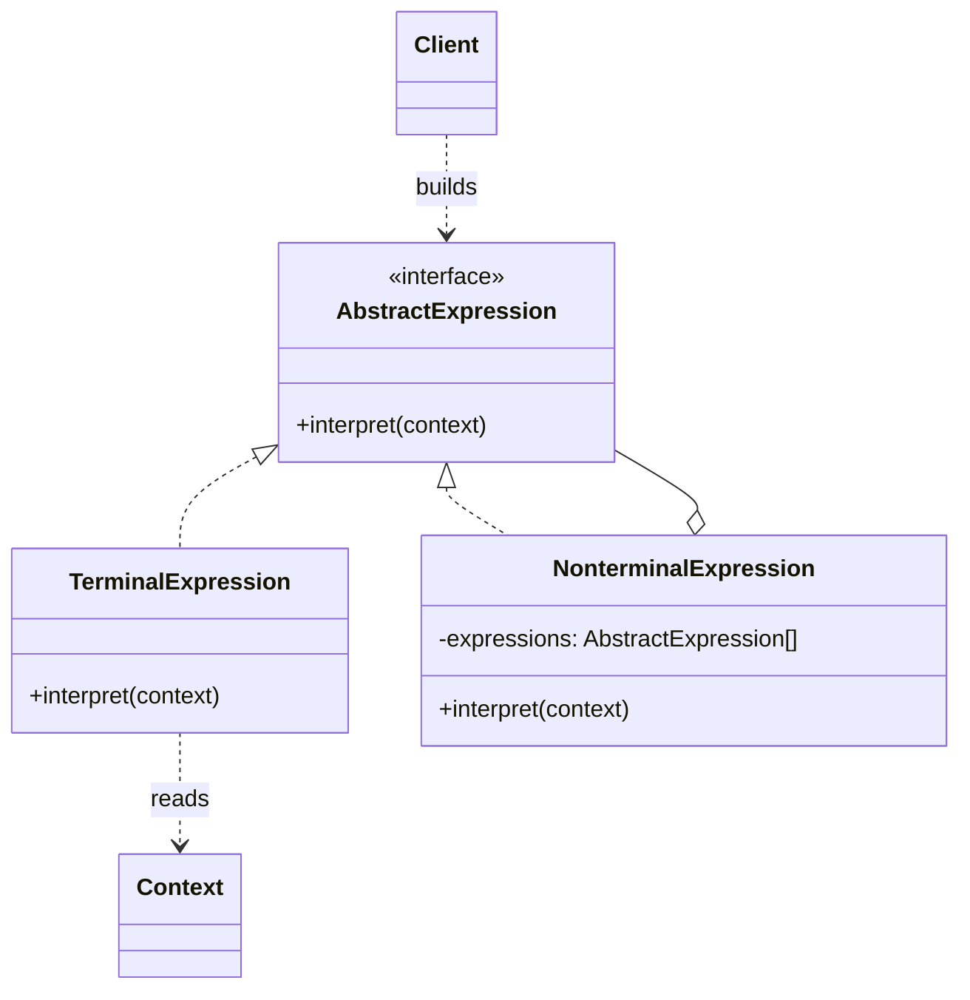
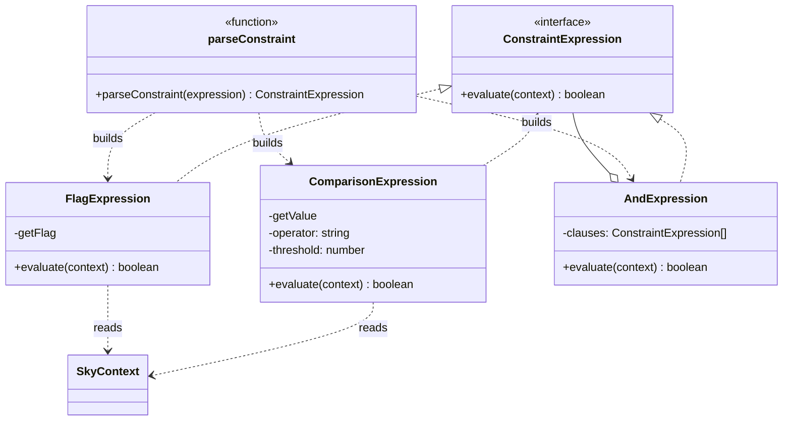

# Walkthrough — Interpreter at Hollowell

Read this **after** you have your own version.

---

## The structure, twice

The GoF diagram. A `Client` builds a tree of `TerminalExpression` and
`NonterminalExpression` objects - both implementing `AbstractExpression`
- once; evaluating the whole tree later means calling `interpret` on the
root and letting it recurse:



This exercise's names:



**On the mapping.** GoF's `TerminalExpression` is split here into two
classes, `ComparisonExpression` and `FlagExpression`, because this
exercise's grammar has two genuinely different kinds of leaf - a numeric
comparison and a named boolean - and the book's own diagram already
allows for more than one terminal type (its own worked example has a
`VariableExp` and a literal number, both terminals). `NonterminalExpression`
is `AndExpression`, the only combinator this grammar has; a grammar with
`||` too would add a second nonterminal class, not extend this one.
`Context` is `SkyContext`. GoF's `Client` - the code that builds the tree
- has no class here; it is `parseConstraint`, a function rather than an
object, because building this particular tree needs no state of its own
between calls.

**On the name.** `ConstraintExpression`, not `AbstractExpression`.
Question 1 - what, not how - is what decides it: `AbstractExpression`
says how the type participates (something in a tree gets interpreted),
`ConstraintExpression` says what it is (a fact about the sky that must
hold). A reader who has never heard of Interpreter can still guess what a
`ConstraintExpression` is for.

**On the name, a second time.** `evaluate`, not `interpret`. GoF's own
word is `interpret`, and this repo's convention (`docs/NAMING.md`) is
to prefer the domain's word over the book's when the domain already has
one - and this domain already uses "evaluate" for exactly this idea:
the frozen public function is `evaluateConstraint`, so a method also
called `evaluate` on every node reads as the same verb recursing, not
two different words for one action. `interpret` would pass questions 1
through 3 well enough on its own; it loses to `evaluate` on consistency
with a name this exercise did not get to choose.

**On the name, a third time.** `AndExpression`, not `CombinatorExpression`
or `AllExpression`. `CombinatorExpression` fails question 2 the moment a
second combinator (`||`, say) exists - it would name every nonterminal,
not this one specifically. `AndExpression` survives question 3 at its
one call site in `parseConstraint`: `new AndExpression(parsed)` reads as
"these clauses, all of them," which is what `&&` means here and all it
needs to mean.

---

## Why this order

**`ConstraintExpression` (step 1) is written with zero implementations.**
One method, no parser, no evaluator yet - which means step 2's
`ComparisonExpression` is provably just "a terminal that reads two
numbers and compares them," with no tree-building logic mixed in to get
wrong at the same time.

**`ComparisonExpression` and `FlagExpression` (steps 2-3) exist before
`AndExpression` (step 4).** `AndExpression` only needs to know that its
clauses implement `evaluate` - writing it after both terminal types
exist means its own tests can use real terminals instead of stubs.

**`parseConstraint` (step 5) is written only after every node type
exists**, and `evaluateConstraint` is rewired to call it (step 6) as a
separate, final commit - the same split Chain of Responsibility used for
`buildChain` and `validateRequest`, for the same reason: "does the tree
parse correctly" and "does the public function still return the right
thing" are different questions, and a mistake in either is easier to
isolate as two commits than one.

## Step 2 — a terminal parameterized, not subclassed

```ts
export const OPERATORS: Record<string, (value: number, threshold: number) => boolean> = {
  ">": (value, threshold) => value > threshold,
  "<": (value, threshold) => value < threshold,
};

export class ComparisonExpression implements ConstraintExpression {
  constructor(
    private readonly getValue: (context: SkyContext) => number,
    private readonly operator: string,
    private readonly threshold: number,
  ) {}

  evaluate(context: SkyContext): boolean {
    const compare = OPERATORS[this.operator];
    if (compare === undefined) throw new Error(`unknown operator: ${this.operator}`);
    return compare(this.getValue(context), this.threshold);
  }
}
```

GoF's own examples subclass per terminal - a `VariableExp` class per
variable would be the book-literal translation of "one flag, one class."
This exercise parameterizes instead: one `ComparisonExpression` class
covers every field and every operator, because the fields and operators
are data (a string key, a function), not distinct behaviors. The
difference matters for act 2 - see [ACT2.md](./ACT2.md).

## Step 5 — matching the longest operator first

```ts
function parseComparison(clause: string): ComparisonExpression {
  const operator = Object.keys(OPERATORS)
    .sort((a, b) => b.length - a.length)
    .find((candidate) => clause.includes(candidate));
  if (operator === undefined) throw new Error(`unparseable clause: ${clause}`);
  // ...
}
```

Written when `OPERATORS` only has `>` and `<` - two single-character
keys with no overlap, so the sort is a no-op today. It is here anyway,
because the alternative (checking `>` before `<` by writing them in that
order and trusting the order never needs to change) is exactly the trap
`src/evaluate.ts`'s baseline falls into the moment `>=` exists alongside
`>`.

---

## Where TypeScript changes this

[TYPESCRIPT.md](../../../../../../docs/TYPESCRIPT.md) notes that
Interpreter's classic form (a class hierarchy, one leaf type per
terminal) is usually replaced in TypeScript by a discriminated union
plus a recursive function - `{ kind: "comparison", ... } | { kind: "flag", ...
} | { kind: "and", clauses: Expr[] }` and one `evaluate(expr, context)`
function with a `switch` on `expr.kind`. This exercise deliberately keeps
the class-and-interface form instead, for a reason worth stating rather
than assuming: the union form is arguably the more idiomatic TypeScript
answer for a *closed* grammar (all node kinds known up front, in one
file) - but this grammar is not obviously closed, and the class form
means a new node kind (a `||` combinator, say) is an entirely new file
implementing `ConstraintExpression`, requiring no edit to the `switch`
a union version would need. Both are legitimate; a reader whose grammar
genuinely will not grow past what it has today should read this as an
argument for the union, not against it.

---

## What it cost

- **A one-clause constraint allocates three objects** (a terminal,
  wrapped in an `AndExpression` holding a list of one) to do what a
  single string comparison did in act 1.
- **The set of valid operators lives one file away from where a clause
  gets split on one.** `parseComparison` in `parse.ts` calls
  `Object.keys(OPERATORS)`, but `OPERATORS` itself is defined in
  `comparison-expression.ts` - correct, and slightly indirect for a
  reader tracing "what operators does this language support" for the
  first time.
- **Two lookup tables, not one**, for the two kinds of terminal
  (`FIELD_GETTERS`/`FLAG_GETTERS` in `parse.ts`, `OPERATORS` in
  `comparison-expression.ts`) - a third kind of terminal would want a
  third table, in a third place.

## If you took a different route

- **A discriminated union plus a recursive `evaluate` function** - see
  "Where TypeScript changes this" above. The more idiomatic default for
  most TypeScript codebases; this exercise chose the classic form on
  purpose, to keep the GoF mapping legible.
- **A real parser (tokenizer plus recursive descent)**, instead of
  `split("&&")` plus one more split per clause - would handle nesting
  (`(a && b) || c`) and precedence, which this grammar does not have and
  was not asked to grow. Worth it the moment parentheses or `||` enter
  the language; pure overhead before that.

## What would change my mind

This drill's verdict is `niche` - not because Interpreter is a bad
pattern, but because most string-matched mini-languages in real
codebases stay exactly as small as `src/evaluate.ts`'s and never grow a
second operator, let alone a grammar deep enough to need recursion. What
would change my mind about recommending this route for *this* exercise's
language specifically: a second combinator (`||`), nesting via
parentheses, or a constraint language that gets saved, sent over a wire,
or edited by someone who is not the codebase's own author - any one of
those turns "one function with a few `if`s" from a reasonable default
into a real liability, and that is exactly where this pattern's
generality stops being ceremony and starts being the thing that saves
the next change.

## What act 2 showed

See [ACT2.md](./ACT2.md) for the numbers. The short version: a new
operator and a new named term cost three files and three lines on this
route, and never touched a class that already existed - only tables. The
counterfactual duplicated an entire comparison block to get the operator
right, at more than five times the lines, while nominally "winning" on
file and hunk count. Read ACT2.md before deciding which of those three
numbers is the one that matters.
