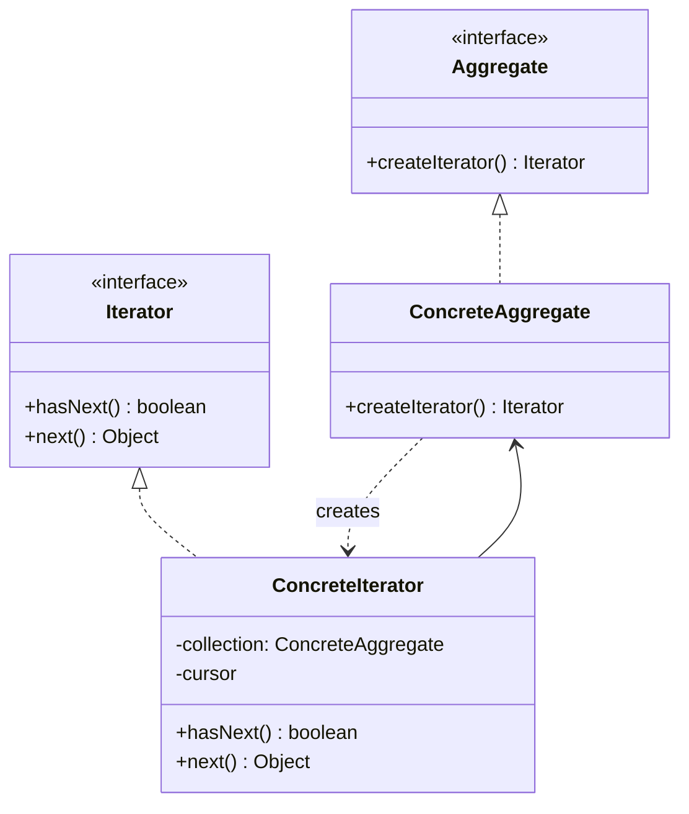
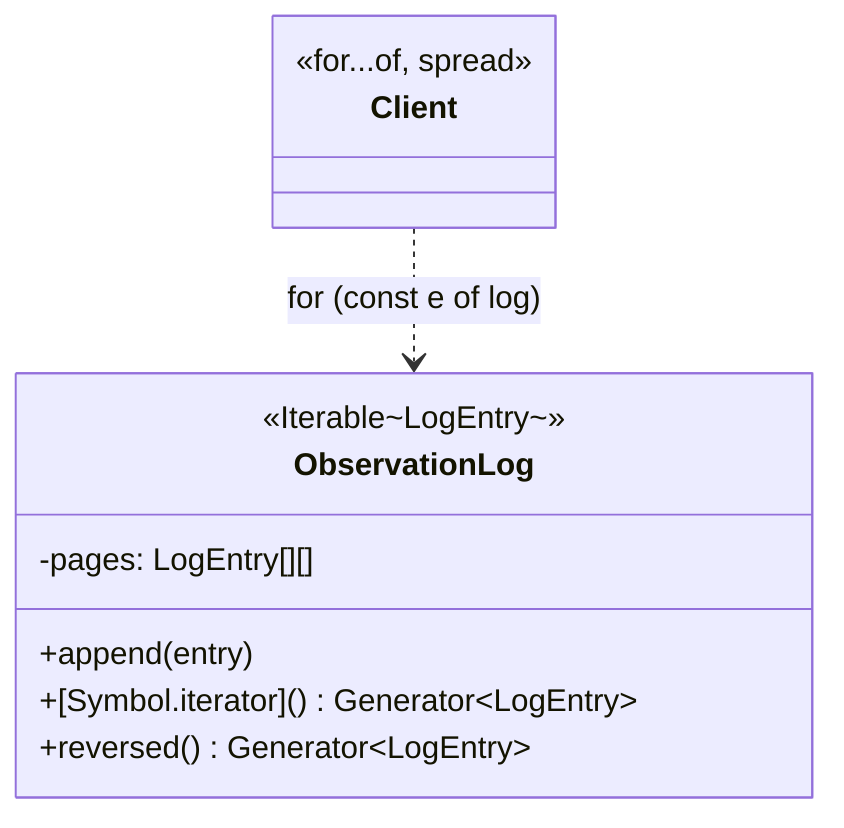

# Walkthrough — Iterator at Hollowell

Read this **after** you have your own version.

---

## The structure, twice

The GoF diagram. A collection hands out an iterator instead of exposing
its own internal representation; the iterator knows how to walk that
representation, and the client only ever calls `hasNext`/`next` (or, in a
language with its own protocol, only ever asks for one):



This exercise's names:



**On the mapping.** GoF's `Aggregate`/`ConcreteAggregate` split collapses
into `ObservationLog` alone - there is only ever one kind of observation
log, so a separate "aggregate interface" would name a distinction that
does not exist here. GoF's `Iterator`/`ConcreteIterator` split collapses
too, but for a different reason: `Symbol.iterator` and `Generator` *are*
that split, provided by the language rather than written by hand.
`[Symbol.iterator]()` plays `createIterator` - it returns an iterator - and
the object a generator function returns, satisfying `{ next(): { value,
done } }`, plays `ConcreteIterator`. Nothing in this file defines that
object's shape explicitly, because `function*` already does.

**On the name, a first time.** `reversed`, not `reverseIterator` or
`getReverseIterator`. Question 1 of
[NAMING.md](../../../../../../docs/NAMING.md) prefers *what* over *how*:
`reversed` says what you get back (the same entries, in the other order);
`reverseIterator` says how it is built, and repeats "iterator" - a word
this file's own `[Symbol.iterator]` already owns - for no distinguishing
reason. `log.reversed()` also reads correctly at the call site (question
3): `for (const entry of log.reversed())` reads as English; `for (const
entry of log.getReverseIterator())` does not add anything a reader needs.

**On the name, a second time.** `[Symbol.iterator]`, not `iterator()` or
`entries()`. This one is closer to GoF's two exceptions in
[NAMING.md](../../../../../../docs/NAMING.md) than to its main rule: the
book's vocabulary (`Iterator`) is not being borrowed as a class name here,
because the *protocol's own name*, `Symbol.iterator`, is what TypeScript
and every consumer of `for...of` already expects. Naming this method
anything else - however descriptive - would mean `for (const e of log)`
stops working, because the language looks for that exact well-known
symbol. This is the domain-has-no-better-word exception, except the domain
in question is the language itself.

**On the name, a third time.** `ObservationLog`, not `EntryStore` or
`LogRepository`. `EntryStore` fails question 4: this class does not just
store entries, it also defines what "in order" and "in reverse" mean for
them, which "store" undersells. `LogRepository` fails question 2 in a
different way - "repository" already means something specific and
narrower elsewhere in software (a persistence-layer abstraction over a
data store), and borrowing it here for an in-memory paged array would
mislead a reader who has seen that word used precisely before.

---

## Why this order

**Step 1 (make the log iterable) happens before any of steps 2-4 touch a
caller.** Writing `[Symbol.iterator]` first, against the *existing* three
callers, means the suite tells you immediately whether the generator
walks entries in the right order - you find out before you have deleted
any of the double loops you are about to replace, so there is always a
known-good version to fall back to if the generator is wrong.

**Steps 2-4 rewrite one caller per commit, in the order they were
originally written.** Each commit replaces one double loop with one
traversal, and the diff for that commit is almost entirely deletion -
which is the easiest kind of diff to review, because there is very little
new logic to check, only old logic being removed.

**Step 5 (remove `pageCount`/`entriesInPage`/`entryAt` from the public
surface) happens last, after nothing calls them.** Removing them earlier
would have broken the three callers before their replacements existed;
removing them here is a pure deletion with the compiler as the only
reviewer that matters - if something outside `log.ts` still needed one of
these, this step would not compile.

## Step 1 — the log learns to hand out its own entries

```ts
export class ObservationLog implements Iterable<LogEntry> {
  private readonly pages: LogEntry[][] = [[]];

  append(entry: LogEntry): void { /* unchanged */ }

  *[Symbol.iterator](): Generator<LogEntry> {
    for (const page of this.pages) {
      for (const entry of page) {
        yield entry;
      }
    }
  }
}
```

`implements Iterable<LogEntry>` is not load-bearing for `for...of` to
work - structural typing means any object with a `[Symbol.iterator]`
method satisfies it. It is here for the reader: it is the one line that
tells you, without reading the method body, what kind of thing this class
promises to be.

## Steps 2-4 — three double loops become three traversals

```ts
export function allMessages(log: ObservationLog): string[] {
  return [...log].map((entry) => entry.message);
}

export function findFirst(log: ObservationLog, needle: string): LogEntry | undefined {
  for (const entry of log) {
    if (entry.message.includes(needle)) return entry;
  }
  return undefined;
}
```

Neither function imports anything from `log.ts` except the type
`ObservationLog` itself. Compare this to what each replaced: a `for` over
`log.pageCount`, a nested `for` over `log.entriesInPage(page)`, and a call
to `log.entryAt(page, offset)` - three distinct facts about the log's
internal shape, known at every call site, now known nowhere outside
`log.ts`.

---

## Where TypeScript changes this

[TYPESCRIPT.md](../../../../../../docs/TYPESCRIPT.md)'s general note on
Iterator: this is the one pattern in the GoF catalogue where the language
does not just make the implementation shorter, it removes an entire half
of the pattern. GoF spends real space on how a client checks `hasNext()`
before every `next()` and on what `next()` should do if called past the
end - `for...of`, `[...iterable]`, and every array/Map/Set method that
accepts an iterable already answer both questions once, for every
iterable in the language, and a generator function only ever has to write
the *what*, not the *how* of the protocol. Writing your own object with a
`next()` method returning `{ value, done }` by hand is occasionally still
correct - it is how you would implement an iterator whose state does not
map cleanly onto a generator function's control flow - but it is a
fallback, not the default, and `meta.json`'s `reviewFocus` for this drill
calls it out explicitly: reaching for `hasNext()`/`next()` here would be
reimplementing a part of the language that already exists.

---

## What it cost

- **`ObservationLog` cannot be understood by reading `append` alone
  anymore** - a reader also has to know what `[Symbol.iterator]` and
  `reversed()` promise, which is two more surfaces than a plain array
  wrapper would have.
- **A genuinely new traversal order is still a change to `log.ts`, not a
  caller.** This is the tradeoff working as intended, not a defect - see
  [ACT2.md](./ACT2.md) for what that centralization was actually worth,
  measured, when a second order showed up.
- **Nothing stops `reversed()` and `[Symbol.iterator]` from drifting apart**
  if `append`'s logic ever changes - both generators independently assume
  pages are filled front-to-back, and nothing enforces that assumption
  beyond the two of them agreeing to make it.

## If you took a different route

- **A plain array instead of paged storage** - the pressure this drill
  exists to create (index arithmetic scattered across callers) never
  happens if `ObservationLog` was just `LogEntry[]` with `push`; iterating
  it would already be `for...of` with no refactor needed. Real logs that
  actually need paging - too large for one array, or backed by a store
  that reads in chunks - are where this exercise's pressure is genuine,
  not invented.
- **`entries()` returning a plain array instead of an iterator** - simpler
  to read for a small log, and arguably fine if nobody ever needs to stop
  partway through. It gives up exactly what `firstMatches` needs in act 2:
  a traversal that can stop after two matches without first building an
  array of everything up to the two-thousandth entry.

## What act 2 showed

See [ACT2.md](./ACT2.md) for the numbers, and read it past the headline:
this module's other drills show 2x-3x gaps between routes, and this one
does not, for a reason worth understanding rather than a reason to
distrust the exercise. Act 1 already banked this pattern's largest win;
act 2 only had a second traversal direction left to prove, and three
reuse sites is enough to win on lines, not enough to win by a lot.
