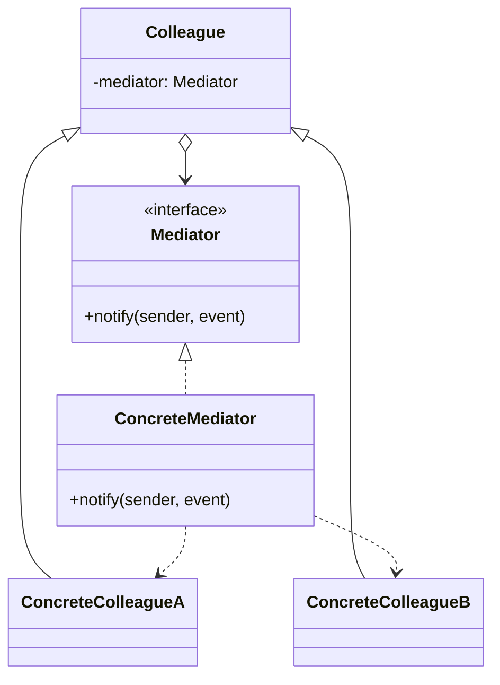
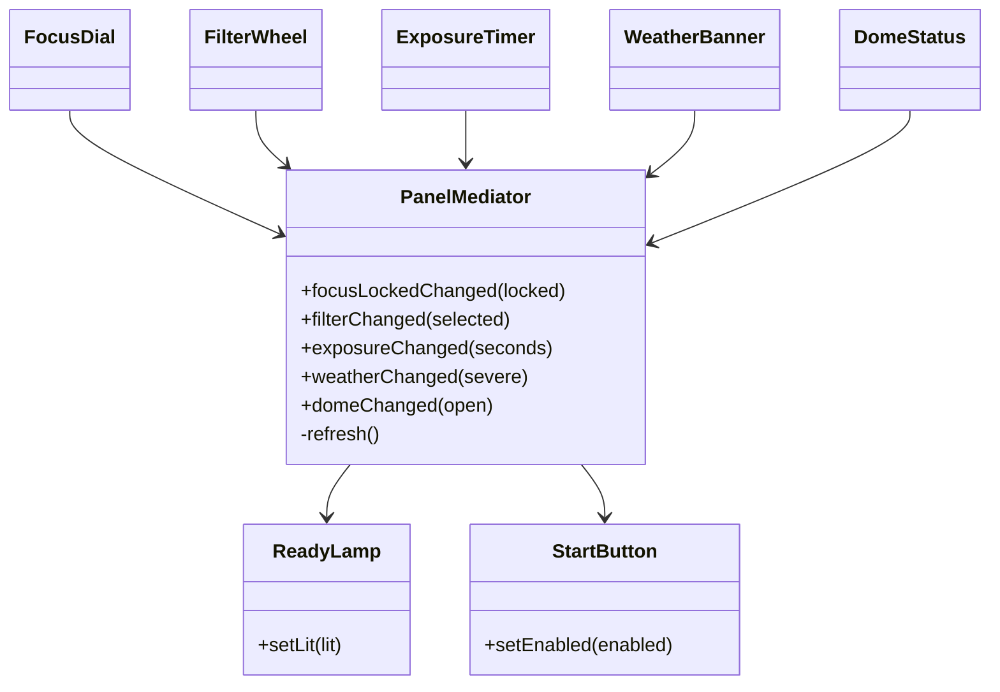

# Walkthrough — Mediator at Hollowell

Read this **after** you have your own version.

---

## The structure, twice

The GoF diagram. Colleagues no longer talk to each other; each holds a
reference only to a shared `Mediator`, and calls into it when something about
the colleague itself changes:



This exercise's names:



**On the mapping.** `PanelMediator` plays `ConcreteMediator`; there is no
separate `Mediator` interface here, because there is exactly one mediator and
no plan to swap it out - GoF's interface exists for when a colleague might
talk to different mediators in different contexts, which is not this panel's
situation. The five input widgets (`FocusDial` through `DomeStatus`) play
`Colleague`, but notice the arrow direction is one-way in this diagram: they
call *into* the mediator, and the mediator calls *into* `ReadyLamp` and
`StartButton`, which are colleagues too but never call back. GoF's own
diagram allows colleagues to be notified back by the mediator (a two-way
relationship); this panel only needs one direction, because `ReadyLamp` and
`StartButton` have nothing of their own to report.

**Named methods (`focusLockedChanged`, `filterChanged`, ...) instead of one
generic `notify(sender, event)`.** GoF's own text describes both variants and
favors genericity for mediators with many colleague types. Five named methods
on a five-widget panel cost nothing extra to write and buy the compiler's
help catching a mismatched call; the generic form starts winning once new
colleague types arrive often enough that editing the mediator's interface
every time becomes the actual friction — which is exactly the tradeoff
[TYPESCRIPT.md](../../../../../../docs/TYPESCRIPT.md) discusses for
interfaces in general.

---

## Why this order

**The output widgets (steps 2–3) are stripped down before any input widget is
rewired (steps 4–7).** `ReadyLamp` and `StartButton` have no inputs of their
own — turning them into pure displays is a smaller, independently checkable
step, and it means that by the time you rewire `FocusDial` in step 4, the
mediator already has somewhere correct to push its answer. Rewiring an input
widget before the outputs are ready would mean building the mediator's
`refresh()` against outputs that still expect to be asked, not told.

**Steps 4–7 rewire one input widget per commit,** each swapping "two
concrete-typed fields plus two direct calls" for "one mediator field plus
one call." Doing all four in one commit would hide whether the fourth one
still fits the same shape as the first three — which matters for exactly
the reason named in `STEPS.md`: `WeatherBanner` looks identical to the other
three right up until act 2 asks you to change what its report *means*.

## Step 1 — the mediator, before any colleague is rewired

```ts
export class PanelMediator {
  private locked = false;
  private selected: string | null = null;
  private seconds = 0;

  constructor(
    private readonly readyLamp: ReadyLamp,
    private readonly startButton: StartButton,
  ) {}

  focusLockedChanged(locked: boolean): void {
    this.locked = locked;
    this.refresh();
  }
  // ...
  private refresh(): void {
    const ready = this.locked && this.selected !== null && this.seconds > 0 && !this.severe;
    this.readyLamp.setLit(ready);
    this.startButton.setEnabled(ready);
  }
}
```

**On the name.** `refresh`, not `recompute` or `update`. Question 2 of
[NAMING.md](../../../../../../docs/NAMING.md) rules out `update` — every
`*Changed` method is also, in some sense, an update, so the word does not
distinguish this one private method from its five public callers. `refresh`
survives question 3 at the call site inside each `*Changed` method: "change
my own field, then refresh [the displays]" reads as two distinct actions,
where "change my own field, then update" reads as one blurry one.

**On the name, a second time.** `PanelMediator`, not `PanelController` or
`ControlPanelMediator`. `PanelController` was the real second choice, and it
loses on question 4 — "controller" promises the object drives behavior, and
this one does not: it never calls a method that causes an externally visible
action, only methods that record a display value. `ControlPanelMediator`
loses on question 1: repeating the domain noun (the panel) in front of the
role noun (the mediator) says how the class was assembled, not what it is
for — `SchedulingPolicy`, not `SchedulingStrategy`, is the same call made in
the Strategy drill's own naming table.

## Steps 4–7 — one input widget, rewired

```ts
export class FocusDial {
  locked = false;
  constructor(private readonly mediator: PanelMediator) {}
  setLocked(locked: boolean): void {
    this.locked = locked;
    this.mediator.focusLockedChanged(locked);
  }
}
```

Compare this to what it replaced: two concrete-typed private fields
(`readyLamp`, `startButton`), a `connect()` method to receive them after
construction, and two direct method calls. `FocusDial` now imports exactly
one thing that is not a language builtin, and it is the mediator — not
`ReadyLamp`, not `StartButton`. A reader checking "does `FocusDial` know
anything about the ready lamp" gets a one-word answer from its import list
alone: no.

---

## Where TypeScript changes this

[TYPESCRIPT.md](../../../../../../docs/TYPESCRIPT.md)'s general note on
Mediator: the pattern's value here has nothing to do with interfaces or
polymorphism — it is purely about *reference direction*, which is a design
decision every language can express identically. What TypeScript's
structural typing changes is smaller and easy to miss: because `FocusDial`
only ever calls one specific method (`focusLockedChanged`) on the mediator,
it does not need `PanelMediator`'s full type — a narrower interface exposing
just that one method would satisfy it just as well, and would make it
provable, not just true by convention, that `FocusDial` cannot call any of
the other four `*Changed` methods by accident. This solution does not split
the mediator into five single-method interfaces, because five widgets each
seeing the whole mediator's shape is easy to read as one unit right now;
it is the kind of change worth making the moment a sixth or seventh input
widget makes "who can call what" worth enforcing rather than trusting.

---

## What it cost

- **One new file whose whole job is knowing about the other six.** Every
  other class in this exercise can be understood by reading it alone;
  `PanelMediator` cannot be understood without also knowing what `ReadyLamp`
  and `StartButton` expose.
- **The mediator grows by exactly one field and one method for every input
  widget it tracks.** This did not shrink the total amount of code that
  reacts to a focus-dial change — it moved it from `FocusDial`'s own file
  into the mediator's. See [ACT2.md](./ACT2.md) for what that move was worth
  when a widget's role in the formula actually changed.
- **Nothing forces every widget to route through the mediator.** A future
  contributor could give a new widget a direct reference to `ReadyLamp` out
  of habit, and nothing short of `./dp shape`'s advisory check or code review
  would catch it.

## If you took a different route

- **A generic `notify(sender, event, payload)` mediator**, discussed above —
  worth it once colleague types multiply; overkill for five well-known,
  rarely-changing input widgets.
- **An observable-state object instead of a mediator** (each widget writes
  into a shared, observable `PanelState`, and `ReadyLamp`/`StartButton`
  subscribe to it) — closer to Observer than Mediator, and a reasonable
  alternative when the "coordination rule" really is just "recompute a
  derived value whenever any input changes," which is arguably all this
  panel does. The mediator earns its keep over that alternative specifically
  because act 2 needs a rule change (dropping weather), not just a new
  input — a change to *how* the derived value is computed, which lives more
  naturally in one method than in a derived-state graph.

## What act 2 showed

See [ACT2.md](./ACT2.md) for the numbers, and for the one thing every other
drill's `ACT2.md` in this module did not have to address: this act 2 retired
part of act 1, on purpose, and the walkthrough there says why that is this
drill's actual lesson, not a defect in the exercise.

## What would change my mind

This drill's verdict is `situational`, and the case for that is the panel's
own size: six widgets, one coordination rule, changing rarely enough that
act 2 is the first change this exercise has ever asked of it. What would
change my mind toward `essential` is a colleague count that keeps growing -
ten widgets, then twenty, each added by a different contributor who would
otherwise reach for a direct reference to whichever other widget seems
closest at hand. That is the situation Mediator was built for: not six
widgets with one rule, but a graph of pairwise dependencies that nobody
can draw anymore. What would change my mind the other way, toward
`avoid`, is the failure mode this exercise's own `TYPESCRIPT.md` entry
names directly - a mediator that has quietly absorbed logging, validation,
persistence and coordination all at once, because "the one place that
already knows about everything" is a standing invitation to put anything
there. `PanelMediator` stays honest here because it does exactly one job -
compute readiness from six inputs - and the moment it does two unrelated
jobs, the right fix is splitting it, not defending the pattern.
