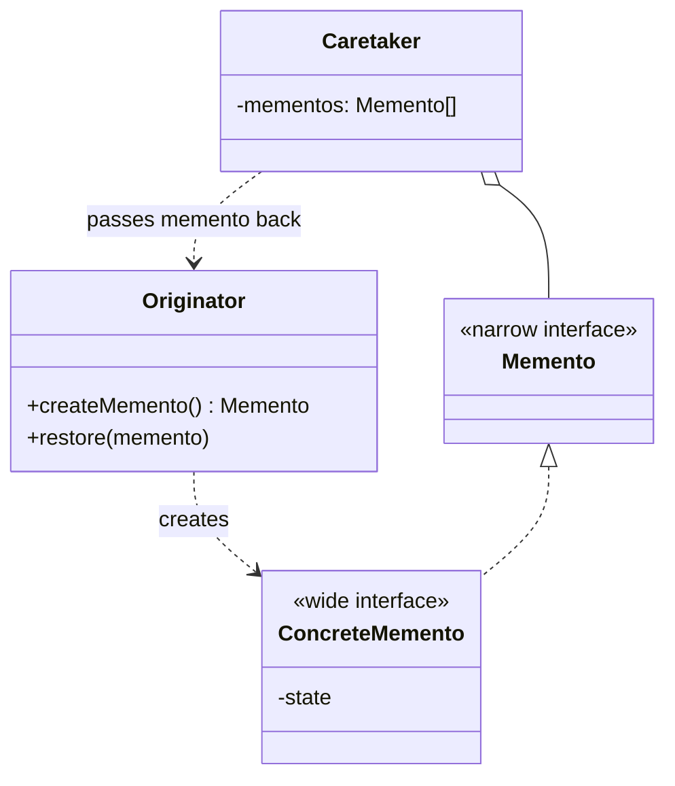
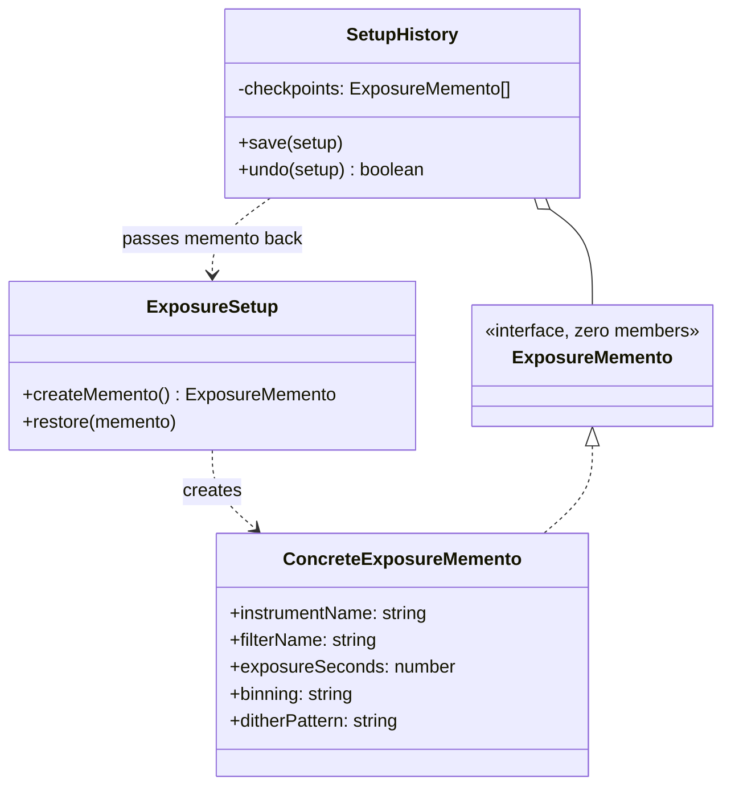

# Walkthrough — Memento at Hollowell

Read this **after** you have your own version.

---

## The structure, twice

The GoF diagram. An `Originator` creates a `Memento` capturing its own
state and can restore from one later; a `Caretaker` holds onto mementos
for the originator, but never looks inside one - the book calls this the
"wide interface, narrow interface" split: the originator sees a wide
interface (every field), the caretaker sees a narrow one (nothing at
all), and both are looking at the same object:



This exercise's names:



**On the mapping.** GoF's `Memento` role is split here across two types
exactly the way the book's own "wide interface, narrow interface" section
describes: `ExposureMemento`, the interface every outside file can name,
has zero members - it is the narrow interface, and it is narrow enough
that there is nothing left to accidentally expose. `ConcreteExposureMemento`
is the wide interface - five `readonly` fields, all real - but only
`setup.ts` ever imports it by name. GoF's own text allows exactly this
split as one legitimate implementation of the pattern (a nested class in
C++, where only the originator can see the memento's private members);
this exercise gets the same effect from two separate exported types
instead of nesting, because TypeScript has no first-class notion of "this
class may see private members of that one."

**On the name.** `ExposureSetup` / `SetupHistory`, not `Originator` /
`Caretaker`. This is [NAMING.md](../../../../../../docs/NAMING.md)'s own
worked example for this exact pattern (`Originator`/`Caretaker` →
`ExposureSetup`/`SetupHistory` in its GoF-roles table), and it is worth
restating why: `Originator` and `Caretaker` describe a *relationship*
between two objects, not what either one *is*. A reader who has never
heard of Memento can still guess what `SetupHistory` does from its name
alone; `Caretaker` alone tells them nothing until they find the thing it
takes care of.

**On the name, a second time.** `ExposureMemento`, not just `Memento`.
Question 2 - could it name something else in this file - rules out the
bare word: this module already has a real domain noun (`ExposureSetup`)
for the thing being saved, and a type called plain `Memento` would read
as generic wherever it is imported on its own, with no hint of *whose*
state it holds. `ExposureMemento` survives question 3 at the one call
site that matters most, `restore(memento: ExposureMemento)`, which reads
as "restore from a saved exposure state" without needing the file name
for context.

**On the name, a third time.** `createMemento` and `restore`, not `save`
and `load`. `save` was rejected because `SetupHistory.save` already owns
that word in this exercise for a different, adjacent action (telling the
caretaker to keep a checkpoint) - reusing it on `ExposureSetup` for "make
me a memento" would leave two `save` methods in the same call chain
meaning two different things. `createMemento` names what the method
*returns*, which is what a caller choosing between it and `restore` needs
to know at the call site.

---

## Why this order

**The memento's two types (step 1) are written before either method on
`ExposureSetup` exists.** `ExposureMemento` and `ConcreteExposureMemento`
have no relationship to `createMemento` or `restore` yet - they are just
a narrow interface and a class that implements it. Writing them first
means step 2's `createMemento` has nothing to invent; it just returns
one.

**`createMemento` (step 2) is committed before `restore` (step 3) exists
at all.** The full act-1 suite already exercises `SetupHistory.save`,
which will call `createMemento` once `SetupHistory` is rewired in step 4
- but step 2 alone can be checked a narrower way first: construct an
`ExposureSetup`, call `createMemento()`, and confirm by hand (or a
throwaway assertion) that the five fields landed in the right
constructor slots, before `restore`'s cast is anywhere in the picture to
mask a mistake.

**`SetupHistory` (step 4) is rewired last, as its own commit.** Steps 1
through 3 only add to `ExposureSetup` - `SetupHistory` still reads and
writes four named fields the whole time, so the act-1 suite stays green
against the *old* caretaker right up until step 4 flips it over to the
opaque type in one commit, which is the one commit `./dp shape memento`
actually needs to pass.

## Step 1 — a memento with nothing to read

```ts
export interface ExposureMemento {}

export class ConcreteExposureMemento implements ExposureMemento {
  constructor(
    readonly instrumentName: string,
    readonly filterName: string,
    readonly exposureSeconds: number,
    readonly binning: string,
  ) {}
}
```

`ExposureMemento` compiles as a valid type for any object, which is the
point and also the thing to notice: TypeScript's structural typing means
an *empty* interface is not "no guarantees," it is "this value is
assignable to `ExposureMemento` iff it is an object" - the interface
does not, by itself, stop a caller from casting or from using `as any`.
What actually stops `SetupHistory` from reading a field is that it never
imports `ConcreteExposureMemento` - there is no name in that file to cast
to, even if someone tried.

## Step 3 — the one place allowed to assume

```ts
restore(memento: ExposureMemento): void {
  const state = memento as ConcreteExposureMemento;
  this.instrumentName = state.instrumentName;
  this.filterName = state.filterName;
  this.exposureSeconds = state.exposureSeconds;
  this.binning = state.binning;
}
```

The cast is safe for a reason worth stating plainly rather than trusting
the reader to infer: `ConcreteExposureMemento` is only ever constructed
in one place, `createMemento`, on this same class, in this same file.
Every `ExposureMemento` that exists at runtime is, in fact, a
`ConcreteExposureMemento` - the cast does not create that guarantee, it
just asserts a guarantee the rest of the file already provides by never
exporting a second way to make one.

---

## Where TypeScript changes this

[TYPESCRIPT.md](../../../../../../docs/TYPESCRIPT.md) flags Memento as
one of the patterns where the hard part in TypeScript is the *intent*
("the caretaker must not read it"), not the mechanics, and suggests
`#private` fields plus a branded type for the opaque token as one route.
This solution takes the plainer of two routes on purpose: an empty
interface and a same-file cast, not `#private` fields or a branded
nominal type. The difference is what kind of guarantee each gives.
`#private` fields (or a `WeakMap` keyed on the originator, holding real
runtime-hidden state) would mean a caretaker genuinely *cannot* read a
field even with `as any` and reflection - the guarantee holds at runtime,
not just at the type checker. This exercise's route only holds at
compile time: a determined caller can still cast past `ExposureMemento`
if they are willing to write a lie the type checker cannot check (there
is nothing in the exported surface to cast *to*, but `as unknown as {
instrumentName: string }` still compiles). For a checkpoint history
inside one process, written and read by the same team, that gap is not
worth the extra machinery - a `WeakMap`-backed token earns its cost the
moment a memento needs to survive being handed to code this file's
authors do not control, which is not this exercise's situation.

---

## What it cost

- **Every field has to be threaded through `createMemento` and `restore`
  by hand, twice, in the same order.** Nothing enforces that a field
  added to `ExposureSetup` is also added to both methods - the type
  checker catches a field left out of the constructor call (wrong
  argument count) but not a field silently never read into the class in
  the first place.
- **One more file-privacy rule to remember**: `ConcreteExposureMemento`
  must never be imported outside `setup.ts`, and nothing enforces this
  beyond convention and code review - TypeScript has no visibility
  modifier that says "this export is for one specific other file only."
- **`SetupHistory`'s own type got simpler, not more complex** - `Checkpoint`
  collapses from a four-field interface to an alias for `ExposureMemento`
  - which is the one place this route paid for itself immediately rather
  than costing something.

## If you took a different route

- **`#private` fields plus a branded opaque type**, giving the caretaker
  a value it genuinely cannot read even by casting - considered and set
  aside for this exercise. It buys a runtime guarantee this domain does
  not need (nothing outside this codebase ever holds one of these
  mementos) at the cost of a `WeakMap` indirection between the token and
  its real data, which is more machinery to explain in a drill whose
  point is the *shape* of the pattern, not its hardest-mode enforcement.
  Worth reaching for the moment a memento crosses a trust boundary - a
  plugin, a serialized payload sent somewhere else - where a same-file
  cast is not a promise anyone outside this file has reason to honor.
- **Serializing the memento to JSON** instead of holding a class
  instance - would make `SetupHistory` trivially picklable (send the
  whole undo stack over the wire, write it to disk) at the cost of
  `restore` no longer being a cast but a runtime shape check, and losing
  `readonly` enforcement on the way back in.

## What act 2 showed

See [ACT2.md](./ACT2.md) for the numbers. The short version: a fifth
field touched two files on this route and never touched `SetupHistory`
at all - the one file the target explicitly promised would not need to
change for a new field, did not change. Read ACT2.md's hunk-count section
before deciding raw lines-touched is the number that matters here; on
this exercise it very nearly is not.
