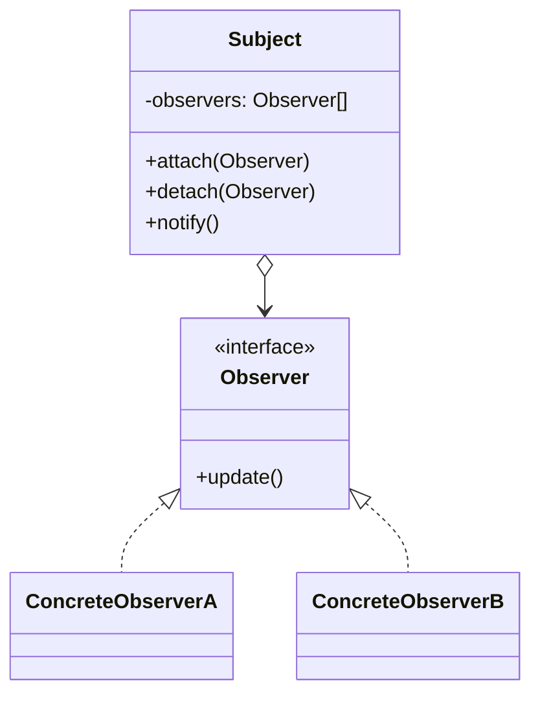
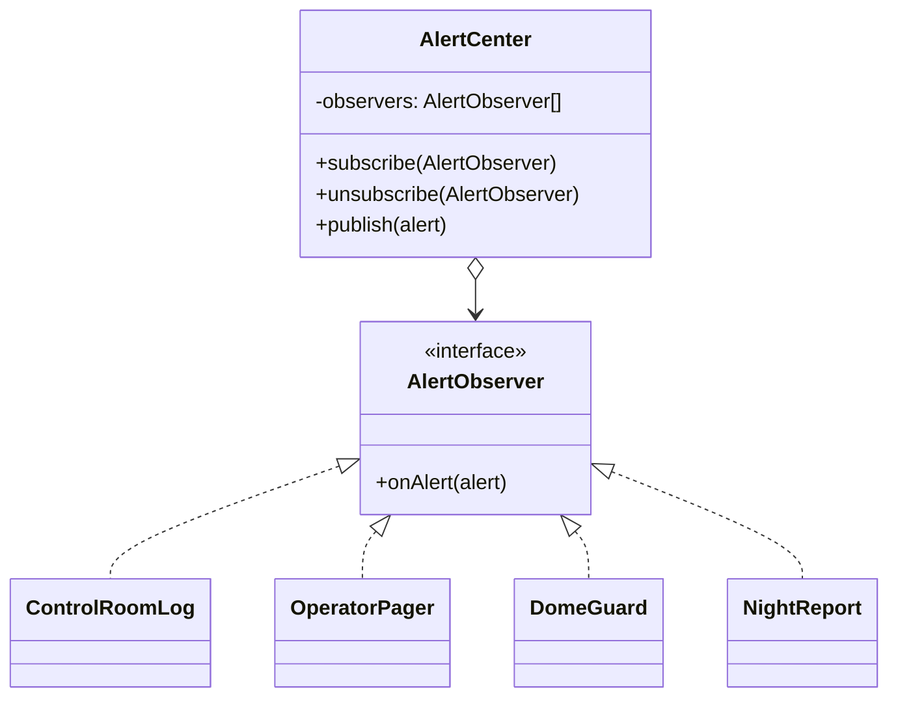

# Walkthrough — Observer at Hollowell

Read this **after** you have your own version.

---

## The structure, twice

The GoF diagram. A `Subject` holds a list of `Observer`s, and calls `update()`
on each when something changes:



This exercise's names:



**On the mapping.** `AlertCenter` is `Subject`; `subscribe`/`unsubscribe` are
`attach`/`detach` under domain-accurate names; `publish` is `notify`, renamed
because "notify" describes the mechanism and "publish" describes what the
center is actually for, from the outside. `AlertObserver.onAlert` is
`Observer.update`, made specific: GoF's `update()` takes no data in the
book's own diagram (it assumes the observer pulls what it needs from the
subject), while this exercise pushes the full `Alert` value along with the
call. That choice is pragmatic, not doctrinal — see the push/pull note below.

**Nothing here plays `ConcreteSubject` separately from `Subject`.** The book
draws them apart because its `Subject` is usually abstract, carrying only the
observer list, with a `ConcreteSubject` adding the actual state that changed.
`AlertCenter` has no state worth abstracting away from the notification
mechanism — there is exactly one kind of thing this subject does — so one
class plays both roles.

---

## Why this order

**Renaming each consumer's method to `onAlert` one file at a time (steps
2–5), before the loop exists (step 6),** means every rename is independently
checkable against the same four act-1 tests, instead of discovering a
mismatch only once a commit introduces the loop and four renames together.
It also means that if you get `DomeGuard`'s early return wrong while moving
it, you find out from a single focused diff, not from a loop that now passes
the wrong alert everywhere at once.

**The interface (step 1) comes before any rename**, not after. Writing
`AlertObserver` first means each rename in steps 2–5 is checked against a
target that already exists, rather than four ad-hoc renames that happen to
agree with each other by luck.

## Step 4 — the one consumer with a decision to make

```ts
export class DomeGuard implements AlertObserver {
  onAlert(alert: Alert): void {
    if (alert.kind !== "weather") return;
    this._entries.push(`closed: ${alert.condition}`);
  }
}
```

**On the name.** `DomeGuard`, not `DomeObserver` or `DomeListener`. Question 2
of [NAMING.md](../../../../../../docs/NAMING.md) rules out `DomeObserver`:
every one of the four classes is an observer now, so the suffix names the
role everything shares, not what makes this one different. `DomeGuard` says
what the class is *for* — guarding the dome — and that it happens to do that
by observing alerts is an implementation detail the name does not need to
carry.

This is also the one class whose `onAlert` contains a decision — ignore
seeing alerts entirely — and that decision belongs here, in the observer, not
in `AlertCenter`. The center does not know, and must not need to know, that
one of its observers only cares about some alerts. Question 4 — is the name
true — matters here too: if `DomeGuard` silently ignored weather alerts as
well under some future condition, the class would still compile against
`AlertObserver`, and only a test would catch that the name had stopped being
accurate.

## Step 6 — the loop, and what it replaced

```ts
private readonly observers: AlertObserver[] = [this.log, this.pager, this.dome, this.report];

publish(alert: Alert): void {
  for (const observer of this.observers) observer.onAlert(alert);
}
```

**On the name.** `observers`, not `listeners` or `subscribers`. All three are
defensible; `observers` won on question 3 (reads-at-the-call-site) against
`listeners` — "for the observer of observers" is a stranger sentence to
mentally parse than it first appears, but `for (const observer of this.
observers)` reads as a direct restatement of the pattern's own name, which is
worth something in a repository whose whole point is teaching that name. Once
act 2 introduces genuinely dynamic membership, `subscribers` becomes the
better word for the field holding *those* — see `ACT2.md`'s baseline, where
the no-pattern route's new array is named `subscribers` for exactly that
reason, while this route's original four-member list stays `observers`.

Notice what this loop does *not* do yet: no `try`/`catch`, no way to add a
fifth member. Act 1 never asked for either, and this walkthrough's
[ACT2.md](./ACT2.md) is about how much of act 2's cost this one loop ends up
absorbing just by existing.

---

## Where TypeScript changes this

[TYPESCRIPT.md](../../../../../../docs/TYPESCRIPT.md)'s claim about Observer
is that it barely changes shape in TypeScript — a one-method interface is
already about as close to "just a function" as an interface gets. The honest
test of that claim here: `AlertObserver` could be a **type alias for a plain
function**, `(alert: Alert) => void`, and every built-in consumer could
subscribe a closure instead of a class instance:

```ts
type AlertListener = (alert: Alert) => void;
center.subscribe((alert) => log.push(describeAlert(alert)));
```

This is a real simplification for consumers with no state of their own to
expose — which describes none of the four built-ins here, since all four
expose `entries` for the tests to read. A function has no natural place to
hang a public `entries` getter; you would need a second object alongside the
closure just to expose it, which is more moving parts, not fewer. The
function form is the better default when a listener is pure reaction with
nothing to inspect from outside; the class form earns its keep here
specifically because every consumer in this domain needs to be queried, not
just triggered.

**Push versus pull**, named above: this exercise's `onAlert(alert)` pushes
the full value. GoF's own diagram leans toward pull — `update()` with no
arguments, the observer calling back into the subject for whatever it needs.
Pull exists for subjects with a lot of state and many kinds of observers that
each want a different slice of it; pushing is simpler and was never worth
complicating here, since every alert is one small, complete, immutable value
that every observer either wants in full or does not want at all.

---

## What it cost

- **Four files now answer "what happens when an alert is published," where
  one used to.** A reader has to find the loop, then separately find — and
  trust — what each of the four `onAlert` implementations actually does.
- **The uniform `onAlert` name hides real differences in what each consumer
  does with an alert** — three push unconditionally, one filters by kind.
  That asymmetry was visible for free in the old names (`respond` suggested
  "maybe," `record`/`page`/`append` suggested "always"); the shared interface
  makes all four look equally obligated until you open `DomeGuard.onAlert`
  and read the guard clause.
- **Nothing in the type system stops a future fifth built-in consumer from
  being added to the `observers` array twice by accident**, which would
  double-count every alert it receives. Four hand-written, distinct field
  names in the old version made that mistake look exactly as wrong as it was;
  a list does not.

## If you took a different route

- **The function/closure form**, discussed above — right for a listener that
  only reacts and exposes nothing; wrong here because every one of the four
  needs to be queried by the tests.
- **An event-emitter style center** (`center.on("alert", handler)`, string
  keys instead of a typed interface) — common in JavaScript codebases,
  weaker here because it trades the compiler's knowledge of `Alert`'s shape
  for a string key that TypeScript cannot check without extra generic
  plumbing this small a domain does not need.

## What act 2 showed

See [ACT2.md](./ACT2.md) for the numbers. Short version: a clean win on every
axis this time, and worth noticing why it is cleaner than Command's — the
capability act 2 asked for (dynamic membership, contained failure) is a
property of the *list*, and act 1 already had exactly one list with exactly
one loop over it. Command's act 2 win was clean on lines but not on file
count, because Command's act-2 capability (undo) needed new objects, not just
new behavior bolted onto an existing collection. Different shape of "aligned,"
same underlying reason: the structure already had the one seam the next
change needed.
