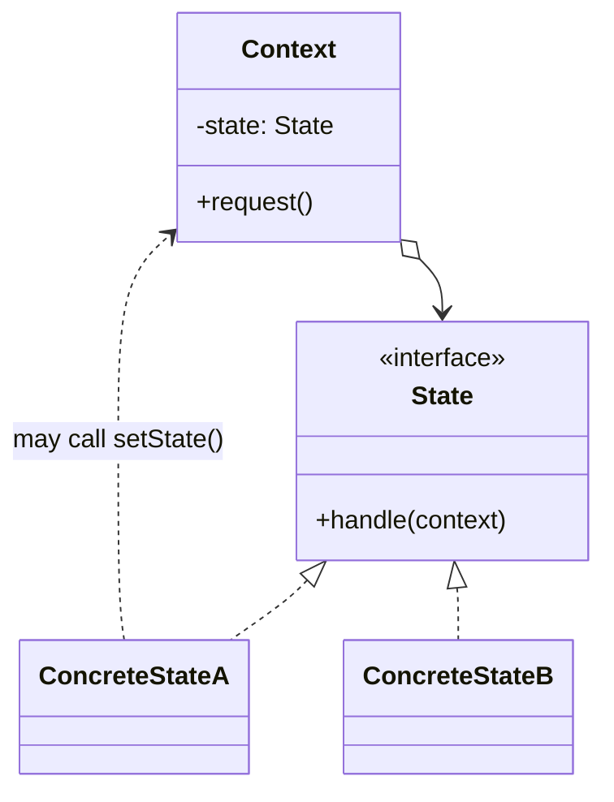
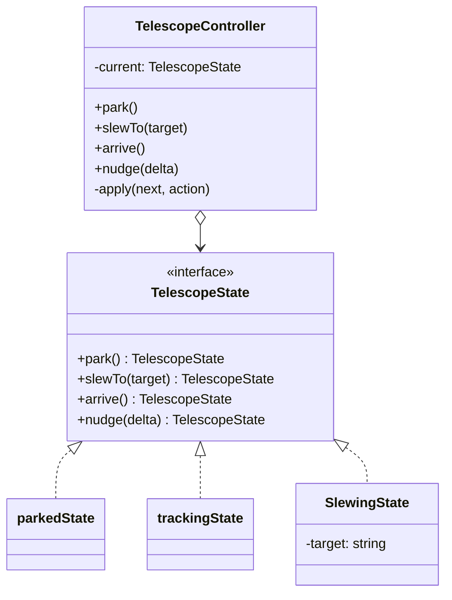

# Walkthrough — State at Hollowell

Read this **after** you have your own version.

---

## The structure, twice

The GoF diagram. The book gives the context a reference to its current state
and lets the state decide what comes next — and, notably, leaves open whether
the *state* or the *context* is the one that performs the transition:



This exercise's names, with the decision made explicit: **the state decides,
the context applies.**



Two departures from the book worth naming. **`Context.setState()` does not
exist here.** GoF's diagram has `ConcreteState` call back into the context to
install itself — a state decides the transition but the context still performs
it, which needs the state to hold a context reference. This exercise's states
instead *return* the next state, and the controller's `apply` installs it.
Simpler, and it works precisely because a telescope state never needs to do
anything to the context beyond announcing what comes next — no state here
needs to, say, schedule a timer or call back into the controller later. The
book's callback shape exists for when it does.

**Two states are object literals, one is a class.** `parkedState` and
`trackingState` carry no data, so a `const` answers the interface; `SlewingState`
carries a target, so it needs a constructor. GoF draws every `ConcreteState` as
a class because its Smalltalk/C++ examples assume classes are the only way to
get polymorphism. TypeScript's structural typing makes the stateless ones free.

---

## Why this order

Writing the transition table before any code (step 1) is the one step with no
diff, and it is the step that makes steps 3–5 mechanical rather than improvised.
Without it, it is easy to discover three-quarters of the way through extracting
`SlewingState` that you never decided, on paper, what `nudge` should do while
slewing — and to guess an answer under the pressure of a half-finished
refactor instead of deciding it up front.

**Extracting one state at a time (3, 4, 5), with the controller still holding
the old fields for the states not yet extracted,** means the suite stays green
after every single state, not just at the end. The alternative — introduce the
interface and every `ConcreteState` in one commit, delete the old fields in the
same commit — is the "one commit called refactor" the review rubric
specifically asks about. It might produce the same final code. It does not
practise the same thing.

## Step 5 — the one state with data

```ts
export class SlewingState implements TelescopeState {
  readonly name = "slewing";
  constructor(private readonly target: string) {}

  slewTo(target: string): TelescopeState {
    throw new Error(
      `Cannot slew to "${target}": a slew to "${this.target}" is already in progress.`,
    );
  }
  arrive(): TelescopeState {
    return trackingState;
  }
  // ...
}
```

**On the name.** `target`, not `destination` or `goal`. Question 2 of
[NAMING.md](../../../../../../docs/NAMING.md) — *could it name something else
here?* — is close on `destination` (fine, if slightly formal) but `goal` loses
on question 4: a goal implies intent beyond pointing coordinates, and this is
just where the mount is headed. The act-1 code called it `slewTarget` on the
controller; dropping the `slew` prefix here is safe because the class name
already says what kind of target this is.

## Step 6 — the controller loses its fields

Before: `currentStatus: Status` and `slewTarget: string | undefined`, read and
written from four different methods. After: `current: TelescopeState`, and
nothing else. The second field did not move into the state interface as a
general concept — it is private to `SlewingState` alone, which is exactly
right: no other state needs it, and the interface does not carry a field that
three of its four implementers would have to ignore.

## Step 7 — one recorder

```ts
private apply(next: TelescopeState, action: string): void {
  this.log.push({ from: this.current.name, action });
  this.current = next;
}
```

**On the name.** `apply`, not `transition` or `dispatch`. `transition` was the
strong second choice and I went back and forth — it is arguably the more
honest noun for what this does. `apply` won on question 3, reads-at-the-call-site:
`this.apply(this.current.park(), "park")` reads as "apply the result of asking
the state to park," which is closer to what is actually happening than
"transition the result."

---

## Where TypeScript changes this

[TYPESCRIPT.md](../../../../../../docs/TYPESCRIPT.md) notes that State barely
changes shape in TypeScript relative to the book — and this exercise is a good
test of that claim, because it is almost true and the one place it is not true
is worth naming.

A **discriminated union plus an exhaustive `switch`** is the serious
alternative:

```ts
type Telescope =
  | { status: "parked" }
  | { status: "slewing"; target: string }
  | { status: "tracking" }
  | { status: "fault"; reason: string };
```

For three states this is arguably *more* readable in one sitting than four
files — you can see every state's shape in one type. It starts to lose to the
object form at exactly the point this exercise hits in act 2: the union makes
"what is legal from what state" a fact you reconstruct from `switch` statements
scattered across every method, which is the original smell, now type-checked
but not gone. The object form keeps that fact local to one file per state. Pick
based on which property matters more for a given controller: seeing every
state's shape at a glance, or keeping every state's rules in one place.

---

## What it cost

- **Five files to read instead of one.** Real, and worse for a codebase this
  small than the Strategy drill's equivalent cost, because the four rules that
  used to sit next to each other in one class now require opening four files to
  compare.
- **`SlewingState`'s constructor parameter is slightly uncomfortable.** It is
  the only state with data, which makes the interface look more uniform than
  the implementations actually are. A reader skimming `TelescopeState` would
  not guess that one implementer needs a constructor argument and the other two
  do not.
- **The "park is always legal" rule is easy to lose.** It is not a rule that
  lives anywhere obvious — it is simply the fact that every state's `park()`
  method happens to return `parkedState` unconditionally. A future contributor
  adding a fifth state has to remember to honour that convention by writing the
  same unconditional `park()`, and nothing enforces it except code review.

## If you took a different route

- **The discriminated union**, discussed above. Right for a controller this
  small if you expect few future states and value glanceability over locality.
- **A class hierarchy with an abstract base providing the default throws**,
  overridden only where a state allows something. Cuts boilerplate (each state
  only writes what it allows); costs a layer of inheritance for three states
  that otherwise have nothing to share.

Not a matter of taste: **no method outside a state's own file may compare
against `this.current.name` to decide what to do.** The moment the controller
starts asking "am I in slewing?" anywhere, the whole point of the state objects
— that the question is never asked, only answered — is gone.

## What act 2 showed

See [ACT2.md](./ACT2.md) for the numbers. Short version: this is a clean win
for the pattern on this axis, and it is worth noticing *why* it is clean where
Template Method's was not. A fourth state is a new thing implementing an
existing, unchanged interface — the interface did not need to change shape,
only gain one more implementer, plus one line in the controller to reach it.
That is the shape of extension this pattern is actually built for.
