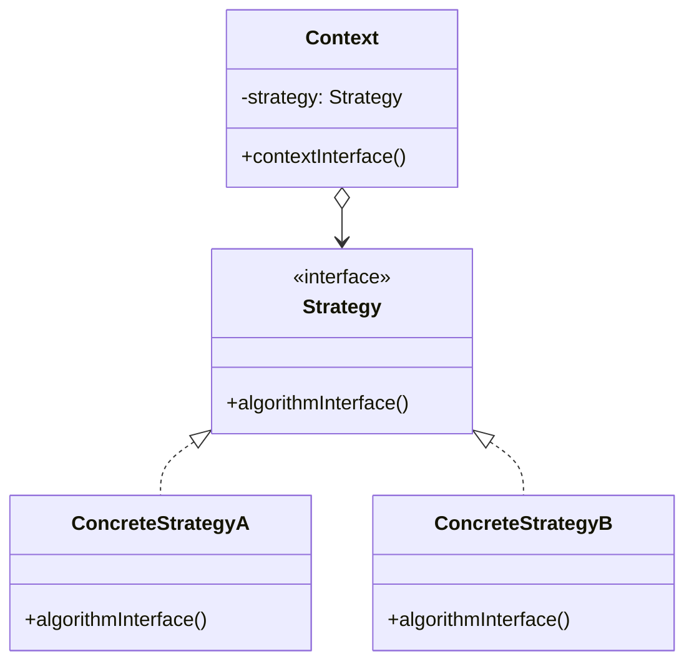
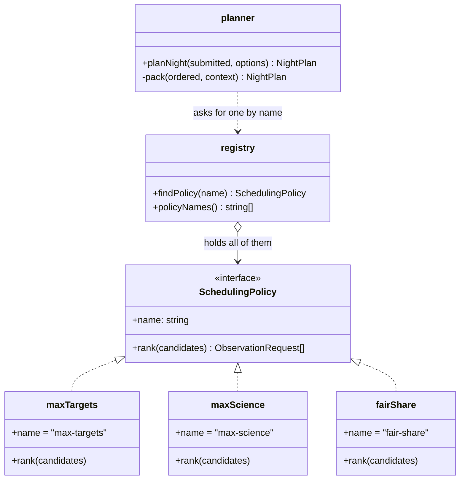

# Walkthrough — Strategy at Hollowell

Read this **after** you have your own version. It is a second opinion, not a key.

---

## The structure, twice

The GoF diagram, with the book's role names:



The same structure with this exercise's names. The mapping is the part nobody writes down,
and it is the real difficulty of reading the book:



Two things differ from the book's picture, and both are worth saying out loud.

**There is no `Context` object.** GoF draws a class that holds a strategy in a field. Here
the context is a *module* — `planner.ts` — and the strategy arrives per call, because a
night is a one-shot computation with no state to keep between nights. If you drew a
`NightPlanner` class holding a policy, you have not made a mistake; you have made a
different call, and it pays off the moment there is something else the planner needs to
remember.

**`registry` is not in the GoF diagram at all.** The book leaves "how does the client get a
strategy" to the client. That works on paper and is exactly where this exercise's real pain
lives: the act-1 code has the list of policy names in three places. The registry is the part
that is missing from the diagram and present in every real codebase.

---

## Why this order

The temptation is to start at step 6 — define the interface, then fill it in. Do that and
you will spend the next hour moving behaviour between files while the suite flickers red,
because you are changing the shape and the content at the same time.

The order here does one thing at a time:

- **Steps 1–2 change nothing and prove something.** After step 2 the three branches are
  textually identical except for the comparator. You cannot know that by reading the
  original — the `for` loop, the `for…of` and the inlined interleave *look* different
  enough to hide a real difference. Making them identical is how you find out there isn't
  one. (There was a moment, writing this, where I thought `fair-share` packed differently,
  because it checks the budget inside a nested loop. It doesn't — the order of offers is
  the same. Step 2 is where I learned that, and it is cheaper to learn there than in step 8.)
- **Steps 3–4 extract the invariant, not the variant.** This is backwards from how most
  people do it, and it is the better direction: once `pack` exists and is used by all three
  branches, the `switch` is visibly nothing but a comparator chooser, and the shape of the
  interface stops being a design question.
- **Steps 5–7 give the variants a home**, in the order function → named object → file. Each
  is mechanical.
- **Step 8 is the payoff** and is a different kind of move: it removes a *duplication of
  knowledge* (which policies exist) rather than a duplication of code.

---

## Step 1 — name the two things every branch repeats

```ts
// before, in all three branches
.filter((request) => request.altitudeDeg >= 20)
entries.push({ requestId: request.id, targetName: request.targetName,
               startsAtMinute: usedMinutes, minutes: request.minutes });

// after
.filter(isAboveHorizon)
entries.push(toEntry(request, usedMinutes));
```

The magic number goes with it:

```ts
/** Below this altitude the dome wall is in the way, whatever the policy says. */
const MINIMUM_ALTITUDE_DEG = 20;
```

**On the name.** `isAboveHorizon`, not `isObservable`. Question 4 of
[NAMING.md](../../../../../../docs/NAMING.md) — *is the name true?* — kills `isObservable`:
a target can be above the dome wall and still unobservable because of cloud, the moon, or a
closed dome. The function only knows about one of those. `isObservable` is the name you
would regret the first time somebody adds a weather check and has to decide whether it goes
inside a function that claims to answer the general question.

The comment earns its place because it answers *why 20*, which the code cannot.

## Step 2 — make the three passes textually identical

No behaviour change, no new names. Rewrite until the three branches differ in exactly one
expression. This step is pure reading comprehension, and it is the step I would defend
hardest if someone called it wasted motion: it is the only point in the route where you
*verify*, rather than assume, that one `pack` can serve all three.

## Steps 3 and 4 — separate ordering from packing, then extract the packer

```ts
// after step 4
function pack(ordered: readonly ObservationRequest[], context: PackContext): NightPlan {
  const entries: PlanEntry[] = [];
  let usedMinutes = 0;
  for (const request of ordered) {
    if (usedMinutes + request.minutes > context.budgetMinutes) continue;
    entries.push(toEntry(request, usedMinutes));
    usedMinutes += request.minutes;
  }
  return { policy: context.policyName, entries, usedMinutes,
           skipped: skippedIds(context.submitted, entries) };
}
```

`continue`, not `break`. One observation longer than the whole night must not end the night,
and there is a test holding that down, because it is the single most likely thing to get
wrong while moving this loop around.

**On the name.** `pack`, not `schedule` or `fill`. Question 1 — *does it say what, or how?*
— rejects `fill` (that is the mechanism). Question 2 — *could it name something else in this
file?* — rejects `schedule`, because "schedule" is what the whole module does and reusing
the word for the inner step makes both fuzzier. `pack` says what it is: a bin-packing walk
over an order somebody else decided.

`PackContext` exists only to keep the parameter count at two. That is a slightly
uncomfortable reason for a type to exist, and I go back and forth on it — see *What it
cost*.

## Steps 5 to 7 — the orderings become objects, then files

```ts
export const maxScience: SchedulingPolicy = {
  name: "max-science",
  rank(candidates) {
    return [...candidates].sort((a, b) => b.priority - a.priority || a.minutes - b.minutes);
  },
};
```

`[...candidates]`, because `sort` mutates and the array belongs to the caller. There is a
test for that too; it is the kind of bug that only shows up in the *second* thing the caller
does with its own array.

**On the name.** `rank`, not `order` or `sort`. Question 2 again: `sort` invites you to
believe it must be a comparator, and `fair-share` is not a comparator — it is a grouping and
an interleave, and no two-argument comparison produces it. `order` reads fine as a verb but
collides with "order" the noun all over a scheduling domain. `rank` is a word this domain
does not otherwise use, which in a domain this crowded is a feature.

I am not fully happy with it. `rank` suggests a score per item, which is exactly what
`fair-share` does *not* have. If you called it `queue` or `prioritise`, I would not argue.

`fair-share` keeps its two helpers in its own file. They are not utilities; they are how
that one policy works, and a `utils.ts` shared between policies would be the first step back
towards the braid we just undid.

## Step 8 — the registry, and the duplication that actually hurt

Before, three places knew the list of policies:

```ts
const KNOWN_POLICIES = ["max-targets", "max-science", "fair-share"];   // 1
`Available: max-targets, max-science, fair-share.`                    // 2
switch (options.policy) { case "max-targets": ...                     // 3
```

After, one place does, and the other two are derived from it:

```ts
const policies: readonly SchedulingPolicy[] = [maxTargets, maxScience, fairShare];

export function policyNames(): readonly string[] {
  return policies.map((policy) => policy.name);
}
```

This is the step that makes act 2 nearly free, and it is worth being precise about why. It
is not "because Strategy". It is because the *name* moved onto the policy, so the list of
names became derivable instead of maintained. You could have done that much without any
interface at all, with a `Record<string, Comparator>` — and you would have got most of the
benefit. Which is a good thing to know about this pattern: a decent chunk of what Strategy
buys here is buyable with a lookup table.

## Step 9 — what `planNight` has left

```ts
export function planNight(submitted, options): NightPlan {
  const policy = findPolicy(options.policy);
  const observable = submitted.filter(isAboveHorizon);
  return pack(policy.rank(observable), {
    submitted, budgetMinutes: options.budgetMinutes, policyName: policy.name,
  });
}
```

Find the policy, drop what is below the wall, rank, pack. If you cannot read a night in four
lines, the split went somewhere else — which is fine, but check that "somewhere else" was a
decision and not a leftover.

---

## Where TypeScript changes this

[TYPESCRIPT.md](../../../../../../docs/TYPESCRIPT.md) puts Strategy at the top of the list
of patterns the language partly dissolves, and that applies here:

```ts
type Rank = (candidates: readonly ObservationRequest[]) => readonly ObservationRequest[];
const policies: Record<string, Rank> = { "max-targets": rankByDuration, /* … */ };
```

That is four lines and no interface. For a policy that is *only* an ordering, it is the
better code, and a reviewer who prefers it is right on the narrow question.

What the object form buys, specifically:

1. **The name lives with the behaviour.** In the `Record`, the key is in the registry and the
   function is elsewhere; nothing stops the two from disagreeing, and nothing tells a policy
   its own name. The act-2 error message needs the names, and it gets them from the
   policies themselves.
2. **Room for a second member.** The moment a policy needs a description for the night log,
   a minimum-altitude override, or its own configuration, the `Record<string, Rank>` becomes
   a `Record<string, { rank, describe, … }>` — which is the interface, arrived at later and
   with a migration to do.
3. **Discoverability.** `policies` is a list of things, not a map of strings to functions;
   `policies.map(p => p.name)` is the kind of question you ask of a collection of objects and
   not of a lookup table.

So the honest summary is: in TypeScript, Strategy is a bet that the varying thing will grow
a second member. Sometimes you lose that bet, and then you wrote five files where four lines
would have done.

One more TypeScript note, which is not in the book because the book's examples are in
C++ and Smalltalk: `noUncheckedIndexedAccess` is why `interleave` has an
`if (request !== undefined)` in it. `group[round]` is `T | undefined` when indices are not
proven, and the check is not defensive noise — it is the compiler pointing out that the
groups have different lengths, which is the whole reason the round-robin needs care.

---

## What it cost

- **Five files and one indirection.** Covered above, and it is the real price.
- **`PackContext` is a type that exists to satisfy a lint rule.** Three parameters would
  have been fine and arguably clearer; the strict profile caps it at three and `pack` wanted
  four. I think the bundle is a small improvement anyway, because the three travel together
  — but if you told me it was the tail wagging the dog I would not have a good answer.
- **The interface fixes what a policy can be.** A policy is an ordering, and only an
  ordering. "No two spectroscopy targets in a row" is a perfectly reasonable future request
  and it does **not** fit: it needs to see what is already scheduled, which means the packer
  would have to consult the policy per step. That is a different interface — `choose(next,
  from, alreadyScheduled)` — and a more expensive one, and I deliberately did not build it.
  Guessing that shape now is the over-engineering this repository is otherwise against.
- **The fair-share name is load-bearing and undefined.** "Fair" means one slot each before
  anyone gets a second, which is one of several defensible fairnesses. The code does not say
  that anywhere except in the test. A domain this political deserves the definition written
  down.

## If you took a different route

Defensible, and I would accept any of them in review:

- **A `NightPlanner` class holding the policy.** More GoF-shaped. Worth it if anything else
  becomes stateful; ceremony if not.
- **A comparator-based interface** (`compare(a, b)`) with `fair-share` as the exception. I
  like this less — the exception is the interesting policy — but the other two get simpler.
- **A `Record<string, Rank>`** with no interface, as above. Right on today's requirements.
- **Keeping `skipped` out of `pack`.** It is arguably a reporting concern and could be
  computed by `planNight`. I put it in `pack` because `pack` is the only thing that knows
  what got in, and I am about 60/40 on it.

Two things are **not** a matter of taste:

1. **The packing logic must exist once.** Three policies that each pack are the original
   problem with an interface painted on, and the exercise's suite will not catch it — the
   act-2 test `darkest-first still obeys the horizon and the budget` exists precisely to
   catch the fourth copy.
2. **The list of policy names must have one owner.** If your error message still hardcodes
   the names, you kept the bug that act 2 is about to find.
