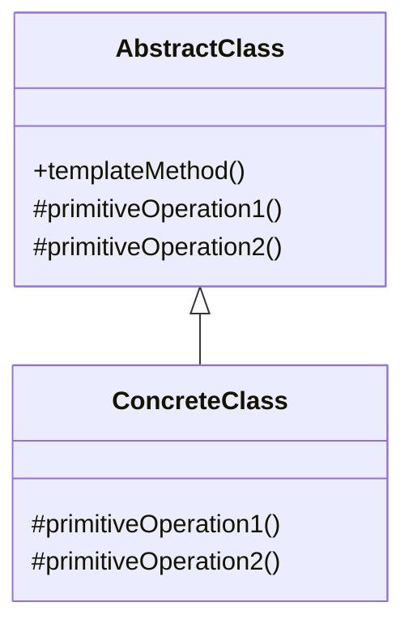
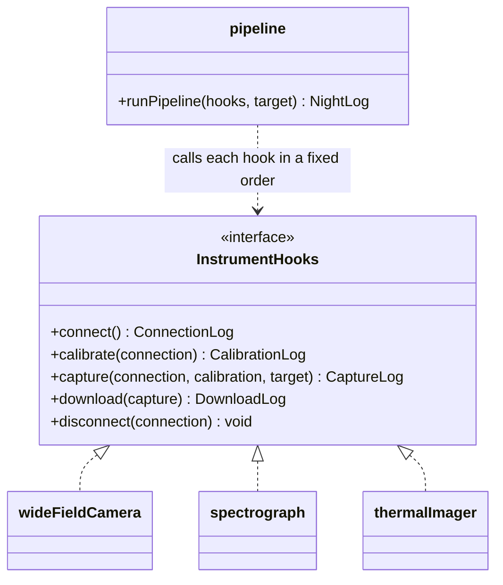

# Walkthrough — Template Method at Hollowell

Read this **after** you have your own version.

---

## The structure, twice

The GoF diagram, with the book's role names. The book draws this with inheritance:
an abstract class owns the template method and declares the steps as abstract or
overridable methods; a subclass fills in the steps it cares about.



The same shape with this exercise's names — and the first thing to notice is that
there is no inheritance at all:



`AbstractClass.templateMethod` becomes a plain function, `runPipeline`, that takes
an object instead of calling `this`. `primitiveOperation1/2` become named methods
on an object literal. The **sealed part** — the one thing a subclass in the book
cannot override — is the order `templateMethod` calls its steps in; here that is
the five lines inside `runPipeline`, and they are just as sealed, for the same
reason: the order is the one thing every instrument must agree on, and letting an
instrument override it would be a different pattern (Strategy, essentially, over
the whole pipeline).

---

## Why this order

Extracting the hooks type before the skeleton (steps 3 before 4) is backwards from
how the shape usually gets discovered — most people notice the skeleton first,
because it is the part that repeats. But writing the skeleton against a type you
have not yet separated from real code means writing it against three candidate
shapes at once, and the three are not quite textually identical until step 1 and
2 establish that they are.

**Step 4 is deliberately done standalone**, against a hand-built hooks object,
before any of the three real functions are touched. This is the same reasoning as
step 2 in the Strategy walkthrough: prove the shared thing works once, on its own,
before trusting it to replace three things that currently work by construction.

## Step 3 — the hooks interface

```ts
export interface InstrumentHooks {
  readonly name: string;
  connect(): ConnectionLog;
  calibrate(connection: ConnectionLog): CalibrationLog;
  capture(connection: ConnectionLog, calibration: CalibrationLog, target: string): CaptureLog;
  download(capture: CaptureLog): DownloadLog;
  disconnect(connection: ConnectionLog): void;
}
```

**On the name.** `InstrumentHooks`, not `InstrumentTemplate` or `PipelineSteps`.
Question 1 of [NAMING.md](../../../../../../docs/NAMING.md) — *what, not how* —
rules out `PipelineSteps`, which describes the mechanism (a sequence) rather than
the role (things the pipeline calls into). `Hooks` is the word this repository
uses elsewhere for "the varying part a shared runner calls into," and keeping it
consistent across drills is worth more than a more clever name here.

## Step 4 — the skeleton

```ts
export function runPipeline(hooks: InstrumentHooks, target: string): NightLog {
  const steps: StepLog[] = [];
  const connection = hooks.connect();
  steps.push({ step: "connect", detail: connection.port });
  const calibration = hooks.calibrate(connection);
  steps.push({ step: "calibrate", detail: calibration.reference });
  const capture = hooks.capture(connection, calibration, target);
  steps.push({ step: "capture", detail: `${capture.frames} frames @ ${capture.exposureSeconds}s` });
  const download = hooks.download(capture);
  steps.push({ step: "download", detail: `${download.bytes} bytes` });
  hooks.disconnect(connection);
  steps.push({ step: "disconnect", detail: connection.port });
  return { instrument: hooks.name, target, steps };
}
```

**On the name.** `runPipeline`, not `runTemplate` or `execute`. Question 4 — *is it
true?* — is what kills `runTemplate`: nothing in this codebase calls the GoF
pattern by name anywhere except the walkthrough, and a reader meeting this file
cold should not need the pattern's name to understand what it does. `execute` was
the other candidate, and question 2 — *could it name something else here?* — is
why it lost: this file is full of things that get executed (hooks, steps); "run a
pipeline" is the one specific thing this function does.

## Steps 5–7 — from duplicated functions to a registry

Each instrument's specific lines become an object; the three objects move to
their own files; the switch becomes a list with a lookup. Mechanically identical
to the Strategy drill's steps 5–8, and the registry's shape — `find` over an array,
throw with the full list on a miss — is deliberately the same idiom. If you wrote
the two drills far apart and they still came out looking like siblings, that is
the idiom working, not a coincidence to apologise for.

---

## Where TypeScript changes this

[TYPESCRIPT.md](../../../../../../docs/TYPESCRIPT.md) lists Template Method as
"a higher-order function taking hooks," and that is exactly what `runPipeline` is.
No `abstract class`, no inheritance, no `protected`. The object-of-functions shape
is not a TypeScript-flavoured compromise; it is arguably closer to the pattern's
*intent* than the book's own mechanism, because what GoF actually wants varied is
a handful of named operations, and an object of named functions says that more
directly than a class hierarchy does.

The one place inheritance would still be the better call: if the instruments
needed to share **default** behaviour for some hooks and override only a few
(GoF's *hook methods*, as distinct from abstract ones). An object literal has no
notion of "inherit this method unless you override it"; a base class does. None
of the three instruments here need that, so the question does not arise — but if
a later instrument only changed `capture` and was happy with generic versions of
everything else, that is the moment to revisit the choice.

---

## What it cost

The honest cost is not the usual "it's an extra layer of indirection" — it is
sharper than that, and act 2 is what exposes it:

- **The skeleton is now a single point of agreement, which cuts both ways.** A
  new instrument that needs the same five stages is one file. A new instrument
  that needs a *different* five stages — or four, or six — means reopening
  `pipeline.ts`, which is the one file this pattern was supposed to protect from
  being reopened.
- **`capture`'s signature grew a parameter nobody asked for.** `calibration` is
  threaded through to `capture` because the thermal imager's exposure time
  depends on the blackbody reading. Two of the three instruments ignore it
  (`_calibration`). That is a real cost of a fixed-shape skeleton: every hook
  gets every upstream value, whether it needs it or not.

## If you took a different route

- **An abstract class with a `run()` template method and `protected abstract`
  steps.** The GoF-literal reading. I think the function-and-hooks version reads
  better for three stateless instruments; I would reconsider for instruments that
  carried real state between stages (an open file handle, a retry counter).
- **A single object with all twelve methods (four instruments × three hooks each)
  keyed by instrument name**, skipping the per-file split. Defensible at this
  size; gets uncomfortable past a handful of instruments.

Not a matter of taste: **the five-stage order must exist in exactly one place**,
and every instrument must go through `runPipeline` rather than assembling its own
`NightLog` by hand. An instrument that builds its own log bypasses the one
invariant the pattern exists to hold.

## What act 2 actually showed, and what would have absorbed it

See [ACT2.md](./ACT2.md) for the measured numbers. The short version: making
`calibrate` optional and teaching `runPipeline` to skip a missing hook is a real
change to the file the pattern sealed, and it cost about as much as the
no-pattern baseline — fewer hunks and one fewer file touched on the no-pattern
side, but more total lines there too. **Neither route is clearly cheaper.** That
is the honest result, and it is the result worth having: this pattern was never
going to make "skip a stage for one case" cheap, because making stages skippable
is not what a *fixed* skeleton is for.

What would have absorbed this act 2 at close to zero cost is a **stage-list**
design: instead of five named hook methods, each instrument declares an ordered
array of `{ name: string; run: (...) => unknown }` stages, and `runPipeline`
iterates whatever list it is given. Adding `guide-camera` with four stages instead
of five is then just a shorter array — no change to the shared runner, because
the runner never assumed five stages, or that every instrument has the same ones.
That design buys the flexibility this act 2 wanted, at the cost of losing the
compiler's guarantee that every instrument implements every stage by the same
name — the trade runs in the opposite direction from Template Method, not in the
same direction with a better price.
