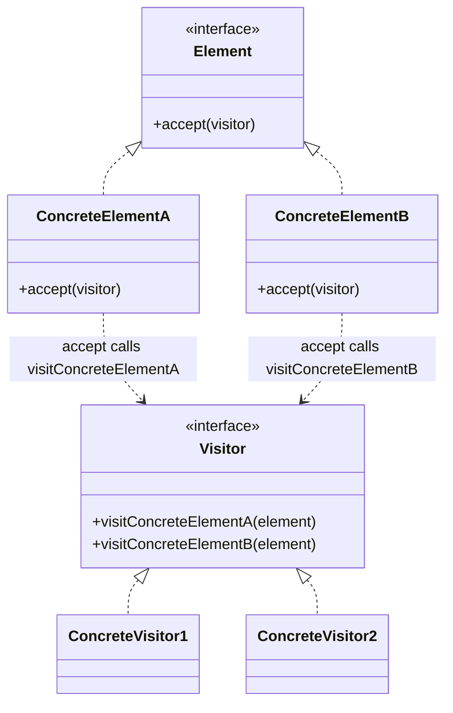
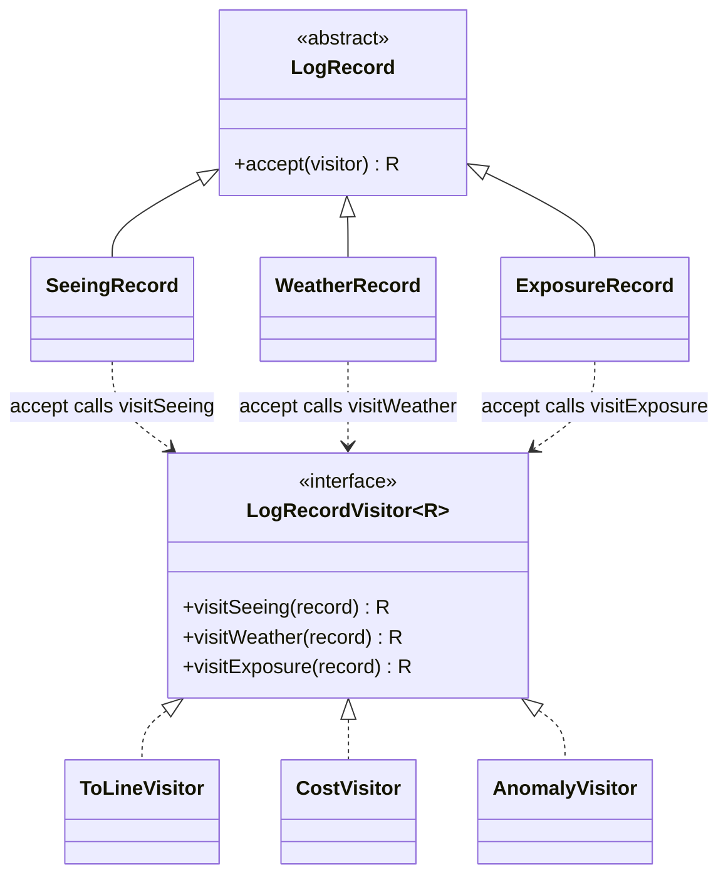

# Walkthrough — Visitor at Hollowell

Read this **after** you have your own version.

---

## The structure, twice

The GoF diagram. Elements accept a visitor instead of exposing operations
of their own; each element's `accept` calls the one method on the visitor
that matches its own concrete type, and the visitor implements one method
per element type:



This exercise's names:



**On the mapping.** GoF's `Element`/`ConcreteElement` split becomes
`LogRecord` and its three subclasses - the abstract class plays `Element`
directly, since there is no separate need for an `Element` interface when
every record already shares one base class. GoF's `Visitor`/
`ConcreteVisitor` split is `LogRecordVisitor<R>` and its three
implementations (`ToLineVisitor`, `CostVisitor`, `AnomalyVisitor`, later
`OperatorNoteVisitor`) - one difference from the book's own diagram worth
naming: GoF's `Visitor` methods are not generic, because C++ and Smalltalk
visitors typically return `void` and accumulate a result as a side effect
on the visitor object itself. `LogRecordVisitor<R>` returns `R` directly
from every method, which TypeScript's generics make free and which turns
every report into a pure function of one record - no visitor needs
internal mutable state to hand back an answer.

**On the name, a first time.** `LogRecordVisitor<R>`, not `LogRecordVisitor`
with three separately-named single-purpose interfaces
(`ToLineVisitor`/`CostVisitor` each defining their own shape). Question 2
of [NAMING.md](../../../../../../docs/NAMING.md) - "could it name something
else in this file?" - argues for the ONE generic interface: three
near-identical interfaces differing only in return type would each need a
name that says nothing `LogRecordVisitor<R>` doesn't already say once,
generically.

**On the name, a second time.** `accept`, not `visit` or `dispatch`. GoF's
own name survives here as the exception in
[NAMING.md](../../../../../../docs/NAMING.md) - the domain (double
dispatch) has no better word of its own, and "accept" is precise about
direction in a way a domain word would not improve on: the record accepts
a visitor, it does not visit one. Question 3 confirms it at the call site:
`record.accept(new ToLineVisitor())` reads as an instruction to the
record, not a query about it - which is correct, `accept` is the one
place a record temporarily takes direction from outside itself.

**On the name, a third time.** `visitSeeing`, not `visitSeeingRecord` or
just `seeing`. Question 1 rules out the bare `seeing` - a method named
after its parameter's domain noun, with no verb, reads like a field, not
an operation. `visitSeeingRecord` is the pattern's own convention
elsewhere in the literature, but this codebase already knows
`LogRecordVisitor<R>` is a visitor *of* `LogRecord`s specifically -
repeating "Record" in every one of its three method names is the kind of
repetition [NAMING.md](../../../../../../docs/NAMING.md)'s worked table
calls out for `ConcreteStrategyA` vs. a plain `maxTargets`.

---

## Why this order

**`accept` is wired onto all three records (steps 3-5) before any visitor
is extracted (steps 6-8).** This means each record's rewiring is checked
against its *old* methods, still present and still correct, rather than
against a visitor that does not exist yet - the suite has something to
compare against at every single step, never a stretch of commits where
neither the old nor the new mechanism is complete.

**The three report classes are extracted one at a time (steps 6-8), and
only after every record already accepts.** Writing `ToLineVisitor` when
every record can already `accept` one means the extraction is purely
"copy this logic into its new home," not "copy this logic into its new
home and also invent the plumbing to reach it."

## Step 2 — the one method every record will keep

```ts
export abstract class LogRecord {
  abstract accept<R>(visitor: LogRecordVisitor<R>): R;
}
```

`accept` is generic over `R`, not fixed to a single return type, because
different reports return different things - a `string`, a `number`, a
`boolean`, and (after act 2) a `string | null`. One `accept` signature
serves all of them; nothing about `LogRecord` needs to know what any
report computes.

## Steps 3-5 — double dispatch, wired once per record

```ts
export class SeeingRecord extends LogRecord {
  constructor(readonly fwhmArcsec: number) {
    super();
  }

  accept<R>(visitor: LogRecordVisitor<R>): R {
    return visitor.visitSeeing(this);
  }
}
```

This is the "double" in double dispatch: calling `record.accept(visitor)`
dispatches once on `record`'s runtime type (which `accept` method runs),
and that method's body dispatches a second time on the *visitor's* shape
by calling the one method that matches - `visitSeeing`, chosen by
`SeeingRecord` itself, not by the caller.

## Steps 6-8 — one report, in full, in one file

```ts
export class AnomalyVisitor implements LogRecordVisitor<boolean> {
  visitSeeing(record: SeeingRecord): boolean {
    return record.fwhmArcsec > 3.0;
  }
  visitWeather(record: WeatherRecord): boolean {
    return record.severity >= 8;
  }
  visitExposure(_record: ExposureRecord): boolean {
    return false;
  }
}
```

Compare this to act 1: the same three rules existed before, but one third
of this file lived in `SeeingRecord`, one third in `WeatherRecord`, one
third in `ExposureRecord`. "What counts as an anomaly" is now answerable
by opening one file and reading fourteen lines, not by opening three files
and holding their fragments in your head at once.

---

## Where TypeScript changes this

[TYPESCRIPT.md](../../../../../../docs/TYPESCRIPT.md)'s general note on
Visitor: this is the pattern whose entire safety property depends on the
compiler refusing incomplete work, and TypeScript's structural interface
checking delivers that refusal directly. `implements LogRecordVisitor<R>`
on a class that is missing `visitDome` (after act 2) is a compile error,
not a runtime surprise the first time a `DomeRecord` reaches a visitor
that forgot about it. A language that let a class "implement" an
interface it only partially satisfies would turn this pattern's real cost
(editing every visitor when a record kind is added) into a silent one
instead - worse, because you find out at 2am when the missing case finally
runs, not at build time.

---

## What it cost

- **Reading "what does `ExposureRecord` do" now means opening
  `records/exposure.ts` and finding one method, `accept`,** that does not
  say anything about what a report does with it. Understanding the full
  behavior of any one record means finding every visitor that handles it
  - which act 1 alone does not make obviously easier than the shape it
  replaced, only differently organized.
- **Every visitor has to implement every method**, whether a given record
  kind is interesting to that report or not - `CostVisitor.visitSeeing`
  and `CostVisitor.visitWeather` both just `return 0`, three lines of
  boilerplate for "this report has nothing to say about these two kinds."
- **See [ACT2.md](./ACT2.md) for the actual price**, measured: this
  route's whole bet is that reports will keep arriving faster than record
  kinds do, and act 2 is the receipt for what happens when that bet is
  wrong even once.

## If you took a different route

- **Keep the methods on each record class** (this exercise's own act 1
  shape) - cheap for a new record kind, expensive for a new report. The
  exact inverse of this solution's tradeoff, not a worse design in the
  abstract - only worse for *this* domain if reports really do arrive
  more often than record kinds, which is a bet about the future, not a
  fact about the code today.
- **A big-switch dispatcher function per report**, `function toLine(record:
  LogRecord): string { switch (record.kind) { ... } }`, using a
  discriminated union instead of a class hierarchy - would read as one
  flat function per report (closer to this solution's shape) without a
  class-based visitor's ceremony, at the cost of losing the compiler's
  exhaustiveness check unless every switch remembers a `default: const
  _exhaustive: never = record;` guard by hand. Worth it the moment the
  hierarchy is genuinely a small number of variant shapes rather than
  classes with their own behavior beyond holding data - which describes
  `SeeingRecord`/`WeatherRecord`/`ExposureRecord`/`DomeRecord` reasonably
  well, and is a legitimate reason to prefer this alternative over the
  classic Visitor shape for a codebase exactly like this one.

## What act 2 showed, and what would have absorbed it

See [ACT2.md](./ACT2.md) for the full breakdown. The short version: the
fourth report cost one new file and one small edit; the fourth record kind
cost an interface change and an edit to every existing report. What would
have absorbed the second half at zero cost is not a different pattern -
it is simply not having used Visitor, and going back to the exact shape
act 1 replaced. Virtual methods on each record class make a new record
kind free (one new class, done) at the price of making a new report
expensive (touch every class) - which is not a hypothetical alternative,
it is the receipt for the bet this solution made, read backwards.
