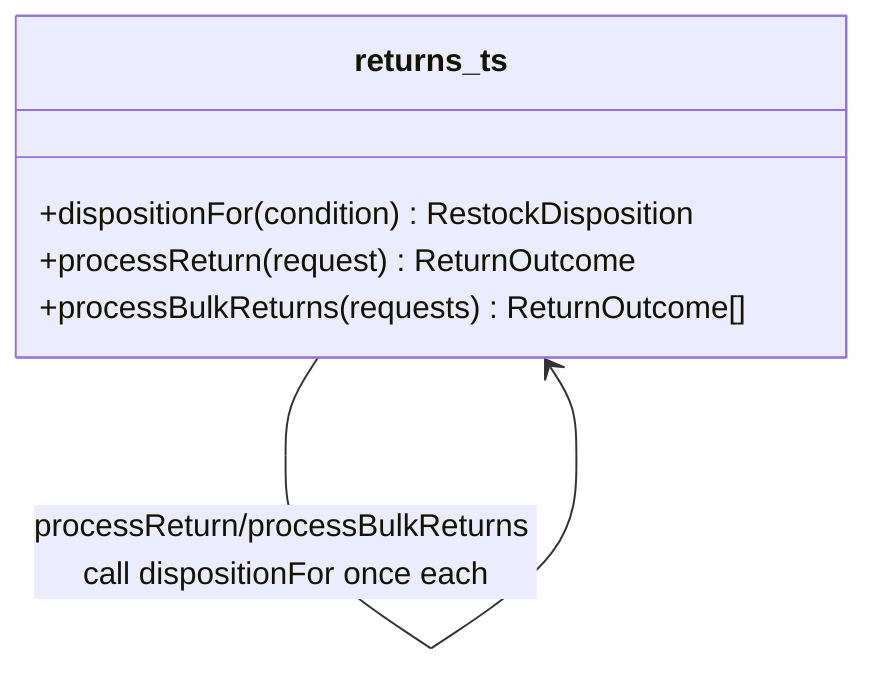

# Walkthrough — Ravensgate returns and refunds engine

Read this **after** you have your own version.

---

## The structure

No book diagram to map this against either - `dispositionFor` is a plain function, and the
question worth sitting with is which of three independent decisions this route bet was worth
pulling into one place:

**On the mapping.** Same answer as [`solutions/reason-based-refunds`](../reason-based-refunds/WALKTHROUGH.md)
gives for its own axis: this is Fowler's *Extract Function*, not a named GoF pattern - there's
nothing here shaped enough like a class hierarchy to call Strategy or State honestly.

**On the name.** `dispositionFor`, not `getDisposition` or `resolveDisposition`. Question 1
from [`docs/NAMING.md`](../../../../../docs/NAMING.md) - `dispositionFor(condition)` reads at
the call site as "the disposition for this condition," which is exactly what the warehouse
floor would ask for it in those words.

---

## Why this route bet on the condition axis

This route's bet: **restock disposition is the decision most worth insulating**, because it's
the one downstream system (the warehouse floor's putaway process) actually consumes on its
own, independent of anything about the customer or the payment. A reasonable bet - and the
warehouse floor's own tooling would have applauded it.

---

## Why act 2 doesn't reward it

The recall is entirely a refund-by-reason change: a new reason, refunded a new way, with no
effect on restock disposition or notification channel at all. This route never touched the
refund branching, so it still duplicates the new branch across both `processReturn` and
`processBulkReturns` - the same shape `src/` is in, and the same cost. See [ACT2.md](./ACT2.md)
for the numbers.

---

## What it cost, and what it didn't win

- **In act 1, this route costs about the same as
  [`solutions/reason-based-refunds`](../reason-based-refunds/WALKTHROUGH.md)** - one function,
  one call site each, a reasonable, defensible restructuring of a real pressure.
- **It just wasn't the pressure this particular act 2 tested.** [ACT2.md](./ACT2.md) shows
  this route tying the no-pattern baseline exactly - 8 lines, 3 hunks - because the axis it
  insulated was never the one that needed to change.
- This is the honest lesson of the exercise: picking which pressure to relieve first is a bet
  about what changes next, and act 1 alone can't tell you which bet pays off.
