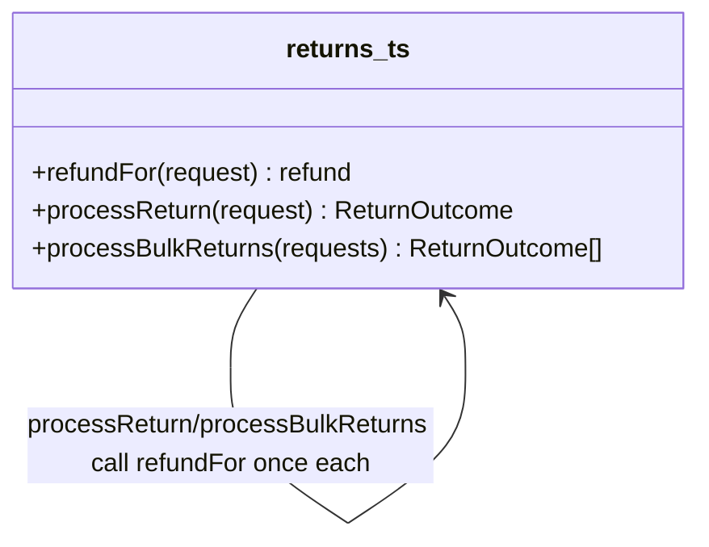

# Walkthrough — Ravensgate returns and refunds engine

Read this **after** you have your own version.

---

## The structure

No book diagram to map this against - `refundFor` is a plain function, not a class hierarchy,
and the point of this route isn't to name a pattern, it's to notice which of three
independent decisions was worth pulling into one place:

**On the mapping.** There isn't one, deliberately: this exercise doesn't name a target, and
the honest answer here is "extract the function that varies along the axis I'm betting will
change again" - which is closer to Fowler's *Extract Function* than to any single GoF pattern.
If the reason-by-reason branching had grown enough independent behaviour per reason (not just
a number and a method, but real per-reason logic), a `Strategy`-shaped answer - one small
object per reason - would have been the next honest step past this. It didn't need to get
there yet.

**On the name.** `refundFor`, not `computeRefund` or `getRefund`. Question 1 from
[`docs/NAMING.md`](../../../../../docs/NAMING.md) - `refundFor(request)` reads at the call
site as "the refund for this request," where `computeRefund` would only restate that a
function computes something, which every function here already does.

**On the name, a second time.** The return type is an inline `Pick<ReturnOutcome, "refundCents"
| "refundMethod">`, not a new named interface. Question 2 - a `Refund` interface would be
one more name competing with `ReturnOutcome` for a reader's attention, for a value that only
ever gets spread back into a `ReturnOutcome` a few lines later.

---

## Why this route bet on the refund axis

Three branches sat in `src/`, all shaped the same way, none announced as more likely to
change than the others. This route's bet: **a reason code is the branch most likely to grow a
new member** - reasons are business categories, and business categories are exactly the kind
of thing operations teams add to without warning (a recall, a fraud hold, a warranty claim).
Conditions and refund methods, by contrast, are closed sets close to physically exhaustive -
an item is sealed, opened-good or opened-damaged, and there are only so many ways a warehouse
can dispose of a returned item.

---

## What it cost, and what it won

- **In act 1, this route touches slightly more than doing nothing** - one function, one call
  site each in `processReturn` and `processBulkReturns`. Cheap, but not free.
- **See [ACT2.md](./ACT2.md) for the payoff**: the recall lands on exactly the axis this route
  restructured, and costs 5 lines across 2 hunks - the cheapest of the three measured routes,
  including the no-pattern baseline.
- Compare [`solutions/condition-based-restock`](../condition-based-restock/WALKTHROUGH.md),
  which made the opposite bet and ties the baseline's cost for this particular change - not
  because that bet was unreasonable, but because it wasn't the axis this act 2 happened to
  test.
