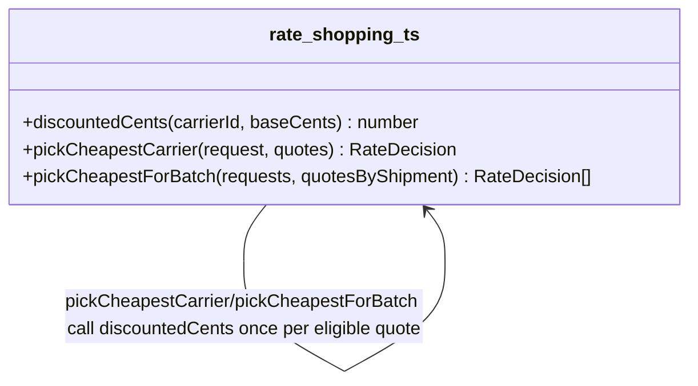

# Walkthrough — Ravensgate rate-shopping engine

Read this **after** you have your own version.

---

## The structure

No book diagram to map this against either - `discountedCents` is a plain function, and the
question worth sitting with is which of several independent decisions this route bet was worth
pulling into one place:

**On the mapping.** Same answer as
[`solutions/eligibility-rules`](../eligibility-rules/WALKTHROUGH.md) gives for its own axis:
this is Fowler's *Extract Function*, not a named GoF pattern - there's nothing here shaped
enough like a class hierarchy to call Strategy or State honestly.

**On the name.** `discountedCents`, not `applyDiscount` or `getPrice`. Question 1 from
[`docs/NAMING.md`](../../../../../docs/NAMING.md) - `discountedCents(carrierId, baseCents)`
reads at the call site as "the price after this carrier's discount," which is exactly the value
both callers need back.

---

## Why this route bet on the pricing axis

This route's bet: **the negotiated discount is the number most worth insulating**, because it's
the one a sales team renegotiates on its own schedule, independent of anything about zones or
weight limits. A reasonable bet - finance would have applauded it.

---

## Why act 2 doesn't reward it

Tanager's small-parcel exception is entirely an eligibility change: a carrier that was
zone-excluded becomes zone-eligible under a new condition, with no effect on price at all. This
route never touched the zone-and-weight branching, so it still duplicates the new clause across
both `pickCheapestCarrier` and `pickCheapestForBatch` - the same shape `src/` is in, and the
same cost. See [ACT2.md](./ACT2.md) for the numbers.

---

## What it cost, and what it didn't win

- **In act 1, this route costs about the same as
  [`solutions/eligibility-rules`](../eligibility-rules/WALKTHROUGH.md)** - one function, one
  call site each, a reasonable, defensible restructuring of a real pressure.
- **It just wasn't the pressure this particular act 2 tested.** [ACT2.md](./ACT2.md) shows this
  route tying the no-pattern baseline exactly - 10 lines, 2 hunks - because the axis it
  insulated was never the one that needed to change.
- This is the honest lesson of the exercise: picking which pressure to relieve first is a bet
  about what changes next, and act 1 alone can't tell you which bet pays off.
