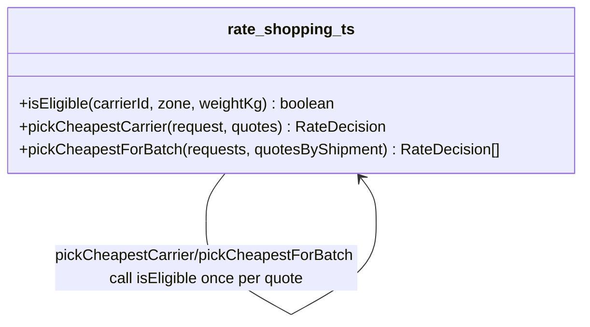

# Walkthrough — Ravensgate rate-shopping engine

Read this **after** you have your own version.

---

## The structure

No book diagram to map this against - `isEligible` is a plain function, not a class hierarchy,
and the point of this route isn't to name a pattern, it's to notice which of several
independent decisions was worth pulling into one place:

**On the mapping.** There isn't one, deliberately: this exercise doesn't name a target, and the
honest answer here is "extract the function that varies along the axis I'm betting will change
again" - closer to Fowler's *Extract Function* than to any single GoF pattern. If eligibility
grew enough independent behaviour per carrier (not just a zone set and a weight number, but real
per-carrier policy - contracts, blackout dates, capacity limits), a `Strategy`-shaped answer -
one small object per carrier - would have been the next honest step past this. It didn't need to
get there yet.

**On the name.** `isEligible`, not `checkEligibility` or `getEligibility`. Question 1 from
[`docs/NAMING.md`](../../../../../docs/NAMING.md) - `isEligible(carrierId, zone, weightKg)`
reads at the call site as a yes/no question about this specific quote, which is exactly what
both callers ask it.

---

## Why this route bet on the eligibility axis

Four branches sat in `src/`, all shaped the same way, none announced as more likely to change
than the others. This route's bet: **which carriers even get considered is the decision most
likely to gain a new exception** - eligibility rules are commercial arrangements (a new
contract, a new service tier, a new exclusion), and commercial arrangements are exactly the
kind of thing a sales team renegotiates without warning. The discount arithmetic, by contrast,
only ever changes a number, not the shape of the rule.

---

## What it cost, and what it won

- **In act 1, this route touches slightly more than doing nothing** - one function, one call
  site each in `pickCheapestCarrier` and `pickCheapestForBatch`. Cheap, but not free.
- **See [ACT2.md](./ACT2.md) for the payoff**: tanager's small-parcel exception lands on
  exactly the axis this route restructured, and costs 2 lines in a single hunk - cheaper than
  both the no-pattern baseline and the other measured route.
- Compare [`solutions/discount-rules`](../discount-rules/WALKTHROUGH.md), which made the
  opposite bet and ties the baseline's cost for this particular change - not because that bet
  was unreasonable, but because it wasn't the axis this act 2 happened to test.
