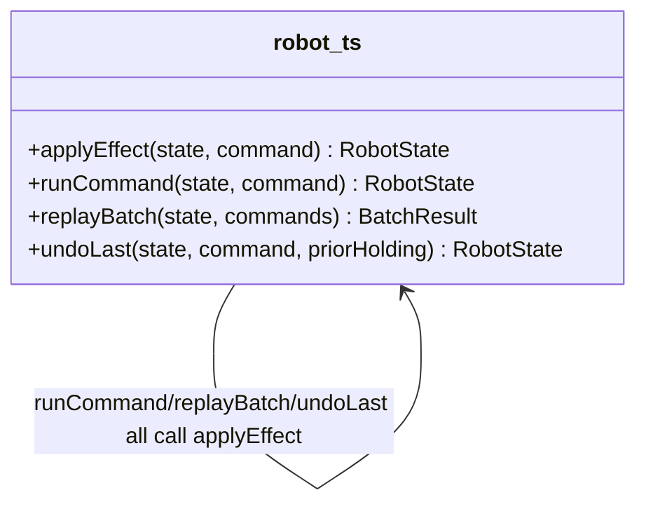

# Walkthrough — Ravensgate warehouse robot command stream

Read this **after** you have your own version.

---

## The structure

No book diagram to map this against either - `applyEffect` is a plain function, and the
question worth sitting with is which of three independent decisions this route bet was worth
pulling into one place:

**On the mapping.** Same answer as
[`solutions/command-rules`](../command-rules/WALKTHROUGH.md) gives for its own axis: this is
Fowler's *Extract Function*, not a named GoF pattern - there's nothing here shaped enough like a
class hierarchy to call Strategy or State honestly.

**On the name.** `applyEffect`, not `transition` or `doCommand`. Question 1 from
[`docs/NAMING.md`](../../../../../docs/NAMING.md) - `applyEffect(state, command)` reads at the
call site as "what this command does to the state," which is exactly the value every one of its
four callers needs back, whether the command is a forward one from the stream or an inverse
built for undo.

---

## Why this route bet on the effect axis

This route's bet: **how a command changes state is the decision most worth insulating**,
because it's the one every single call site needs, including the two nobody thinks about
until something goes wrong - `replayBatch`'s rollback loop and `undoLast`. Four call sites
sharing one function is the biggest single reduction in duplicated logic available anywhere in
this kata. A reasonable bet - the operator's undo button and the batch's rollback path would
have applauded it.

---

## Why act 2 doesn't reward it

The inspection-zone rule is entirely a legality change: a new condition on when a command is
*allowed*, with no effect on what the command *does* once it's permitted, and no effect on how
to invert it. This route never touched the legality branching, so it still duplicates the new
clause across `runCommand` and `replayBatch`'s own validation - the same shape `src/` is in, and
the same cost. See [ACT2.md](./ACT2.md) for the numbers.

---

## What it cost, and what it didn't win

- **In act 1, this route costs about the same as
  [`solutions/command-rules`](../command-rules/WALKTHROUGH.md)** - one function, four call
  sites collapsed to one, a reasonable, defensible restructuring of a real pressure.
- **It just wasn't the pressure this particular act 2 tested.** [ACT2.md](./ACT2.md) shows this
  route tying the no-pattern baseline exactly - 6 lines, 2 hunks - because the axis it
  insulated was never the one that needed to change.
- This is the honest lesson of the exercise: picking which pressure to relieve first is a bet
  about what changes next, and act 1 alone can't tell you which bet pays off.
