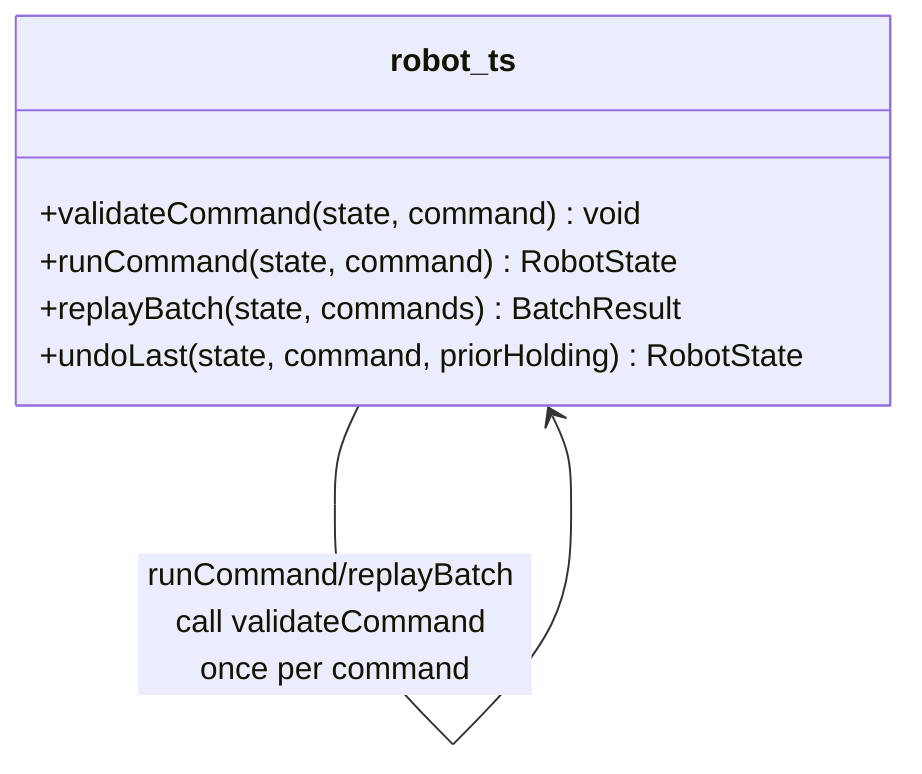

# Walkthrough — Ravensgate warehouse robot command stream

Read this **after** you have your own version.

---

## The structure

No book diagram to map this against - `validateCommand` is a plain function, not a class
hierarchy, and the point of this route isn't to name a pattern, it's to notice which of three
independent decisions was worth pulling into one place:

**On the mapping.** There isn't one, deliberately: this exercise doesn't name a target, and the
honest answer here is "extract the function that varies along the axis I'm betting will change
again" - closer to Fowler's *Extract Function* than to any single GoF pattern. If legality grew
enough independent behaviour per command kind (not just a bounds check and two holding checks,
but real per-command policy - permits, inspection logs, per-carrier rules), a `Strategy`-shaped
answer - one small object per command kind - would have been the next honest step past this. It
didn't need to get there yet.

**On the name.** `validateCommand`, not `checkCommand` or `isLegal`. Question 1 from
[`docs/NAMING.md`](../../../../../docs/NAMING.md) - `validateCommand(state, command)` reads at
the call site as "make sure this command is legal," which is exactly what both callers ask it
to do, and it throws rather than returning a boolean because both callers already treat an
illegal command as an exceptional path, not a branch.

---

## Why this route bet on the legality axis

Three decisions sat in `src/`, all shaped the same way, none announced as more likely to change
than the others. This route's bet: **legality is the decision most likely to gain a new
exception**, because legality rules are compliance and business policy - the kind of thing
operations and legal teams add to without warning (an inspection requirement, a new restricted
item, a temporary hold on a zone). What a command actually does to the robot's state, and how
to invert it, are closer to physics: a move's effect and its opposite aren't going to change
just because a new business rule shows up.

---

## What it cost, and what it won

- **In act 1, this route touches slightly more than doing nothing** - one function, two call
  sites. Cheap, but not free.
- **See [ACT2.md](./ACT2.md) for the payoff**: the inspection-zone rule lands on exactly the
  axis this route restructured, and costs 3 lines in a single hunk - the cheapest of the three
  measured routes, including the no-pattern baseline.
- Compare [`solutions/command-effects`](../command-effects/WALKTHROUGH.md), which made the
  opposite bet and ties the baseline's cost for this particular change - not because that bet
  was unreasonable, but because it wasn't the axis this act 2 happened to test.
